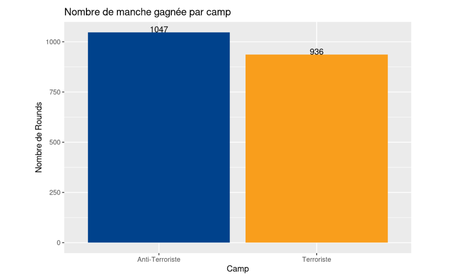
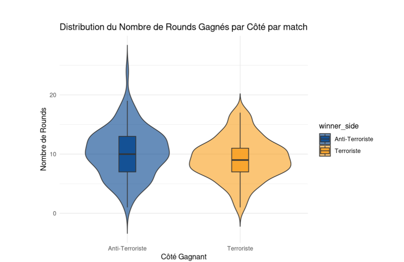
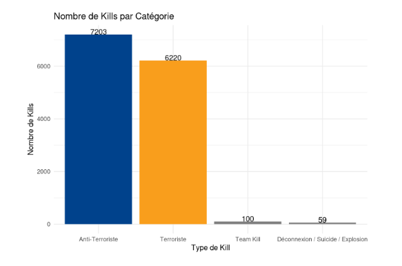
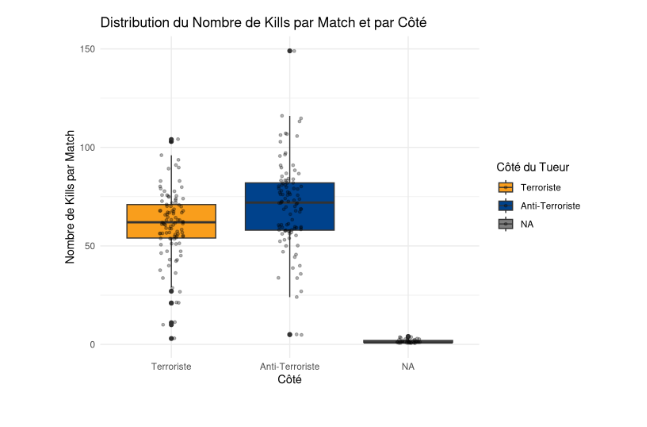
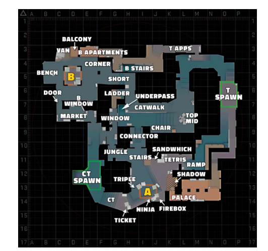

```{r setup, include=FALSE}
library(tidyverse)
library(ggridges)
knitr::opts_chunk$set(message = FALSE, warning = FALSE)
```

# Introduction

Bienvenue dans les coulisses de Counter-Strike 2. Les fichiers `.dem`, ces boîtes noires du jeu, ne sont pas de simples replays : ce sont des flux de données brutes, enregistrant chaque tick du serveur avec la précision d'un horloger suisse. Ici, CS2 n'est pas qu'une question de réflexes, c'est un générateur de données, où chaque poulet sacrifié sur Inferno, chaque "Have Fun" lancé dans le chat et chaque millimètre de déplacement est méticuleusement archivé.

**Notre mission ?** Analyser cet amas de données pour répondre à certaines questions. Par exemple, décrypter si la politesse est une stratégie gagnante : un "Have Fun" dans le chat, est-ce un buff de victoire ou juste une prière avant de se faire one-tap ? Ou encore trancher la plus grande superstition de l'e-sport : sacrifier des poulets sur Inferno, est-ce un rituel sacré ou juste une façon de polluer notre base de données avec des cadavres de volailles ?

**L'objectif final ?** Transformer ce chaos binaire en visualisations percutantes : heatmaps des zones de décès, efficacité des équipements selon l'économie, impact d'un clutch... Bref, donner un sens visuel à des milliers de ticks invisibles, pour révéler les schémas cachés derrière chaque victoire. En résumé, prouver que derrière chaque "GG", chaque "EZ" et chaque poulet explosé, il y a une donnée qui attend d'être exploitée.

## Information générale concernant Counter-Strike 2

#### Structure d'une partie

Une partie se déroule en 24 rounds maximum. La première équipe qui remporte 13 rounds gagne la partie. Après 12 rounds, les équipes inversent leurs rôles. En cas d'égalité 12-12, des prolongations départagent les équipes.

#### Objectifs par camp

Les **Terroristes (T)** doivent soit poser la bombe sur l'un des deux sites et la faire exploser, soit éliminer tous les adversaires. Les **Contre-Terroristes (CT)** doivent empêcher la pose, désamorcer la bombe si elle est posée, ou éliminer tous les adversaires avant la fin du temps imparti.

#### Gestion économique

Chaque action (victoire, défaite, élimination, pose ou désamorçage de bombe) rapporte de l'argent. Au début de chaque round, les joueurs l'utilisent pour acheter armes, protections et grenades. Si une équipe manque d'argent, elle peut faire un round "eco" (acheter peu ou rien) afin d'économiser pour s'équiper complètement au round suivant.

#### Déroulement d'un round

Un round dure 1 minute et 55 secondes : 15 secondes de phase d'achat, puis une phase de jeu fondée sur les objectifs de chaque camp. Si la bombe est posée, le chronomètre passe à 40 secondes, et les CT doivent la désamorcer avant qu'elle n'explose.

## Données

### Type de données

Notre dataset s'appuie sur les **fichiers de démo (`.dem`)** de Counter-Strike 2, qui permettent une reconstitution fidèle de chaque match. Ces fichiers enregistrent l'intégralité des données de jeu : de l'évolution du score aux déplacements précis des joueurs, jusqu'aux interactions avec l'environnement comme les mouvements des poulets. C'est cette précision qui justifie notre choix d'exploiter ce format.

### Provenance des données

Nos fichiers proviennent du site [**HLTV**](https://www.hltv.org/), référence mondiale dédiée à l'actualité, aux statistiques et à la couverture compétitive de Counter-Strike. Nous disposons de **522 fichiers de démos**, répartis sur huit cartes :

| Échantillons | Carte |
|:---:|:---|
| 103 | de_mirage |
| 95 | de_ancient |
| 86 | de_dust2 |
| 79 | de_nuke |
| 61 | de_inferno |
| 51 | de_overpass |
| 37 | de_anubis |
| 10 | de_train |

### Structure du pipeline de données

Le traitement suit un flux automatisé en plusieurs étapes. 

**Collecte** : récupération des archives `.rar` contenant les démos depuis les serveurs de HLTV, chaque archive correspondant à un match.

**Extraction** : décompression pour isoler les fichiers `.dem`, format brut des données de match. 

**Analyse et stockage** : utilisation de l'outil [**CSDM (CS Demo Manager)**](https://cs-demo-manager.com/) pour parser les fichiers et extraire les événements de jeu (kills, positions, économie, tirs,
dégâts...), structurés puis injectés dans une base **PostgreSQL**.

**Déploiement** : mise à disposition via un conteneur PostgreSQL couplé à l'interface CloudBeaver.

Pour chaque question du rapport, les données nécessaires sont extraites de cette base sous forme de fichiers `.csv`, présentés au fil de l'analyse via les requêtes SQL correspondantes.

## Plan d'analyse

Counter-Strike est un jeu qui soulève sans cesse des questions quand on y joue : un placement, une arme, un timing, une dépense d'argent, beaucoup d'intuitions que l'on accumule partie après partie, mais que l'on ne vérifie presque jamais. La question qui guide notre travail est donc la suivante : **dans quelle mesure ces données peuvent-elles répondre aux interrogations d'un joueur, voire en dégager de véritables tendances stratégiques et améliorer son expérience du jeu ?**
Autrement dit, en fouillant ces milliers de ticks, peut-on faire émerger une meilleure compréhension du jeu qui permettrait notamment de perfectionner la pratique du jeu?

Nous avons regroupé nos questions en plusieurs parties:

**I - Mirage, cas d'étude**
**II - Sites, bombes & stratégies**
**III - Armes & dynamique des rounds**
**IV - On s'amuse**


### Quelques précautions

Quelques précautions avant d'entrer dans l'analyse. Nos données proviennent exclusivement du jeu professionnel : nos conclusions décrivent le haut niveau et ne se transposent pas forcément à une partie classique. Et comme le vocabulaire de CS peut rebuter les non-initiés, un glossaire est fourni en annexe.

# Exploration

```{r, include=FALSE}
knitr::opts_chunk$set(echo = FALSE)
library(ggplot2)
library(dplyr)
library(ggimage)
library(patchwork)
library(dbscan)
library(tidyr)
set.seed(42)
library(tidyverse)
library(ggridges)
```
Afin de simplifier la lecture des graphiques, nous adopterons les conventions suivantes :

- Les Terroristes seront représentés par la couleur **orange**
- Les Anti-Terroristes seront représentés par la couleur **bleue*
------------------------------------------------------------------------

# I - Mirage, cas d'étude

Nous commençons par une exploration approfondie d'une seule carte, *Mirage*, la plus représentée dans notre jeu de données (103 matchs). L'idée est de confronter une croyance répandue parmi les joueurs (certaines cartes favoriseraient un camp en raison de leur design) à des données issues de parties réelles, puis de pousser jusqu'à une analyse spatiale fine des affrontements.

*Mirage* est souvent perçue par les joueurs comme **favorable aux Anti-Terroristes**. C'est cette intuition que nous allons mettre à l'épreuve.

*La même analyse pourrait être reproduite sur les autres cartes : il suffirait de modifier les fichiers CSV utilisés.*

Notre processus repose sur l'extraction de fichiers `.csv` depuis notre base de données à l'aide de requêtes SQL, présentées à chaque fois qu'un nouveau fichier est introduit.

## La carte Mirage favorise-t-elle un camp ?

### Est-ce qu'un camp gagne plus de rounds que l'autre ?

Dans un premier temps, nous récupérons l'ensemble des rounds joués sur *Mirage* afin d'observer la proportion de rounds remportés par chaque camp.

**rounds_de_mirage.csv**

``` sql
CREATE TABLE csdm.public.round_de_mirage
AS SELECT *
FROM rounds WHERE match_checksum
IN ( SELECT checksum FROM demos WHERE map_name = 'de_mirage' )
```

```{r, eval=FALSE}
rounds = read.csv("rounds_de_mirage.csv")
rounds_mapped = mutate(rounds, winner_side = case_when(
winner_side == 2 ~ "Terroriste",
winner_side == 3 ~ "Anti-Terroriste"
))
rounds_count = count(rounds_mapped, winner_side)
ggplot(rounds_count, aes(x = winner_side, y = n, fill = winner_side)) +
geom_bar(stat = "identity", show.legend = FALSE) +
labs(
title = "Nombre de manche gagnée par camp",
x = "Camp",
y = "Nombre de Rounds"
) +
geom_text(aes(label = n), vjust = 0) +
scale_fill_manual(values = c(
"Anti-Terroriste" = "#00428C",
"Terroriste" = "#F99E1C"
))
```


Sur le papier, et compte tenu du nombre limité de matchs disponibles (103 matchs), la différence observée reste relativement faible. On peut alors se demander si cette tendance devient plus significative lorsque l'on considère le nombre de rounds gagnés par match, plutôt que le total brut.

```{r, eval=FALSE}
#tally permet de compter le nombre de lignes dans chaque groupe
#On est proche d'une logique de SQL avec un group by et un count
#On rajoute ungroup pour récuperer un ensemble non groupé
rounds_per_match <- ungroup(tally(group_by(rounds_mapped, match_checksum,
winner_side)))

ggplot(rounds_per_match, aes(x = winner_side, y = n, fill = winner_side)) +
geom_violin(trim = FALSE, alpha = 0.6) +
geom_boxplot(width = 0.15, outlier.shape = NA, alpha = 0.8) +
labs(
title = "Distribution du Nombre de Rounds Gagnés par Côté par match",
x = "Côté Gagnant",
y = "Nombre de Rounds"
) +
scale_fill_manual(values = c("Anti-Terroriste" = "#00428C","Terroriste" = "#F99E1C")) +
theme_minimal()
```

D'un point de vue statistique, il est difficile de conclure à une différence significative entre les deux camps. La dispersion des valeurs est importante, comme le montre l'étendue des distributions, ce qui limite la capacité à identifier un avantage clair.

Il est donc nécessaire d'aller plus loin dans l'analyse afin de déterminer si un éventuel avantage en faveur des Anti-Terroristes peut être mis en évidence de manière plus robuste.

### Est-ce que les kills expliquent cet avantage ?

Nous cherchons maintenant à déterminer si les kills peuvent expliquer un éventuel avantage observé entre les deux camps. Dans un premier temps, nous récupérons les informations relatives aux kills.

**kills_de_mirage.csv**

``` sql
CREATE TABLE csdm.public.kill_de_mirage
AS SELECT killer_x, killer_y, killer_z, victim_x, victim_y, victim_z,
killer_side, victim_side, match_checksum
FROM kills WHERE match_checksum
IN ( SELECT checksum FROM demos WHERE map_name = 'de_mirage' )
```

#### Un camp fait-il plus de kills que l'autre ?

```{r, eval=FALSE}
kills = read.csv("kills_de_mirage.csv")
kill_categories <- mutate(kills, kill_type = case_when(
killer_side == victim_side ~ "Team Kill",
killer_side == 2 & victim_side == 3 ~ "Terroriste",
killer_side == 3 & victim_side == 2 ~ "Anti-Terroriste",
TRUE ~ "Déconnexion / Suicide / Explosion" #Cas par défaut pour traiter
))
kill_categories <- count(kill_categories, kill_type)
kill_categories <- mutate(kill_categories, kill_type = factor(kill_type, levels = c(
"Anti-Terroriste",
"Terroriste",
"Team Kill",
"Déconnexion / Suicide / Explosion"
)))
ggplot(kill_categories, aes(x = kill_type, y = n, fill = kill_type)) +
geom_bar(stat = "identity", show.legend = FALSE) +
labs(title = "Nombre de Kills par Catégorie",
x = "Type de Kill",
y = "Nombre de Kills") +
theme_minimal()+
geom_text(aes(label=n), vjust=0)+
scale_fill_manual(values = c(
"Anti-Terroriste" = "#00428C",
"Terroriste" = "#F99E1C"
))
```

On observe une différence d'environ 1 000 kills, ce qui peut être significatif dans l'économie d'une partie. Toutefois, afin de s'assurer de la pertinence de cette observation, nous allons rapporter le nombre de kills au nombre de kills par camp et par match.

#### Y a-t-il une différence de kills par match ?

```{r, eval=FALSE}
#Ici les logs m'indiquent de mettre .groups = 'drop' au lieu de ungroup
kills_per_match <- summarise(
group_by(kills, match_checksum, killer_side),
n_kills = n(), .groups='drop'
)

ggplot(kills_per_match, aes(
x = factor(killer_side, levels = c(2, 3), labels = c("Terroriste", "Anti-Terroriste")), #On fait le mapping entre le chiffre et le camp en texte
y = n_kills,
fill = factor(killer_side, levels = c(2, 3), labels = c("Terroriste", "Anti-Terroriste"))
)) +
geom_boxplot() +
geom_jitter(width = 0.1, alpha = 0.3, size = 1) + #Permet de rajouter les points
labs(
title = "Distribution du Nombre de Kills par Match et par Côté",
x = "Côté", y = "Nombre de Kills par Match"
) +
scale_fill_manual(
name="Côté du Tueur",
values = c("Terroriste" = "#F99E1C","Anti-Terroriste" = "#00428C")
) + theme_minimal()
```

*Les valeurs NA correspondent aux autres types de kills ne résultant pas d'un affrontement direct entre les deux équipes.*


De même que pour le nombre moyen de manches gagnées par match, la variabilité des données ne permet pas de conclure clairement à un avantage d'un camp sur l'autre. On peut éventuellement conjecturer un léger avantage en faveur des Anti-Terroristes, mais les résultats ne sont pas suffisamment robustes pour en tirer une conclusion définitive.

## Analyse spatiale : la carte influence-t-elle les combats ?

À partir de ce point, nous utilisons une terminologie associée aux différentes zones de la carte. Une carte annotée est fournie afin de faciliter la compréhension des analyses qui suivent.



Par ailleurs, nous avons mis en place un masque pour simplifier l'affichage des graphiques. Nous avons utilisé la carte ***Mirage*** disponible dans notre jeu de données, en conservant les zones utiles *(blanches)* et en rendant le fond *(zones jouables)* transparent. Ce masque est ensuite appliqué sur les graphiques afin de ne conserver que les zones pertinentes pour l'analyse.

**Algorithme python pour la génération du masque**

``` python
def process_image_for_white_and_transparent(input_path, output_path,
white_threshold=240):
    img = cv2.imread(input_path, cv2.IMREAD_UNCHANGED)
    if img is None:
        raise FileNotFoundError(f"Impossible de lire l'image : {input_path}")
    if img.shape[2] == 3:
        img = cv2.cvtColor(img, cv2.COLOR_BGR2BGRA)
    bgr = img[:, :, 0:3]
    alpha_orig = img[:, :, 3]
    hsv = cv2.cvtColor(bgr, cv2.COLOR_BGR2HSV)
    lower_white = np.array([0, 0, white_threshold])
    upper_white = np.array([180, 255, 255])
    mask_white = cv2.inRange(hsv, lower_white, upper_white)
    mask_transparent = (alpha_orig == 0).astype(np.uint8) * 255
    pixels_to_become_white = cv2.bitwise_or(mask_white, mask_transparent)
    output_bgr = np.zeros_like(bgr, dtype=np.uint8)
    output_alpha = np.zeros_like(alpha_orig, dtype=np.uint8)
    output_bgr[pixels_to_become_white == 255] = [255, 255, 255]
    output_alpha[pixels_to_become_white == 255] = 255
    result_rgba = cv2.merge([output_bgr[:, :, 0], output_bgr[:, :, 1], output_bgr[:, :, 2],
    output_alpha])
    cv2.imwrite(output_path, result_rgba)

input_image_original = "de_mirage.png"
output_image_processed = "de_mirage_processed.png"
process_image_for_white_and_transparent(input_image_original, output_image_processed)
```

*Nous avons ensuite retravaillé ces images afin de les rendre plus propres, notamment en supprimant certains pixels noirs résiduels présents dans les zones blanches de la carte.*

### Où sont posées les bombes ?

Nous commençons par récupérer les informations relatives aux bombes plantées, afin d'identifier les zones de plant privilégiées par les Terroristes.

**bomb_de_mirage.csv**

``` sql
DROP TABLE IF EXISTS csdm.public.bomb_de_mirage;
CREATE TABLE csdm.public.bomb_de_mirage AS
WITH mirage_matches AS (
SELECT checksum
FROM demos
WHERE map_name = 'de_mirage'
),
planted AS ( /*Permet de crée des 'tables' temporaires dans la requête*/
SELECT
bp.match_checksum,
bp.round_number,
bp.x,
bp.y
FROM bombs_planted bp
WHERE bp.match_checksum IN (SELECT checksum FROM mirage_matches)
),
exploded AS (
SELECT
match_checksum,
round_number
FROM bombs_exploded
WHERE match_checksum IN (SELECT checksum FROM mirage_matches)
),
defused AS (
SELECT
match_checksum,
round_number
FROM bombs_defused
WHERE match_checksum IN (SELECT checksum FROM mirage_matches)
)
SELECT
p.match_checksum,
p.round_number,
p.x,
p.y,
CASE
WHEN e.match_checksum IS NOT NULL THEN 'exploded'
WHEN d.match_checksum IS NOT NULL THEN 'defused'
ELSE 'planted_only'
END AS bomb_status
FROM planted p /*On peut donc les réutiliser ici*/
LEFT JOIN exploded e
ON p.match_checksum = e.match_checksum
AND p.round_number = e.round_number
LEFT JOIN defused d
ON p.match_checksum = d.match_checksum
AND p.round_number = d.round_number;
```

#### Tout d'abord, est-ce que les Terroristes jouent souvent la bombe sur Mirage ?

```{r, eval=FALSE}
bombs = read.csv("bombs_de_mirage.csv")
bomb_rounds <- select(bombs, match_checksum, round_number)

#On join les deux bases de données pour vérifier la présence ou non d'information
#De la pose d'une bombe lors du round
rounds_bomb_status <- left_join(
rounds,
mutate(bomb_rounds, has_bomb = TRUE),
by = c("match_checksum", "number" = "round_number")
)
rounds_bomb_status <- mutate(
rounds_bomb_status,
has_bomb = ifelse(is.na(has_bomb), "Sans bombe", "Avec bombe")
)

#On compte les occurences avant pour pouvoir utiliser geom_col
df_bomb_rounds <- count(rounds_bomb_status, has_bomb)

ggplot(df_bomb_rounds, aes(x = has_bomb, y = n, fill = has_bomb)) +
geom_col() + #Plus simple a gérer que geom_bar
geom_text(aes(label = n), vjust = -0.3) +
scale_fill_manual(values = c(
"Avec bombe" = "#F99E1C",
"Sans bombe" = "#00428C"
)) +
labs(
title = "Rounds avec vs sans bombe plantée (Mirage)",
x = "Type de round",
y = "Nombre de rounds",
fill="Status"
) +
theme_minimal()
```

```{r, eval=FALSE}
df_match_prop <- group_by(rounds_bomb_status, match_checksum, has_bomb)
df_match_prop <- summarise(df_match_prop, n = n(), .groups = "drop")
df_match_prop <- group_by(df_match_prop, match_checksum)
df_match_prop <- mutate(df_match_prop, prop = n / sum(n))
df_match_prop <- ungroup(df_match_prop)

ggplot(df_match_prop, aes(x = has_bomb, y = prop, fill = has_bomb)) +
geom_violin(trim = FALSE, alpha = 0.6) +
geom_boxplot(width = 0.15, outlier.shape = NA, alpha = 0.8) +
scale_fill_manual(values = c(
"Avec bombe" = "#F99E1C",
"Sans bombe" = "#00428C"
)) +
labs(
title = "Proportion de rounds avec/sans bombe par match (Mirage)",
x = "Type de round",
y = "Proportion dans le match",
fill="Status"
) +
theme_minimal()
```

La distribution des proportions de rounds avec et sans bombe par match reste relativement stable, indiquant que la structure des matchs est globalement homogène sur cet aspect. On observe néanmoins une certaine variabilité, suggérant des styles de jeu légèrement différents selon les rencontres.

Nous allons toutefois analyser l'issue des rounds en fonction de la pose ou non de la bombe.

```{r, eval=FALSE}
rounds_no_bomb <- anti_join(
rounds,
bomb_rounds,
by = c("match_checksum" = "match_checksum",
"number" = "round_number")
)
rounds_no_bomb <- mutate(rounds_no_bomb,
winner_side = case_when(
winner_side == 2 ~ "Terroriste",
winner_side == 3 ~ "Anti-Terroriste"
)
)
df_no_bomb <- count(rounds_no_bomb, winner_side)

ggplot(df_no_bomb, aes(x = winner_side, y = n, fill = winner_side)) +
geom_col() +
geom_text(aes(label = n), vjust = -0.3) +
scale_fill_manual(values = c(
"Anti-Terroriste" = "#00428C",
"Terroriste" = "#F99E1C"
)) +
labs(
title = "Issue des round sans bombe plantée (Mirage)",
x = "Camp gagnant",
y = "Nombre de rounds",
fill="Camp"
) +
theme_minimal()
```

Lorsque la bombe n'est pas plantée, l'avantage semble revenir aux Anti-Terroristes. Leur position de défense et leur capacité de temporisation peuvent expliquer ce résultat.

*Pour confirmer cette observation, il serait pertinent d'analyser plus en détail les durées des rounds, les conditions de victoire, ainsi que la proportion de rounds se terminant par l'élimination complète de l'équipe adverse.*

#### Emplacement de prédilection pour les bombes ?

```{r, eval=FALSE}
killer_xy = select(kills, c(killer_x ,killer_y))
ggplot(bombs, aes(x = x, y = y)) +
geom_image(
data = tibble(x = -680, y = -850),
aes(image = "images/de_mirage.png"),
size = 1.32
)+
geom_bin2d(bins = 50) +
scale_fill_continuous(type = "viridis")+
coord_equal(ratio=1, xlim=c(max(select(killer_xy, killer_x)), min(select(killer_xy, killer_x))),
ylim=c(max(select(killer_xy, killer_y)), min(select(killer_xy, killer_y))))+geom_image(
data = tibble(x = -680, y = -850),
aes(image = "images/de_mirage_mask.png"),
size = 1.32
)
```

Les règles du jeu imposent le placement de la bombe dans des zones dédiées, appelées sites A et B. Cependant, on observe que le site B présente une zone particulièrement utilisée pour le plant.

Mais cette tendance correspond-elle à une stratégie réellement gagnante ?

#### Est-ce que les bombes servent réellement ?

```{r, eval=FALSE}
ggplot(count(bombs, bomb_status), aes(x = bomb_status, y = n, fill=bomb_status)) +
geom_bar(stat = "identity") +
theme_minimal() +
scale_x_discrete(labels = c(
"defused" = "Désamorcée",
"exploded" = "Explosée",
"planted_only" = "Plantée uniquement"
))+
scale_fill_manual(values = c(
"defused" = "#00ba38",
"exploded" = "#f8766d",
"planted_only" = "#619cff"
),labels = c(
"defused" = "Désamorcée",
"exploded" = "Explosée",
"planted only" = "Plantée uniquement"
)) +
labs(
title = "Etat final de la bombe sur Mirage",
x = "Etat de la bombe",
y = "Occurence",
fill="Etat de la bombe"
)
```

On remarque que les bombes sont moins souvent désamorcées que dans les autres cas (explosions ou absence de désamorçage après avoir été plantées). Cette tendance est-elle similaire pour chaque site ?

#### Quelle issue pour les bombes sur chaque site ?

Nous allons utiliser un algorithme de *k-means* afin d'identifier les clusters et d'estimer la proportion de chaque type d'issue en fonction du site sur lequel on se trouve.

```{r, eval=FALSE}
km <- kmeans(bombs[, c("x", "y")], centers = 2)
bombs$cluster <- as.factor(km$cluster)
centers <- summarise(
group_by(bombs, cluster),
mean_x = mean(x),
mean_y = mean(y),
.groups = "drop"
)
print(centers)
```

Par analyse visuelle de la carte, il est possible d'associer le cluster 1 au site A et le cluster 2 au site B.

```{r, eval=FALSE}
cluster_labels <- mutate(centers,
site = ifelse(mean_x > median(mean_x), "A site", "B site"))

bombs <- left_join(
bombs,
select(cluster_labels, cluster, site),
by = "cluster"
)

df_prop <- group_by(bombs, site, bomb_status)
df_prop <- summarise(df_prop, n = n(), .groups = "drop")
df_prop <- group_by(df_prop, site)
df_prop <- mutate(df_prop, prop = n / sum(n))

ggplot(df_prop, aes(x = bomb_status, y = prop, fill = bomb_status)) +
geom_bar(stat = "identity") +
facet_wrap(~ site) +
theme_minimal() +
scale_x_discrete(labels = c(
"defused" = "Désamorcée",
"exploded" = "Explosée",
"planted_only" = "Plantée U"
))+
scale_fill_manual(values = c(
"defused" = "#00ba38",
"exploded" = "#f8766d",
"planted_only" = "#619cff"
),
labels = c(
"defused" = "Désamorcée",
"exploded" = "Explosée",
"planted_only" = "Plantée U"
)) +
labs(
title = "Bomb outcomes by Mirage site",
x = "Bomb status",
y = "Proportion",
fill="Etat de la bombe"
)
```

L'analyse des issues de bombe montre une différence de comportement entre les deux sites.

Sur le site A, les rounds se terminent plus fréquemment par des bombes plantées sans désamorçage, suivies des explosions. Cela suggère une meilleure réussite des Terroristes une fois la bombe installée sur ce site.

Sur le site B, les explosions sont plus fréquentes que les simples situations de bombe plantée, ce qui indique des situations où la défense intervient moins efficacement avant l'issue du round.

Dans les deux cas, les désamorçages représentent systématiquement l'issue la moins fréquente, ce qui confirme que la pose de bombe tend globalement à favoriser les Terroristes, indépendamment du site.

#### Quel est le taux de victoires pour chaque site avec pose de bombes ?

En considérant que les Terroristes remportent le round lorsque la bombe explose ou reste simplement plantée, et que les Anti-Terroristes gagnent en cas de désamorçage, nous pouvons comparer les taux de victoire selon les sites.

```{r, eval=FALSE}
df_win <- filter(bombs, bomb_status %in% c("exploded", "defused", "planted_only"))
df_win <- mutate(df_win,
winner = case_when(
bomb_status %in% c("exploded", "planted_only") ~ "Terroriste",
bomb_status == "defused" ~ "Anti-Terroriste"
)
)
df_win <- group_by(df_win, site, winner)
df_win <- summarise(df_win, n = n(), .groups = "drop")
df_win <- tidyr::complete(df_win, site, winner = c("Terroriste", "Anti-Terroriste"), fill = list(n = 0))
df_win <- group_by(df_win, site)
df_win <- mutate(df_win, prop = n / sum(n))
df_win <- ungroup(df_win)

ggplot(df_win, aes(x = winner, y = prop, fill = winner)) +
geom_col() +
facet_wrap(~ site) +
scale_fill_manual(values = c("Terroriste" = "#F99E1C", "Anti-Terroriste" = "#00428C")) +
labs(
title = "Proportion de victoires par site (avec pose de bombe)",
x = "Côté gagnant",
y = "Proportion",
fill="Gagnant"
) +
theme_minimal()
```

Dès qu'une bombe est plantée, l'avantage bascule en faveur des Terroristes, que ce soit sur le site A ou sur le site B. À l'inverse, en l'absence de bombe, l'avantage revient aux Anti-Terroristes.

On peut donc conclure que la présence de la bombe constitue un facteur déterminant dans l'issue d'un round, indépendamment de son emplacement. La défense et la temporisation apparaissent comme les stratégies les plus efficaces pour les Anti-Terroristes, tandis que les Terroristes prennent l'avantage une fois la bombe amorcée.

### Où meurent et où tuent les joueurs ?

```{r, eval=FALSE}
#Je prépare les données pour pouvoir exploiter les côtés plus simplement
killer_xy = select(kills, x = killer_x, y = killer_y, side = killer_side)
killer_xy = mutate(killer_xy, side = case_when(
side == 2 ~ "terro",
side == 3 ~ "anti"
))

victim_xy = select(kills, x = victim_x, y = victim_y, side = victim_side)
victim_xy = mutate(victim_xy, side = case_when(
side == 2 ~ "terro",
side == 3 ~ "anti"
))
```

**Fonction pour l'affichage des cartes de densité**

```{r, eval=FALSE}
#J'ai trouvé comment faire des fonctions pour pouvoir simplifier l'affichage des
#cartes avec le mask et la fonction de densité
plot_heatmap <- function(data, title = "") {
ggplot(data, aes(x = x, y = y)) +
geom_image(
data = tibble(x = -680, y = -850),
aes(image = "images/de_mirage.png"),
size = 1.32
) +
stat_density_2d(
aes(fill = after_stat(ndensity)),
geom = "raster",
contour = FALSE,
alpha = 0.5,
bins = 100
) +
scale_fill_gradientn(colors = c("blue", "green", "yellow", "red")) +
geom_image(
data = tibble(x = -680, y = -850),
aes(image = "images/de_mirage_mask.png"),
size = 1.32
) +
coord_equal() +
ggtitle(title)
}
```

```{r, eval=FALSE}
plot_heatmap(victim_xy, "Mort - Général")
```

```{r, eval=FALSE}
plot_heatmap(killer_xy, "Killer - Général")
```

Ici, on n'observe pas de différence marquée entre les zones où se trouvent les tueurs et celles où se trouvent les victimes. Les densités restent globalement similaires sur l'ensemble de la carte.

On observe des zones clés *(de forte concentration)* telles que Connector, Stairs, Shadow, Palace, Tetris, Short ou encore Balcony, des espaces connus des joueurs comme étant des points de confrontation fréquents.

Une différence notable est la hausse de la densité sur la carte des morts au niveau de Top Mid. Un endroit réputé pour être une ligne favorable à l'affrontement au centre de la carte entre les Anti-Terroristes et les Terroristes. Mais est-ce une ligne utilisée ?

### Distance moyenne de kill ?

```{r, eval=FALSE}
kills = mutate(kills, distance = sqrt((killer_x - victim_x)^2 + (killer_y - victim_y)^2))
mean_distance = mean(kills$distance, na.rm = TRUE)
mean_distance
```

Cette distance relativement courte peut expliquer la similarité observée entre les cartes de densité. En effet, les engagements ont tendance à se produire à moyenne portée, ce qui limite les différences spatiales marquées entre les zones de kills et de morts.

Elle n'écarte pas notre hypothèse sur la ligne de duel au centre de la carte qui couvre catwalk, window et Top Mid.

Nous allons maintenant analyser ces mêmes cartes en distinguant les camps afin d'affiner l'interprétation.

### Y a-t-il une différence selon le camp ?

```{r, eval=FALSE}
p1 <- plot_heatmap(filter(killer_xy, side == "terro"), "Killer - Terrorists")
p2 <- plot_heatmap(filter(killer_xy, side == "anti"), "Killer - Anti-Terrorists")
p3 <- plot_heatmap(filter(victim_xy, side == "terro"), "Mort - Terrorists")
p4 <- plot_heatmap(filter(victim_xy, side == "anti"), "Mort - Anti-Terrorists")
(p1 + p2 ) / (p3 + p4)
```

On observe des cartes de chaleur similaires dans leur structure globale. Cependant, les zones les plus marquées ne sont pas identiques selon les camps. Chez les Terroristes, on observe une forte concentration de morts au niveau de Top Mid, Palace et Tetris, tandis que chez les Anti-Terroristes, celles-ci se situent davantage au niveau de Window, Stairs et Ticket.

On remarque que les deux équipes partagent une zone centrale commune, ainsi que quelques zones plus spécifiques situées de part et d'autre de la carte selon le camp. On peut alors se demander s'il est pertinent de diviser la carte en deux zones distinctes afin de mieux caractériser ces différences de contrôle et d'engagement.

**Mise en perspective**

*Le site HLTV propose aussi des visuels avec heatmaps pour Mirage. Ils possèdent un plus grand nombre d'observations, cependant on converge vers une solution qui ressemble à la leur même avec moins d'observations. Voici le lien pour aller consulter leur proposition de heatmaps :* [Counter-Strike Statistics database | HLTV.org](https://www.hltv.org/stats/maps/map/32/Mirage?showKills=true&showDeaths=false&firstKillsOnly=false&allowEmpty=false&showKillDataset=true&showDeathDataset=false). Nous pouvons alors décemment nous permettre de faire des généralités concernant ces cartes de chaleur.

*Avant d'envisager une segmentation de la carte, nous allons dans un premier temps analyser les lignes de tir, afin de déterminer si certaines orientations ou trajectoires sont plus favorables à un camp en particulier.*

## Analyse avec algorithmes de Data Analyse

### Quelles sont les directions des kills ?

Nous allons dans un premier temps reconstruire les vecteurs associés aux éliminations, afin d'analyser les directions des tirs mortels.

```{r, eval=FALSE}
vectors <- mutate(kills,
dx = victim_x - killer_x,
dy = victim_y - killer_y,
start_x = killer_x,
start_y = killer_y
)
```

### Existe-t-il des lignes de tir récurrentes ?

Nous utilisons ensuite l'algorithme de clustering DBSCAN afin d'identifier d'éventuelles trajectoires de tirs récurrentes. L'objectif est de mettre en évidence les vecteurs les plus fréquemment observés. Les hyperparamètres ont été choisis de manière empirique.

```{r, eval=FALSE}
#Normalisation de la donnée
vectors_norm <- scale(select(vectors, killer_x, killer_y, dx, dy))

#DBSCAN
cl <- dbscan::dbscan(vectors_norm, eps = 0.3, minPts = 50)
cl

vectors$cluster <- cl$cluster
```

*Ce clustering peut être débattu, dans la mesure où une grande partie des points n'est pas regroupée et est considérée comme du bruit. Cependant, étant donné la nature du rendu (un document PDF), l'augmentation du nombre de clusters nuirait à la lisibilité des graphiques (qui sont déjà assez compliqués à lire). Nous avons donc retenu ce partitionnement comme compromis entre interprétabilité et richesse de l'information.*

*Il est laissé à la discrétion du lecteur d'expérimenter d'autres paramètres afin de tirer ses propres conclusions. Une analyse plus poussée et un travail d'optimisation des hyperparamètres seraient nécessaires pour exploiter pleinement cette approche.*

On observe en effet qu'un nombre important d'observations est classé comme bruit. Il serait possible d'ajuster les paramètres afin de rendre le clustering plus inclusif, mais cela risquerait de dégrader la pertinence des groupes identifiés en introduisant une trop forte variabilité au sein des clusters.

```{r, eval=FALSE}
killer_xy = select(kills, c(killer_x, killer_y))
victim_xy = select(kills, c(victim_x, victim_y))

#On reconstitue les cluster avec les éléments nécessaire
#ON UTILISE LA MEDIANE POUR AVOIR DES TRAJECTOIRES REELLES ET QUI
#NE TRAVERSE PAS LE MUR
cluster_representatives <- filter(vectors, cluster != 0)
cluster_representatives <- group_by(cluster_representatives, cluster)
cluster_representatives <- summarise(cluster_representatives,
killer_x = median(killer_x),
killer_y = median(killer_y),
victim_x = median(victim_x),
victim_y = median(victim_y),
n = n()
)
cluster_representatives <- ungroup(cluster_representatives)

ggplot(killer_xy, aes(x = killer_x, y = killer_y)) +
geom_image(
data = tibble(killer_x = -680, killer_y = -830),
aes(image = "images/de_mirage.png"),
size = 1.32
) +
geom_segment(
data = cluster_representatives,
aes(
x = killer_x,
y = killer_y,
xend = victim_x,
yend = victim_y,
color = as.factor(cluster)
),
arrow = arrow(length = unit(0.2, "cm"), type = "closed"),
alpha = 0.9,
linewidth = 1.2
) +
geom_image(
data = tibble(killer_x = -680, killer_y = -830),
aes(image = "images/de_mirage_mask.png"),
size = 1.32
) +
labs(
title="Lignes de tir récurrentes",
x ="x",
y ="y"
)+
scale_color_discrete(name = "Cluster")+
geom_point(size = 0.1, alpha = 0.01) +
coord_equal()
```

On retrouve plusieurs lignes connues des joueurs, notamment la ligne de Window vers Top Mid, ainsi que des échanges à double sens entre Tetris et Ticket, ou encore entre Palace et Tetris.

*Dans cette analyse, l'axe Z n'est pas pris en compte. Ce choix est motivé par le fait que cette dimension est difficile à représenter de manière lisible et qu'elle n'apporte qu'une information limitée à quelques situations spécifiques, notamment sur des positions comme Van vers Balcony ou encore la distinction entre Shadow et Palace.*

Reste alors à déterminer à quel camp bénéficie chaque trajectoire de tir.

### Quel camp domine chaque cluster ?

```{r, eval=FALSE}
killer_counts <- filter(vectors, cluster != 0)
killer_counts <- count(killer_counts, cluster, killer_side, name = "n")

killer_counts <- rename(killer_counts, side = killer_side)

ggplot(killer_counts, aes(x = factor(cluster), y = n, fill = factor(side))) +
geom_bar(stat = "identity", position = "stack") +
labs(
title = "Nombre de tirs par cluster et côté",
x = "Cluster",
y = "Nombre de tirs",
fill = "Camp"
) +
scale_fill_manual(
values = c("2" = "#F99E1C", "3" = "#00428C"),
labels = c("2" = "Terroriste", "3" = "Anti-Terroriste")
) +
theme_minimal()
```

On observe que certaines lignes sont davantage utilisées par les Anti-Terroristes ou par les Terroristes. Cela peut s'expliquer par leur orientation, souvent dirigée vers des positions contrôlées par le camp adverse.

Certaines trajectoires sont ainsi majoritairement exploitées par les Anti-Terroristes, ce qui pourrait contribuer à expliquer leur léger avantage mis en évidence dans les analyses précédentes.

On remarque notamment que la ligne 6 (Window vers Top Mid) semble conférer un avantage aux Anti-Terroristes. Cette observation vient confirmer l'hypothèse formulée à partir des heatmaps.

Cependant, cela soulève une question plus générale : existe-t-il réellement des zones de jeu distinctes entre les deux camps ?

```{r, eval=FALSE}
tmp1 <- filter(vectors, cluster != 0)
tmp2 <- count(tmp1, cluster, killer_side)
tmp3 <- group_by(tmp2, cluster)
tmp4 <- mutate(tmp3,
total = sum(n),
prop = n / total)
cluster_side <- ungroup(tmp4)

tmp5 <- group_by(cluster_side, cluster)
tmp6 <- slice_max(tmp5, n, n = 1, with_ties = FALSE)
dominant_cluster <- ungroup(tmp6)

sel <- select(dominant_cluster, cluster, killer_side, total)
cluster_representatives2 <- left_join(
cluster_representatives,
sel,
by = "cluster"
)

#On convertit les sides en textes
cluster_representatives2$killer_side <- factor(
cluster_representatives2$killer_side,
levels = c(2, 3),
labels = c("Terroriste", "Anti-Terroriste")
)

ggplot(killer_xy, aes(x = killer_x, y = killer_y)) +
geom_image(
data = tibble(killer_x = -680, killer_y = -830),
aes(image = "images/de_mirage.png"),
size = 1.32
) +
geom_segment(
data = cluster_representatives2,
aes(
x = killer_x,
y = killer_y,
xend = victim_x,
yend = victim_y,
color = killer_side
),
arrow = arrow(length = unit(0.2, "cm"), type = "closed"),
linewidth = 1,
alpha = 0.9
) +
geom_image(
data = tibble(killer_x = -680, killer_y = -830),
aes(image = "images/de_mirage_mask.png"),
size = 1.32
) +
scale_color_manual(values = c(
"Terroriste" = "#F99E1C",
"Anti-Terroriste" = "#4DA3FF"
)) +
labs(
title = "Lignes de tir par camp",
x = "x",
y = "y",
color = "Camp dominant"
) +
coord_equal(ratio=1, xlim=c(max(select(killer_xy, killer_x)), min(select(killer_xy, killer_x))),
ylim=c(max(select(killer_xy, killer_y)), min(select(killer_xy, killer_y))))+
theme_minimal()
```

*Ce résultat est à prendre avec précaution, ici la coloration se base sur le camp dominant, mais ne tient pas compte de la répartition exacte, il suffit d'un tir de différence pour que la couleur change.*

### Peut-on séparer la carte en deux zones distinctes en fonction des deux camps par rapport à leurs morts / kills ?

#### Killer

Ici nous avons pris la décision de faire un SVM linéaire, on pourrait étoffer avec un non linéaire, mais pour notre étude cela suffira.

```{r, eval=FALSE}
killer_xy_side = select(kills, killer_x, killer_y, killer_side)
killer_xy_side = mutate(killer_xy_side,
killer_side = case_when(
killer_side == 2 ~ "Terroriste",
killer_side == 3 ~ "Anti-Terroriste"
),
side_num = ifelse(killer_side == "Terroriste", 1, 0)
)
killer_xy_side = filter(killer_xy_side, !is.na(killer_side))

model <- glm(side_num ~ killer_x + killer_y,
data = killer_xy_side,
family = "binomial")

coef_k <- coefficients(model)

ggplot(killer_xy_side, aes(x = killer_x, y = killer_y)) +
geom_image(
data = tibble(killer_x = -680, killer_y = -830, killer_side = 1),
aes(image = "images/de_mirage.png"),
size = 1.32
) +
geom_point(aes(color = killer_side), size = 0.5) +
geom_image(
data = tibble(killer_x = -680, killer_y = -850, killer_side = 1),
aes(image = "images/de_mirage_mask.png"),
size = 1.32
) +
geom_abline(
slope = -coef_k[2] / coef_k[3],
intercept = -coef_k[1] / coef_k[3],
color = "red",
linewidth = 1
) +
scale_color_manual(values = c(
"Terroriste" = "#F99E1C",
"Anti-Terroriste" = "#4DA3FF"
))+
labs(title="Séparation de la carte en fonction du camp du tueur", color="Camp du tueur")+
coord_equal()
```

#### Victim

```{r, eval=FALSE}
victim_xy_side = select(kills, victim_x, victim_y, victim_side)
victim_xy_side = mutate(victim_xy_side,
victim_side = case_when(
victim_side == 2 ~ "Terroriste",
victim_side == 3 ~ "Anti-Terroriste"
),
side_num = ifelse(victim_side == "Terroriste", 1, 0)
)

model <- glm(side_num ~ victim_x + victim_y,
data = victim_xy_side,
family = "binomial")

coef_v <- coefficients(model)

ggplot(victim_xy_side, aes(x = victim_x, y = victim_y)) +
geom_image(
data = tibble(victim_x = -680, victim_y = -830, victim_side = 1),
aes(image = "images/de_mirage.png"),
size = 1.32
) +
geom_point(aes(color = victim_side), size = 0.5) +
geom_image(
data = tibble(victim_x = -680, victim_y = -850, victim_side = 1),
aes(image = "images/de_mirage_mask.png"),
size = 1.32
) +
geom_abline(
slope = -coef_v[2] / coef_v[3],
intercept = -coef_v[1] / coef_v[3],
color = "blue",
size = 1
)+
scale_color_manual(values = c(
"Terroriste" = "#F99E1C",
"Anti-Terroriste" = "#4DA3FF"
))+
labs(title="Séparation de la carte en fonction du camp de la victime", color="Camp de la victime")+
coord_equal()
```

Si on superpose ces deux droites on obtient le graphique suivant :

#### Superposition

```{r, eval=FALSE}
ggplot(victim_xy_side, aes(x = victim_x, y = victim_y)) +
geom_image(
data = tibble(x = -680, y = -830),
aes(x = x, y = y, image = "images/de_mirage.png"),
size = 1.32
) +
geom_point(data = victim_xy_side, aes(x = victim_x, y = victim_y), alpha = 0.01, size = 0.1) +
geom_image(
data = tibble(x = -680, y = -850),
aes(x = x, y = y, image = "images/de_mirage_mask.png"),
size = 1.32
) +
geom_abline(
slope = -coef_k[2] / coef_k[3],
intercept = -coef_k[1] / coef_k[3],
color = "red",
size = 1
) +
geom_abline(
slope = -coef_v[2] / coef_v[3],
intercept = -coef_v[1] / coef_v[3],
color = "blue",
size = 1
) +
labs(title = "Segmentation par Kill et par Victim")+
coord_equal()
```

On observe l'apparition d'un *no man's land* au centre de la carte. La superposition avec les autres visualisations permet de mettre en évidence des éléments particulièrement intéressants concernant la répartition des engagements entre les deux camps.

## On s'amuse ?

```{r, eval=FALSE}
slope_k <- -coef_k[2] / coef_k[3]
intercept_k <- -coef_k[1] / coef_k[3]
slope_v <- -coef_v[2] / coef_v[3]
intercept_v <- -coef_v[1] / coef_v[3]

hatch_x <- seq(-2500, 2000, by = 50)
hatch_data <- data.frame(
x = hatch_x,
y_start = slope_k * hatch_x + intercept_k,
y_end = slope_v * hatch_x + intercept_v
)

ggplot(killer_xy, aes(x = killer_x, y = killer_y)) +
geom_image(
data = tibble(killer_x = -680, killer_y = -830),
aes(image = "images/de_mirage.png"),
size = 1.32
) +
geom_segment(
data = hatch_data,
aes(x = x, xend = x, y = y_start, yend = y_end),
color = "black",
alpha = 0.4,
linewidth = 1
) +
geom_segment(
data = cluster_representatives2,
aes(
x = killer_x,
y = killer_y,
xend = victim_x,
yend = victim_y,
color = killer_side
),
arrow = arrow(length = unit(0.2, "cm"), type = "closed"),
linewidth = 1,
alpha = 0.9
) +
geom_image(
data = tibble(killer_x = -680, killer_y = -830),
aes(image = "images/de_mirage_mask.png"),
size = 1.32
) +
scale_color_manual(values = c(
"Terroriste" = "#F99E1C",
"Anti-Terroriste" = "#4DA3FF"
)) +
geom_abline(slope = slope_k, intercept = intercept_k, color = "black", linewidth = 1) +
geom_abline(slope = slope_v, intercept = intercept_v, color = "black", linewidth = 1) +
labs(
title = "Lignes de tir et Zone 'No Man's Land'",
subtitle = "La zone hachurée représente l'espace entre le front des tueurs et celui des victimes",
x = "X", y = "Y"
) +
theme_minimal() +
coord_equal(ratio=1, xlim=c(max(select(killer_xy, killer_x)), min(select(killer_xy, killer_x))),
ylim=c(max(select(killer_xy, killer_y)), min(select(killer_xy, killer_y))))+
theme(legend.position = "none")
```

On observe que les lignes naissent dans l'un ou l'autre camp et qu'à une exception près, leur camp d'origine détermine celui qui les utilise le plus.

```{r, eval=FALSE}
df_victimes_plot <-
filter(select( victim_xy , x = victim_x, y = victim_y), !is.na(x) & !is.na(y))

ggplot(df_victimes_plot, aes(x = x, y = y)) +
geom_image(data = tibble(x = -680, y = -850), aes(image = "images/de_mirage.png"), size = 1.32) +
stat_density_2d(
aes(fill = after_stat(ndensity)),
geom = "raster",
contour = FALSE,
alpha = 0.5,
bins = 100
) +
scale_fill_gradientn(colors = c("blue", "green", "yellow", "red")) +
geom_segment(data = hatch_data, aes(x = x, xend = x, y = y_start, yend = y_end),
color = "black", alpha = 0.4, linewidth = 1, inherit.aes = FALSE) +
geom_image(data = tibble(x = -680, y = -850), aes(image = "images/de_mirage_mask.png"), size = 1.32) +
geom_abline(slope = slope_k, intercept = intercept_k, color = "black", linewidth = 1) +
geom_abline(slope = slope_v, intercept = intercept_v, color = "black", linewidth = 1) +
coord_equal(ratio=1, xlim=c(max(select(killer_xy, killer_x)), min(select(killer_xy, killer_x))),
ylim=c(max(select(killer_xy, killer_y)), min(select(killer_xy, killer_y))))+
theme(legend.position = "none")+
ggtitle("Heatmap des morts")
```

```{r, eval=FALSE}
# On prépare les données tueurs
df_tueurs_plot <-
filter(select(killer_xy, x = killer_x, y = killer_y),!is.na(x) & !is.na(y))

ggplot(df_tueurs_plot, aes(x = x, y = y)) +
geom_image(data = tibble(x = -680, y = -850), aes(image = "images/de_mirage.png"), size = 1.32) +
stat_density_2d(
aes(fill = after_stat(ndensity)),
geom = "raster",
contour = FALSE,
alpha = 0.5,
bins = 100
) +
scale_fill_gradientn(colors = c("blue", "green", "yellow", "red")) +
geom_segment(data = hatch_data, aes(x = x, xend = x, y = y_start, yend = y_end),
color = "black", alpha = 0.4, linewidth = 1, inherit.aes = FALSE) +
geom_image(data = tibble(x = -680, y = -850), aes(image = "images/de_mirage_mask.png"), size = 1.32) +
geom_abline(slope = slope_k, intercept = intercept_k, color = "black", linewidth = 1) +
geom_abline(slope = slope_v, intercept = intercept_v, color = "black", linewidth = 1) +
coord_equal(ratio=1, xlim=c(max(select(killer_xy, killer_x)), min(select(killer_xy, killer_x))),
ylim=c(max(select(killer_xy, killer_y)), min(select(killer_xy, killer_y))))+
theme(legend.position = "none")+
ggtitle("Heatmap des tueurs")
```

On observe que les zones de forte densité se concentrent majoritairement au sein du *no man's land*. En croisant ces résultats avec les visualisations séparant les densités par camp, il apparaît que les principaux pics de densité propres à chaque équipe se situent de part et d'autre de cette zone centrale.

## Conclusion du cas Mirage

L'étude de *Mirage* permet de mettre en évidence une dynamique structurée entre Terroristes et Anti-Terroristes, mais aussi un déséquilibre dans la manière dont chaque camp contrôle la carte.

À première vue, les résultats globaux sur les rounds et les kills ne montrent pas de déséquilibre important. Cependant, dès que l'on entre dans une analyse spatiale et comportementale, une tendance apparaît : les Anti-Terroristes disposent d'un réseau de positions et de lignes de tir qui sont à leur avantage. Cette organisation leur permet de mieux contrôler l'espace et de multiplier les points d'engagement défensifs.

À l'inverse, les Terroristes semblent moins présents en termes de diversité de lignes, mais leurs actions sont plus orientées vers un objectif précis : la prise de site et l'exploitation du post-plant. Cette différence de logique explique pourquoi les deux camps peuvent apparaître équilibrés au niveau global, malgré des avantages locaux différents.

Un point important ressort : dès que la bombe est posée, l'avantage bascule en faveur des Terroristes, ce qui confirme le poids central de cette mécanique dans l'issue des rounds. À l'opposé, lorsque la bombe n'est pas plantée, les Anti-Terroristes reprennent l'avantage grâce à leur capacité de contrôle et de temporisation.

Enfin, les analyses de clustering et de densité montrent que les engagements ne sont pas répartis aléatoirement, mais suivent des structures récurrentes et des zones de friction bien identifiées. Cela renforce l'idée que l'équilibre de Mirage ne vient pas d'une symétrie parfaite, mais d'un compromis entre deux styles de jeu opposés.

**En résumé :**

- Les Anti-Terroristes dominent le contrôle spatial et les lignes de tir.
- Les Terroristes dominent les situations de post-plant.
- L'équilibre global de la carte résulte de cette opposition de styles plutôt que d'une égalité parfaite sur tous les aspects.

Ainsi, *Mirage* n'est pas une carte déséquilibrée, mais une carte où l'avantage dépend du contexte du round et de la capacité de chaque camp à imposer sa phase de jeu.

------------------------------------------------------------------------

# II - Sites, bombes & stratégies

Après avoir étudié une carte en profondeur, nous élargissons la focale à l'ensemble des cartes pour interroger le plant de la bombe et les choix tactiques qui l'entourent : quel site mène le plus souvent à la victoire des Terroristes, la bombe plantée fait-elle réellement basculer un round, une smoke bien placée change-t-elle le rapport de force, et la grenade est-elle l'arme d'un camp plutôt que de l'autre.

## Quel site mène le plus souvent à la victoire des Terroristes ?

Pour répondre à cette question, on regarde si les bombes qui ont explosé ont été davantage plantées sur le site A ou le site B, en fonction des différentes cartes.

**Attendu des résultats.** Au niveau des résultats, on peut s'attendre à une bonne répartition, et dans le cas contraire cela signifierait un manque d'équilibre dans le jeu.

**Récupération des données.** Il n'y aura pas de tri en fonction de la victoire des Terroristes, car on considère que l'explosion d'une bombe signifie toujours la victoire des Terroristes sur le round.

``` sql
SELECT
demos.map_name,
bombs_exploded.site,
COUNT(*) AS nb_explosions
FROM bombs_exploded
JOIN demos ON bombs_exploded.match_checksum = demos.checksum
GROUP BY demos.map_name, bombs_exploded.site
ORDER BY demos.map_name, nb_explosions DESC;
```

Ainsi nous obtenons un tableur de 16 entrées avec chacune 3 valeurs : map_name, site et nb_explosions.

```{r}
library(readr)
library(dplyr)
library(ggplot2)
donnes <- read_csv("grenade_exploded.csv")

ggplot(donnes, aes(x = map_name, y = nb_explosions, fill = site)) +
geom_bar(stat = "identity", position = "dodge") +
labs (
title = "Graphique de la quantité de bombes explosées par site (A ou B) et map",
x = "Nom des map",
y = "Nombre de bombes explosées",
fill = "Nom du site"
)+
scale_fill_manual(values = c(
"A" = "#f74843",
"B" = "#116fc6"
))+
geom_text(aes(label = nb_explosions),
position = position_dodge(width = 0.9),
vjust = 2,
color = "white",
size = 3
)+
theme_minimal() +
theme(axis.text.x = element_text(angle = 45, hjust = 1))
```

```{r}
donnes <- donnes %>%
group_by(map_name) %>%
mutate(pourcentage = nb_explosions / sum(nb_explosions) * 100)

ggplot(donnes, aes(x = map_name, y = nb_explosions, fill = site)) +
geom_bar(stat = "identity", position = "fill") +
labs(
title = "Répartition des bombes explosées par site (A ou B) et map, en pourcentage",
x = "Nom des maps",
y = "Proportion",
fill = "Nom du site"
) +
scale_fill_manual(values = c(
"A" = "#f74843",
"B" = "#116fc6"
)) +
geom_text(aes(label = paste0(round(pourcentage, 1), "%")),
position = position_fill(vjust = 0.5),
color = "white",
size = 3
) +
geom_hline(yintercept = 0.5, color = "grey", linewidth = 0.5) +
scale_y_continuous(labels = scales::percent) +
theme_minimal() +
theme(axis.text.x = element_text(angle = 45, hjust = 1))
```

Avec ces deux visualisations, on peut observer des tendances favorables des bombes explosées pour le site A comme pour le site B, cela va vraiment dépendre des cartes. Au global, on voit qu'il y a un certain équilibre sur l'intégralité des cartes, et que seule la carte Mirage se démarque (la carte Train n'est pas prise en compte par manque de données et donc un manque de fiabilité pour les résultats) avec plus de réussite pour les Terroristes sur le site A que le B.

Avec ces résultats, on peut déduire qu'il n'y a pas vraiment de site à privilégier pour l'activation de la bombe, mais ces graphiques ne permettent pas de savoir si les joueurs ont une préférence pour un site ou l'autre, et qui pourrait expliquer les variations de pourcentage.

**Attendu des résultats.** Pour avoir des résultats les plus complets possibles, il faudrait donc comparer la quantité de bombes posées à celles de bombes désamorcées et celles ayant explosé. Avec cela, on pourra faire parler correctement les données, savoir s'ils se font plus désamorcer la bombe sur l'un des sites, ou encore si tout simplement les joueurs privilégient certains sites.

**Récupération des données.**

``` sql
SELECT
demos.map_name,
bombs_planted.site,
COUNT(DISTINCT bombs_planted.id) AS nb_plantees,
COUNT(DISTINCT bombs_exploded.id) AS nb_explosees,
COUNT(DISTINCT bombs_defused.id) AS nb_desamorcees
FROM bombs_planted
JOIN demos ON bombs_planted.match_checksum = demos.checksum
LEFT JOIN bombs_exploded
ON bombs_exploded.match_checksum = bombs_planted.match_checksum
AND bombs_exploded.round_number = bombs_planted.round_number
AND bombs_exploded.site = bombs_planted.site
LEFT JOIN bombs_defused
ON bombs_defused.match_checksum = bombs_planted.match_checksum
AND bombs_defused.round_number = bombs_planted.round_number
AND bombs_defused.site = bombs_planted.site
GROUP BY demos.map_name, bombs_planted.site
ORDER BY demos.map_name, bombs_planted.site;
```

Similairement à la requête précédente, il y a 16 entrées mais avec 2 colonnes supplémentaires comparé à la précédente : l'une pour les bombes plantées et l'autre pour les bombes désamorcées.

```{r}
library(readr)
library(dplyr)
library(ggplot2)
library(tidyr)
donnes2 <- read_csv("grenade_planted_repartition.csv")

donnes2 <- donnes2 %>%
tidyr::pivot_longer(
cols = c(nb_plantees, nb_explosees, nb_desamorcees),
names_to = "type",
values_to = "quantite"
) %>%
mutate(type = factor(type,
levels = c("nb_plantees", "nb_explosees", "nb_desamorcees"),
labels = c("Plantées", "Explosées", "Désamorcées")
))

ggplot(donnes2, aes(x = site, y = quantite, fill = type)) +
geom_bar(stat = "identity") +
labs(
title = "Comparaison bombes plantées, explosées et désamorcées par map et par site",
x = "Nom du site",
y = "Nombre de bombes",
fill = "Types de bombes"
) +
scale_fill_manual(values = c(
"Explosées" = "#F99E1C",
"Désamorcées" = "#00428C",
"Plantées" = "#df99ed"
)) +
geom_text(aes(label = quantite),
position = position_stack(vjust = 0.5),
color = "white",
size = 2.5,
fontface = "bold"
) +
facet_wrap(~ map_name, ncol = 4) +
theme_minimal()
```

```{r}
donnes2 <- read_csv("grenade_planted_repartition.csv")

donnes2 <- donnes2 %>%
tidyr::pivot_longer(
cols = c(nb_plantees, nb_explosees, nb_desamorcees),
names_to = "type",
values_to = "quantite"
) %>%
mutate(type = factor(type,
levels = c("nb_plantees", "nb_explosees", "nb_desamorcees"),
labels = c("Plantées", "Explosées", "Désamorcées")
))

ggplot(donnes2, aes(x = site, y = quantite, fill = type)) +
geom_bar(stat = "identity", position = "fill") +
labs(
title = "Comparaison bombes plantées, explosées et désamorcées par map et par site, en pourcentage",
x = "Nom du site",
y = "Proportion des types de bombes",
fill = "Types de bombes"
) +
scale_fill_manual(values = c(
"Explosées" = "#F99E1C",
"Désamorcées" = "#00428C",
"Plantées" = "#df99ed"
)) +
geom_text(aes(label = paste0(round(quantite / tapply(quantite, interaction(site, map_name), sum)[interaction(site, map_name)], 2) * 100, "%")),
position = position_fill(vjust = 0.5),
color = "white",
size = 2.5,
fontface = "bold"
) +
facet_wrap(~ map_name, ncol = 4) +
scale_y_continuous(labels = scales::percent) +
theme_minimal()
```

La première information qui nous marque avec ces graphiques est la proportion de bombes n'ayant ni explosé ni été désamorcées. Cela va donc être toutes les situations où un round se termine par la mort de l'une des 2 équipes après que la bombe ait été plantée, ou encore le manque de temps nécessaire à l'explosion. Avec cela on peut donc voir que le premier motif de fin (après mise en place de la bombe) n'est pas la bombe en soi mais bien le combat entre les 2 équipes, qui représente environ 60% des cas de bombes plantées. En 2e information, on peut observer que les proportions de bombes désamorcées et explosées restent toutes similaires, peu importe le site. On peut cependant remarquer que certains sites sont privilégiés des joueurs sur les cartes de Mirage, Ancient et Dust.

**Conclusion.** Vu que les proportions de désamorçage et d'explosion sont globalement toutes similaires, carte et site confondus, on peut en conclure que Counter-Strike 2 est très équilibré sur ce point, car il n'y a pas de site favorisant significativement les joueurs poseurs de bombes. La réussite du round ne repose donc pas tant sur la sélection du site en tant que tel, mais bien plus sur la situation en jeu et la stratégie que les 2 équipes auront.

## Une smoke près du bombsite change-t-elle le rapport de force ?

On se demande si lorsqu'un joueur pose une bombe smoke (fumigène) près d'un site de bombe, cela augmente la probabilité que les Terroristes gagnent en posant la bombe. On a donc pris, pour chaque manche où une bombe smoke a été utilisée, le taux de victoire des Terroristes. On a aussi restreint les observations aux smokes posées près des sites de bombes, mais en n'ayant les résultats que pour 4 cartes, car il faut renseigner à la main les coordonnées de chaque site de bombe. On obtient donc ces bar charts :

```{r, fig.width=12, fig.height=8}
smokes <- read_csv("smokes_all.csv")
smokes %>%
mutate(winner_side = factor(winner_side, levels = c(2, 3), labels = c("CT", "T"))) %>%
mutate(site = factor(site, levels = c("A", "B"), labels = c("Site A", "Site B"))) %>%
count(map, site, winner_side) %>%
group_by(map, site) %>%
mutate(pct = n / sum(n)) %>%
ggplot(aes(x = winner_side, y = pct, fill = winner_side)) +
geom_col() +
facet_wrap(~ map + site, ncol = 4) +
scale_fill_manual(values = c("CT" = "#00428C", "T" = "#F99E1C")) +
scale_y_continuous(labels = scales::percent) +
labs(title = "Taux de victoire quand une smoke est posée près d'un bombsite", x = NULL, y = NULL, fill = NULL)
```

On voit donc bien qu'il y a un taux de victoire plus élevé pour les Terroristes sur 3 des 4 cartes, mais pas pour dust2. Cela pourrait venir du fait que les CT gagnent en général plus souvent sur cette carte, et cela n'a pas été pris en compte dans la visualisation. Il faudrait donc recommencer la visu, en comparant le taux de victoire d'une manche quand une smoke est posée avec le taux de victoire d'une manche en général.

```{r, fig.width=12, fig.height=8}
smokes <- read_csv("smokes_all.csv")
win_rate_per_round <- read_csv("win_rate_per_round.csv")

win_rate_per_round <- win_rate_per_round %>%
mutate(map = str_remove(map, "^de_"))

global_wr <- win_rate_per_round %>%
mutate(winner_side = factor(winner_side, levels = c(2, 3), labels = c("CT", "T"))) %>%
count(map, winner_side) %>%
group_by(map) %>%
mutate(pct_global = n / sum(n)) %>%
select(-n)

sites <- smokes %>% distinct(map, site) %>%
mutate(site = factor(site, levels = c("A", "B"), labels = c("Site A", "Site B")))

global_wr_expanded <- global_wr %>%
left_join(sites, by = "map")

smokes %>%
mutate(winner_side = factor(winner_side, levels = c(2, 3), labels = c("CT", "T"))) %>%
mutate(site = factor(site, levels = c("A", "B"), labels = c("Site A", "Site B"))) %>%
count(map, site, winner_side) %>%
group_by(map, site) %>%
mutate(pct = n / sum(n)) %>%
ggplot(aes(x = winner_side, y = pct, fill = winner_side)) +
geom_col() +
geom_hline(
data = global_wr_expanded,
aes(yintercept = pct_global, color = winner_side),
linetype = "dashed",
linewidth = 0.7,
show.legend = FALSE
) +
facet_wrap(~ map + site, ncol = 4) +
scale_fill_manual(values = c("CT" = "#00428C", "T" = "#F99E1C")) +
scale_color_manual(values = c("CT" = "#00428C", "T" = "#F99E1C")) +
scale_y_continuous(labels = scales::percent) +
labs(
title = "Taux de victoire quand une smoke est posée près d'un bombsite",
subtitle = "Ligne pointillée = win rate global (par map)",
x = NULL, y = NULL, fill = NULL
)
```

En ajoutant le winrate global, on remarque finalement que le winrate est largement influencé par la carte, et que le fait de lancer une bomb smoke sur le site A ou B ne change pas beaucoup le winrate, sauf pour la carte dust2 où cette stratégie favorise les Contre-Terroristes.

## La grenade est-elle plus utilisée par les Terroristes ou les Contre-Terroristes ?

Cette question est intéressante pour comprendre qui, globalement, utilise le plus ce type d'arme. Cela comprend les différents types de grenades, donc fumigènes, explosifs, etc. Il va ainsi falloir mettre en évidence l'utilisation des grenades par chaque camp, puis les représenter et les interpréter. On aura peut-être une représentation différente suivant les cartes.

**Attendu des résultats.** Je pense que les Terroristes utilisent plus les grenades que les Contre-Terroristes, avec la pratique de la smoke sur bombsite, et que les Contre-Terroristes n'utilisent pas forcément beaucoup de grenades.

**Récupération des données.** Pour la récupération des données, nous avons 2 possibilités : la première consiste à récupérer la donnée "thrower_side" pour chaque type de grenade séparément ("grenade_bounces", "flashbangs_explode", "decoys_start", "smokes_start"), puis de tout assembler pour ensuite comparer. La deuxième est de directement le faire depuis la table "grenade_positions", qui semble être la version déjà compilée de tous les types de grenades. Pour raison de simplification évidente, nous choisirons la 2e option.

``` sql
SELECT thrower_side FROM grenade_positions
```

Le résultat de cette requête est donc une table d'une seule colonne, et contenant pas moins de 140 770 359 entrées.

```{r}
library(readr)
library(dplyr)
library(ggplot2)
dataset <- read_csv("Result - 1 2026-04-20 23-52-40.csv")

donnes_sum = count(dataset, thrower_side)
donnes <- mutate(donnes_sum, thrower_side = case_when(
thrower_side == 2 ~ "Terroristes",
thrower_side == 3 ~ "Contre-Terroristes"
))

ggplot(donnes, aes(x = factor(thrower_side), y = n, fill = factor(thrower_side)))+
geom_col() +
labs (
title = "Diagramme de l'utilisation des grenades de tout type, en fonction du camp",
x = "Camp",
y = "Nombre de grenades lancées",
fill = "Camp"
)+
geom_text(aes(label = n), vjust = -0.5) +
scale_fill_manual(values = c(
"Terroristes" = "#F99E1C",
"Contre-Terroristes" = "#00428C"
))
```

À travers cette visualisation et en raison du grand échantillonnage, on peut voir une tendance d'utilisation de grenades légèrement plus élevée du côté Terroriste. Cela permet également de se rendre compte que l'utilisation de grenades par les Contre-Terroristes est également très fréquente et ne dépend donc pas uniquement du camp.

Pour compléter le graphique, nous allons regarder si cette tendance persiste sur toutes les cartes. De plus, je me demande les proportions d'utilisation des différents types de grenades, let's find out !

**Attendu des résultats.** N'ayant pas énormément de pratique sur le jeu, je ne suis pas sûr qu'il y ait de grande différence d'utilisation de grenades entre les différentes cartes, on peut donc imaginer que les différentes cartes vont suivre la tendance trouvée précédemment.

**Récupération des données.** Pour la récupération des données, j'ai choisi de faire une requête me permettant de réaliser toutes les visualisations à partir d'un unique export.

``` sql
SELECT d.map_name, CASE gp.thrower_side WHEN 2 THEN 'CT' WHEN 3 THEN 'T' END
AS side, gp.grenade_name, COUNT(DISTINCT gp.grenade_id) AS total_grenades FROM
grenade_positions gp JOIN demos d ON gp.match_checksum = d.checksum WHERE
gp.thrower_side IN (2, 3) GROUP BY d.map_name, gp.thrower_side, gp.grenade_name
ORDER BY d.map_name, side, gp.grenade_name
```

Le résultat de cette requête est donc une table de 4 colonnes (map_name, side, grenade_name et total, correspond au nombre de grenades en fonction des 3 critères précédents), et contenant 95 entrées.

```{r}
dataset <- read_csv("grenade_emeline 2026-05-16 20-22-34.csv")

donnes <- dataset |>
group_by(map_name, side) |>
summarise(total = sum(total_grenades))

ggplot(donnes, aes(x = side, y = total, fill = side))+
geom_col() +
labs (
title = "Utilisation des grenades par camp et par map",
x = "Camp",
y = "Nombre de grenades lancées",
fill = "Camp"
)+
scale_fill_manual(values = c(
"T" = "#F99E1C",
"CT" = "#00428C"
))+
facet_wrap(~ map_name, ncol = 4)+
geom_text(aes(label = total), vjust = -0.28, size = 3)
```

Malgré que l'on retrouve la tendance générale sur la majorité des cartes du jeu, on constate un équilibrage sur la carte Train (le nombre de données étant limité sur cette carte, ils ne reflètent pas forcément la réalité), Nuke et Inferno. La carte Anubis se détache des autres avec une légère tendance favorable pour les Contre-Terroristes.

Regardons maintenant la répartition des grenades utilisées.

**Attendu des résultats.** Je pense que l'on va retrouver une grande majorité de grenades fumigènes dû à la pratique de la smoke, sans forcément de prédominance ou schéma particulier pour les autres grenades.

```{r fig.width=16, fig.height=15}
donnes <- read_csv("grenade_emeline 2026-05-16 20-22-34.csv")

ggplot(donnes, aes(x = side, y = total_grenades, fill = grenade_name))+
geom_col(position = "stack") +
labs (
title = "Utilisation des grenades par type, camp et map",
x = "Camp",
y = "Nombre de grenades lancées",
fill = "Type de grenade"
)+
scale_fill_manual(values = c(
"Decoy Grenade" = "#B0B0B0",
"Flashbang" = "#F5C400",
"HE Grenade" = "#E84040",
"Incendiary Grenade" = "#E87820",
"Molotov" = "#8B1A1A",
"Smoke Grenade" = "#4A90C4"
))+
facet_wrap(~ map_name, ncol = 4)+
theme_minimal()+
geom_text(aes(label = total_grenades),
position = position_stack(vjust = 0.5),
size = 3,
fontface = "bold",
color = "white"
)+
theme(
panel.background = element_rect(fill = "black", color = NA)
)
```

On observe bien que la Smoke Grenade est la plus utilisée par les joueurs, puis la Flashbang. On retrouve ensuite une quantité similaire de grenades Molotov et de grenades Incendiaires, au détail près que les Molotov sont très utilisées par les Contre-Terroristes alors que ce sont les Incendiaires qui sont le plus utilisées par les Terroristes. Les joueurs utilisent également de nombreuses grenades explosives (HE Grenade) et délaissent totalement les grenades de leurres. La répartition diffère légèrement suivant les cartes, mais toutes semblent suivre ce schéma.

**Conclusion.** On constate que les Terroristes lancent globalement plus de grenades que les Contre-Terroristes sur la majorité des cartes, tirée principalement par un usage plus intensif des High Explosive Grenades et des Molotovs. Les Contre-Terroristes compensent légèrement par une utilisation plus importante des Smokes et des Incendiaires.

À l'échelle des différents types de grenades, il s'avère que la Smoke Grenade est la grenade la plus utilisée tous camps et toutes cartes confondus, suivie de près par la Flashbang, ce qui met en lumière l'importance des déplacements et stratégies dans le jeu.

Certaines cartes se distinguent néanmoins : Train affiche des volumes très faibles sur les deux camps, ses données étant insuffisantes pour en tirer des conclusions fiables. Les cartes Nuke et Mirage montrent quant à elles une distribution plus équilibrée entre les camps. Enfin, Anubis se démarque avec un volume de grenades nettement plus élevé côté CT, ce qui peut s'expliquer par la géographie particulière de cette carte, favorable aux positions défensives.

------------------------------------------------------------------------

# III - Armes & dynamique des rounds

Nous passons maintenant au cœur mécanique du jeu : l'économie, le timing, l'arsenal et les situations de clutch. Ces analyses cherchent à comprendre ce qui décide réellement d'un round une fois l'action lancée : l'avantage durable du pistol round, le poids du premier kill, le moment où l'on tue selon l'arme, la viabilité du run and gun, et les chances de retourner une situation défavorable.

## Le pistol round confère-t-il un avantage durable ?

On cherche à savoir si gagner le pistol round (round 1) donne un avantage sur les rounds suivants. La théorie des joueurs est que le pistol round crée un avantage économique qui "snowball" sur les 2-3 rounds suivants grâce à l'argent gagné. On s'attend donc à voir le taux de victoire de l'équipe ayant gagné le pistol diminuer progressivement au fil des rounds jusqu'à revenir à 50%.

**Données utilisées** : table `rounds`, colonnes `match_checksum`, `number` et `winner_side`.

``` sql
SELECT match_checksum, number, winner_side
FROM rounds
WHERE number BETWEEN 1 AND 12
```

```{r, message=FALSE}
pistol <- read_csv("line_pistol.csv")

pistol_winners <- pistol %>%
filter(number == 1) %>%
select(match_checksum, pistol_winner = winner_side)

pistol_data <- pistol %>%
left_join(pistol_winners, by = "match_checksum") %>%
mutate(pistol_won = winner_side == pistol_winner)

stats <- pistol_data %>%
group_by(number) %>%
summarise(winrate = mean(pistol_won) * 100, .groups = "drop")

ggplot(stats, aes(x = number, y = winrate)) +
geom_line(color = "#00428C", linewidth = 1.2) +
geom_point(color = "#00428C", size = 3) +
geom_hline(yintercept = 50, linetype = "dashed", color = "gray50") +
scale_x_continuous(breaks = 1:12) +
labs(
title = "Persistance de l'avantage du pistol round",
x = "Numéro du round",
y = "Taux de victoire (%)"
) +
ylim(0, 100) +
theme_minimal(base_size = 13)
```

**Interprétation.** L'avantage du pistol round est donc réel mais court. Il est massif au round 2 (80%) grâce au "bonus round", puis chute brutalement dès le round 3 et se stabilise autour de 50% à partir du round 4-5. L'effet du pistol dure donc exactement 2 rounds, après quoi les économies se rééquilibrent complètement.

## Quel côté (T ou CT) a un avantage structurel selon les cartes ?

On cherche à savoir si certaines cartes favorisent structurellement un camp par rapport à l'autre. On s'attend à trouver des asymétries selon les cartes, par exemple Inferno traditionnellement perçue comme favorable aux Terroristes.

**Données utilisées** : tables `rounds` et `demos`, colonnes `winner_side` et `map_name`.

``` sql
SELECT r.winner_side, d.map_name
FROM rounds r
JOIN demos d ON r.match_checksum = d.checksum
```

```{r, message=FALSE}
maps <- read_csv("avantage_map.csv")
maps$map_name <- gsub("de_", "", maps$map_name)

maps <- maps %>%
filter(winner_side %in% c(2, 3)) %>%
mutate(
camp = case_when(
winner_side == 2 ~ "Anti-Terroriste",
winner_side == 3 ~ "Terroriste"
))

stats_maps <- maps %>%
group_by(map_name, camp) %>%
summarise(n = n(), .groups = "drop") %>%
group_by(map_name) %>%
mutate(winrate = n / sum(n) * 100)

ggplot(stats_maps, aes(x = camp, y = winrate, fill = camp)) +
geom_col(width = 0.6) +
geom_text(aes(label = paste0(round(winrate, 1), "%")), vjust = -0.4, size = 3) +
facet_wrap(~ map_name, ncol = 4) +
scale_fill_manual(values = c("Anti-Terroriste" = "#00428C", "Terroriste" = "#F99E1C")) +
labs(
title = "Avantage structurel T vs CT par map",
x = "",
y = "Taux de victoire (%)"
) +
ylim(0, 110) +
theme_minimal(base_size = 11) +
theme(
legend.position = "bottom",
axis.text.x = element_blank()
)
```

**Interprétation.** Les écarts sont faibles sur toutes les cartes, jamais au-delà de quelques points de pourcentage. Aucune carte ne présente de déséquilibre flagrant, même si Nuke ou Overpass semblent légèrement favorables aux CT.

## Le premier kill d'un round est-il décisif ?

Pour ce graphique, on se demande si le premier kill d'un round est décisif, et donc s'il est important pour une équipe d'aller chercher cette première élimination à tout prix. Cela pourrait dire aussi que mourir bêtement en premier diminue de beaucoup les chances de gagner ce round. Le graphique suivant a donc été construit en comptant le nombre de fois où le side du gagnant de la manche est le même que le side du joueur qui a fait le premier kill, en rapportant cela au nombre total de manches :

```{r}
kills <- read_csv("kills_all.csv")
kills_summary <- kills %>%
mutate(same_side = winner_side == killer_side) %>%
count(same_side) %>%
mutate(pct = n / sum(n))

ggplot(kills_summary, aes(x = "", y = pct, fill = same_side)) +
geom_col() +
scale_y_continuous(labels = scales::percent) +
scale_fill_manual(
values = c("TRUE" = "#00428C", "FALSE" = "#F99E1C"),
labels = c("TRUE" = "Round gagné", "FALSE" = "Round perdu")
) +
labs(x = NULL, y = NULL, fill = NULL, title = "Taux de victoire du round de l'équipe ayant fait le premier kill") +
theme_minimal()
```

On voit donc bien qu'il y a presque 75% de manches où la manche a été gagnée par l'équipe du joueur ayant fait le premier kill. Cependant, un autre paramètre peut être pris en compte pour augmenter (ou diminuer) cette statistique, et c'est le type d'économie choisi par l'équipe ayant fait le premier kill de la manche en cours. En effet, si une équipe fait le premier kill mais qu'elle a choisi d'économiser sur ce round, alors il reste de bonnes chances qu'elle perde ce round quand même. Le prochain graphique contient donc les données du premier, mais en ne gardant que les rounds où le type d'économie est le même pour chaque équipe :

```{r}
kills <- read_csv("kills_all_2.csv")
kills_summary <- kills %>%
mutate(same_side = winner_side == killer_side) %>%
count(same_side) %>%
mutate(pct = n / sum(n))

ggplot(kills_summary, aes(x = "", y = pct, fill = same_side)) +
geom_col() +
scale_y_continuous(labels = scales::percent) +
scale_fill_manual(
values = c("TRUE" = "#00428C", "FALSE" = "#F99E1C"),
labels = c("TRUE" = "Round gagné", "FALSE" = "Round perdu")
) +
labs(x = NULL, y = NULL, fill = NULL, title = "Taux de victoire de l'équipe avec le premier kill, en ne gardant que les rounds équilibrés") +
theme_minimal()
```

En retirant les rounds déséquilibrés, on obtient un résultat plus juste, et légèrement inférieur au premier graphique. Cependant, une visualisation de cette valeur cette fois-ci par round pourrait révéler une nouvelle tendance. On garde ici le dataset du précédent graphique :

```{r, fig.width=10}
kills <- read_csv("kills_all_2.csv")

kills_summary <- kills %>%
mutate(same_side = winner_side == killer_side) %>%
group_by(round_number, same_side) %>%
summarise(n = n(), .groups = "drop") %>%
group_by(round_number) %>%
mutate(pct = n / sum(n))

ggplot(kills_summary, aes(x = factor(round_number), y = pct, fill = same_side)) +
geom_col(width = 2.0) +
scale_x_discrete(expand = c(0.01, 0.01), guide = guide_axis(n.dodge = 2)) +
scale_y_continuous(labels = scales::percent) +
scale_fill_manual(
values = c("TRUE" = "#00428C", "FALSE" = "#F99E1C"),
labels = c("TRUE" = "Round gagné", "FALSE" = "Round perdu")
) +
labs(x = NULL, y = NULL, fill = NULL, title = "Taux de victoire de l'équipe avec le premier kill, par round") +
theme_minimal()
```

Une première observation qui peut être faite est qu'au deuxième round, l'équipe qui fait le premier kill a beaucoup de chances de gagner ce round. En effet, comme l'équipe qui a gagné le premier round possède désormais de meilleures armes, elle a plus de chances de tuer en premier un joueur, puis de gagner le round. Une autre observation est qu'à partir des rounds 20-21, l'écart type augmente, et donc prendre le premier kill peut augmenter de beaucoup les chances de gagner le round, mais cela peut aussi conférer un avantage moins important que normalement pour gagner le round.

## Quelles sont les armes les plus utilisées ?

Pour répondre à la question, nous allons d'abord nous intéresser à la répartition d'achat des armes sur CS. Ce premier graphique montre la répartition de ces achats pour 8 cartes.

```{r, fig.width=12, fig.height=8}
purchases <- read_csv("weapon_buys.csv")

purchases_summary <- purchases %>%
group_by(map_name, weapon_name) %>%
summarise(n = n(), .groups = "drop") %>%
group_by(map_name) %>%
mutate(pct = n / sum(n)) %>%
ungroup()

# Armes dépassant 1% sur au moins une map
top_weapons <- purchases_summary %>%
group_by(weapon_name) %>%
summarise(max_pct = max(pct)) %>%
filter(max_pct >= 0.01) %>%
pull(weapon_name)

weapon_colors <- c(
"M4A1" = "#2196F3",
"AK-47" = "#F44336",
"AWP" = "#4CAF50",
"Five-SeveN" = "#FF9800",
"FAMAS" = "#9C27B0",
"Desert Eagle" = "#00BCD4",
"M4A4" = "#E91E63",
"Galil AR" = "#FFEB3B",
"MAC-10" = "#795548",
"MP9" = "#FFC107",
"P250" = "#00E5FF",
"SSG 08" = "#76FF03",
"Tec-9" = "#64FFDA"
)

purchases_summary <- purchases_summary %>%
mutate(
fill_color = ifelse(weapon_name %in% top_weapons, weapon_name, "Autres"),
label = ifelse(pct >= 0.01, sprintf("%.1f%%", pct * 100), NA)
)

final_colors <- c(
weapon_colors[names(weapon_colors) %in% top_weapons],
"Autres" = "#B0BEC5"
)

weapon_order <- purchases_summary %>%
group_by(fill_color) %>%
summarise(mean_pct = mean(pct)) %>%
arrange(desc(mean_pct)) %>%
pull(fill_color)

purchases_summary <- purchases_summary %>%
mutate(fill_color = factor(fill_color, levels = weapon_order))

ggplot(purchases_summary, aes(x = map_name, y = pct, fill = fill_color)) +
geom_col(width = 0.7) +
geom_text(
aes(label = label),
position = position_stack(vjust = 0.5),
size = 2.5, color = "white", na.rm = TRUE
) +
scale_y_continuous(labels = scales::percent) +
scale_fill_manual(values = final_colors) +
labs(x = NULL, y = NULL, fill = "Arme",
title = "Répartition des achats d'armes par map") +
theme_minimal() +
theme(axis.text.x = element_text(angle = 45, hjust = 1))
```

Deux armes se dégagent, l'AK-47 et la M4A1, avec une répartition régulière pour chaque carte. Viennent ensuite la Tec-9, le Desert Eagle et l'AWP de notable. On peut noter aussi que la MAC-10 est plus achetée sur Inferno, et que la SSG 08, qui est une arme très peu achetée sur toutes les cartes, est cependant pas mal achetée sur dust2.

Nous allons maintenant mettre cela en perspective avec la répartition des kills des armes pour chacune de ces cartes :

```{r, fig.width=12, fig.height=8}
purchases <- read_csv("weapon_kills.csv")

purchases_summary <- purchases %>%
group_by(map_name, weapon_name) %>%
summarise(n = n(), .groups = "drop") %>%
group_by(map_name) %>%
mutate(pct = n / sum(n)) %>%
ungroup()

# Armes dépassant 1% sur au moins une map
top_weapons <- purchases_summary %>%
group_by(weapon_name) %>%
summarise(max_pct = max(pct)) %>%
filter(max_pct >= 0.01) %>%
pull(weapon_name)

weapon_colors <- c(
"M4A1" = "#2196F3",
"AK-47" = "#F44336",
"AWP" = "#4CAF50",
"Glock-18" = "#FF9800",
"FAMAS" = "#9C27B0",
"Desert Eagle" = "#00BCD4",
"M4A4" = "#E91E63",
"Galil AR" = "#FFEB3B",
"MAC-10" = "#795548",
"MP9" = "#FFC107",
"USP-S" = "#00E5FF",
"SSG 08" = "#76FF03",
"Tec-9" = "#64FFDA",
"Knife" = "#8BC34A",
"Dual Berettas" = "#3F51B5"
)

purchases_summary <- purchases_summary %>%
mutate(
fill_color = ifelse(weapon_name %in% top_weapons, weapon_name, "Autres"),
label = ifelse(pct >= 0.01, sprintf("%.1f%%", pct * 100), NA)
)

final_colors <- c(
weapon_colors[names(weapon_colors) %in% top_weapons],
"Autres" = "#B0BEC5"
)

weapon_order <- purchases_summary %>%
group_by(fill_color) %>%
summarise(mean_pct = mean(pct)) %>%
arrange(desc(mean_pct)) %>%
pull(fill_color)

purchases_summary <- purchases_summary %>%
mutate(fill_color = factor(fill_color, levels = weapon_order))

ggplot(purchases_summary, aes(x = map_name, y = pct, fill = fill_color)) +
geom_col(width = 0.7) +
geom_text(
aes(label = label),
position = position_stack(vjust = 0.5),
size = 2.5, color = "white", na.rm = TRUE
) +
scale_y_continuous(labels = scales::percent) +
scale_fill_manual(values = final_colors) +
labs(x = NULL, y = NULL, fill = "Arme",
title = "Répartition des kills par armes par map") +
theme_minimal() +
theme(axis.text.x = element_text(angle = 45, hjust = 1))
```

On peut déjà remarquer que le SSG 08 se démarque aussi dans les kills sur la carte dust2, ce qui prouve que ce choix d'achat s'avère être une bonne stratégie sur cette carte. Une autre observation marquante est que les armes Five-SeveN et P250 ne sont pas présentes sur la visualisation, car elles font moins d'1% des kills. Cependant, le Five-SeveN est acheté environ 5% du temps ! On peut donc se demander s'il est rentable d'acheter cette arme. De plus, des armes qui n'étaient pas présentes sur le précédent graphique ont fait leur apparition, comme le couteau ou le Glock, mais surtout l'USP-S et les Dual Berettas, dont l'USP-S qui est présente sur environ 5% des kills.

## Courir ou s'arrêter : le "run and gun" est-il efficace ?

Tirer en se déplaçant dégrade la précision dans CS2, mais cette pénalité varie selon l'arme. On cherche à savoir pour quelles armes le "run and gun" reste viable. On s'attend à ce que les fusils lourds (AK-47, AWP) deviennent inutilisables en mouvement, tandis que les armes de close (MAC-10, Glock-18) restent efficaces. On a décidé de fixer le seuil à 90 unités de vitesse entre immobile et mobile.

**Données utilisées** : tables `shots` et `damages`, colonnes `weapon_name`, `player_velocity_x/y`, `tick`.

``` sql
SELECT
  LOWER(s.weapon_name) AS arme,
  CASE WHEN sqrt(POWER(s.player_velocity_x,2)+ POWER(s.player_velocity_y,2)) < 90
       THEN 'Immobile' ELSE 'En mouvement' END AS etat,
  COUNT(*) AS nb_tirs,
  COUNT(d.id) AS nb_touches
FROM shots s
LEFT JOIN damages d
  ON d.match_checksum = s.match_checksum
  AND d.round_number = s.round_number
  AND d.attacker_steam_id = s.player_steam_id
  AND ABS(d.tick - s.tick) <= 8
WHERE s.weapon_name IN ('AK-47','AWP','MAC-10','Glock-18')
  AND s.player_velocity_x IS NOT NULL
GROUP BY 1, 2;
```

```{r, message=FALSE}
prec <- read_csv("precision_mouvement.csv")

prec <- prec %>%
mutate(
precision = nb_touches / nb_tirs * 100,
weapon_name = case_when(
str_detect(weapon_name, "ak") ~ "AK-47",
str_detect(weapon_name, "awp") ~ "AWP",
str_detect(weapon_name, "mac") ~ "MAC-10",
str_detect(weapon_name, "glock") ~ "Glock-18",
TRUE ~ weapon_name
),
etat = factor(etat, levels = c("Immobile", "En mouvement"))
)

ggplot(prec, aes(x = weapon_name, y = precision, fill = etat)) +
geom_col(position = "dodge", width = 0.7) +
geom_text(aes(label = paste0(round(precision), "%")),
position = position_dodge(width = 0.7), vjust = -0.4, size = 3.5) +
scale_fill_manual(values = c("Immobile" = "#00428C", "En mouvement" = "#F99E1C")) +
labs(title = "Précision des tirs selon le mouvement du joueur",
subtitle = "Pourcentage de tirs ayant touché, par arme",
x = NULL, y = "Précision (%)", fill = NULL) +
theme_minimal(base_size = 13)
```

**Interprétation.** On peut voir que les armes lourdes chutent fortement en mouvement : l'AK-47 perd un tiers de sa précision et l'AWP s'effondre. Les armes de close encaissent cependant bien mieux : la MAC-10 reste pleinement utilisable en courant. La viabilité du run and gun dépend donc entièrement de l'arme.

## Quand tue-t-on dans le round, selon l'arme ?

On se demande maintenant si l'arme détermine aussi le moment du kill. On s'attend à ce que les armes utilisées en rush (MP9, MAC-10) tuent tôt, et que les armes de full buy (AK-47, AWP, M4) soient présentes tout le round.

**Données utilisées** : tables `kills`, `rounds`, `demos`, colonnes `tick`, `freeze_time_end_tick`, `tickrate`.

``` sql
SELECT LOWER(k.weapon_name) AS arme,
    (k.tick - r.freeze_time_end_tick) / d.tickrate AS temps_kill
FROM kills k
JOIN rounds r ON k.match_checksum = r.match_checksum AND k.round_number = r.number
JOIN demos d ON k.match_checksum = d.checksum
WHERE LOWER(k.weapon_name) IN ('ak-47','m4a1','awp','mp9','mac-10')
  AND k.tick >= r.freeze_time_end_tick
  AND (k.tick - r.freeze_time_end_tick) / d.tickrate < 115;
```

```{r, message=FALSE}
timing <- read_csv("timing_kills.csv")

timing %>%
mutate(arme = case_when(
str_detect(arme, "ak") ~ "AK-47",
str_detect(arme, "m4") ~ "M4",
str_detect(arme, "awp") ~ "AWP",
str_detect(arme, "mp9") ~ "MP9",
str_detect(arme, "mac") ~ "MAC-10",
TRUE ~ arme
)) %>%
ggplot(aes(x = temps_kill, y = arme, fill = arme)) +
geom_density_ridges(alpha = 0.8, scale = 1.5, color = "white") +
scale_fill_viridis_d(option = "C") +
labs(title = "Quand tue-t-on, selon l'arme ?",
subtitle = "Moment du kill dans le round, en secondes après le freeze time",
x = "Temps écoulé dans le round (s)", y = NULL) +
theme_minimal(base_size = 13) +
theme(legend.position = "none")
```

**Interprétation.** Les distributions confirment l'intuition. Les pistolets MP9, MAC-10 présentent un pic tôt, vers quinze à vingt-cinq secondes. L'AK-47 et l'AWP, à l'inverse, affichent des courbes étalées et presque plates sur tout le round.

## Quelle est la probabilité de gagner un clutch selon le désavantage numérique ?

On cherche à savoir, dans des situations défavorables où un joueur se retrouve seul survivant dans son équipe, quelles sont les chances de gagner le round selon le nombre d'adversaires restants. On s'attend à ce que la probabilité de gagner baisse plus le nombre d'adversaires augmente. On utilise la table `clutches`, en croisant `opponent_count` (nombre d'adversaires au début du clutch) et `won` (booléen indiquant si le clutch a été remporté). Chaque entrée correspond à un clutch unique : un 1v3 reste un 1v3 même si le joueur finit par éliminer deux adversaires avant de perdre.

**Données utilisées** : table `clutches`, colonnes `opponent_count` et `won`.

``` sql
SELECT opponent_count, won
FROM clutches
WHERE opponent_count <= 5
```

```{r, message=FALSE}
clutchs <- read_csv("rclutch.csv")

clutch_stats <- clutchs %>%
filter(opponent_count <= 5) %>%
group_by(opponent_count) %>%
summarise(
total = n(),
wins = sum(won == "true"),
winrate = round(wins / total * 100, 1),
.groups = "drop"
) %>%
mutate(label = paste0("1v", opponent_count))

ggplot(clutch_stats, aes(x = label, y = winrate)) +
geom_col(width = 0.6, fill = "#00428C") +
geom_text(aes(label = paste0(winrate, "%")), vjust = -0.4, size = 4) +
labs(
title = "Probabilité de gagner un clutch selon le nombre d'adversaires",
x = "Situation de clutch",
y = "Taux de victoire (%)"
) +
ylim(0, 100) +
theme_minimal(base_size = 13)
```

**Interprétation.** Le graphique répond clairement à la question : on observe une chute drastique du taux de victoire à mesure que le désavantage augmente. Le 1v1 (58%) mérite une attention particulière, car on pourrait s'attendre à un taux plus proche de 50%. Cela peut s'expliquer par le fait que, pour qu'une telle situation soit enregistrée comme un clutch 1v1, l'adversaire a nécessairement survécu à un clutch adverse juste avant (1v2, 1v3...), et arrive donc potentiellement affaibli, mal positionné ou à court de ressources.

On peut aussi être surpris par un taux aussi faible dès le 1v3, ce qui peut s'expliquer par le fait que les données ne concernent que le pro play, où l'on choisit plus souvent d'économiser dans ces situations. Cette visualisation permet donc de mesurer à quel point un clutch en 1v3, 1v4 ou 1v5 représente un exploit statistique. Ces taux sont toutefois à nuancer : la table enregistre également les situations où le joueur a délibérément choisi de sauvegarder son équipement sans combattre, comptabilisées comme un clutch perdu. Les vrais taux de réussite lorsqu'un joueur tente réellement le clutch sont donc probablement plus élevés que ce que le graphique indique.

------------------------------------------------------------------------

# IV - On s'amuse

Pour clore l'exploration, nous mettons à l'épreuve quelques croyances bien ancrées chez les joueurs : sacrifier un poulet sur Inferno porte-t-il chance, les messages échangés dans le chat influencent-ils le résultat, et les joueurs de Counter-Strike sont-ils finalement polis.

## Tuer un poulet sur Inferno est-il corrélé à la victoire du round ?

**Attendu des résultats.** On peut s'attendre à ce que la mort d'un poulet n'ait pas d'impact significatif sur l'issue du round, les poulets étant des éléments purement esthétiques de la carte Inferno.

**Récupération des données.** Pour répondre à cette question, on filtre les données sur la carte de_inferno, on joint la table chicken_deaths aux rounds correspondants via match_checksum et round_number, puis on regarde le winner_side associé.

``` sql
SELECT
rounds.match_checksum,
rounds.number AS round_number,
CASE rounds.winner_side
WHEN 2 THEN 'CT'
WHEN 3 THEN 'T'
ELSE 'Unknown'
END AS camp_vainqueur,
COUNT(chicken_deaths.killer_entity_id) AS nb_poulets_tues
FROM rounds
INNER JOIN demos
ON rounds.match_checksum = demos.checksum
AND demos.map_name = 'de_inferno'
LEFT JOIN chicken_deaths
ON rounds.match_checksum = chicken_deaths.match_checksum
AND rounds.number = chicken_deaths.round_number
GROUP BY
rounds.match_checksum,
rounds.number,
rounds.winner_side
ORDER BY rounds.match_checksum, rounds.number;
```

Le résultat est une table de 4 colonnes (match_checksum, round_number, camp_vainqueur, nb_poulets_tues) où chaque ligne représente un round joué sur Inferno avec le nombre de poulets tués et le camp vainqueur associé.

*Cette visualisation a été réalisée avec Power BI et non avec R. La figure correspondante est insérée dans le rapport HTML.*

On peut observer que la grande majorité des rounds se joue sans aucun décès de poulet, ce qui n'est que peu surprenant. Pour les rounds où un ou plusieurs poulets sont tués, on ne constate pas de tendance claire en faveur des Terroristes ou Contre-Terroristes. La mort d'un poulet sur Inferno ne semble donc pas être un facteur corrélé à la victoire du round, malgré les superstitions.

**Conclusion.** Contrairement aux analyses précédentes réalisées sur RStudio, cette visualisation a été faite avec Power BI. Cela permet une manipulation interactive des données à travers la visualisation : il est possible de filtrer dynamiquement par nombre de poulets tués, ou par partie, sans avoir à relancer du code et générer un autre graphique.

En contrepartie, Power BI demande davantage de manipulations pour la mise en forme, avec des placements d'options peu intuitifs si l'on n'y est pas initié, là où quelques lignes suffisent à produire un graphique propre et compréhensible avec R. Power BI reste néanmoins plus accessible pour un utilisateur non-développeur par son absence de code.

En ce qui concerne la tuerie des poulets sur Inferno, l'absence de résultat concret nous permet de dire que cela relève seulement d'une envie soudaine des joueurs pour le meurtre de cet animal, sans impact ni corrélation avec leur capacité de réussir ou non un round.

## Est-ce que les messages dans le chat ont une influence sur la partie ?

Dans les jeux compétitifs comme *Counter-Strike*, la communication est souvent perçue comme un facteur clé de la victoire. Pourtant, d'un point de vue pragmatique, les messages textuels envoyés dans le chat (comme un simple *"ez"* ou *"gg"*) relèvent davantage de l'expression d'émotions ou de la mise en avant de l'ego d'un joueur que d'une stratégie impactant directement le déroulement de la partie. Notre hypothèse initiale est donc qu'il n'existe aucune corrélation entre l'envoi de messages et l'issue des matchs.

Pour vérifier cela, nous allons analyser les messages, leur fréquence, leur contenu et leur timing, en les croisant avec les résultats des parties. Notre analyse s'appuie sur les tables `demos`, `matches`, `messages` et `players`.

```{r, include=FALSE}
library(dplyr)
library(ggplot2)
library(tidyr)
```

```{r, include=FALSE}
#Chargement des données
#On aurait du utiliser le steamID mais on suppose que chaque
#joueur ne change pas de nom ( on le sait )
demos = read.csv("demos.csv")
matches = read.csv("matches.csv")
messages = read.csv("messages.csv")
players = read.csv("players.csv")

n_player <- count(distinct(players, name)) #884 joueurs
player_n_partie <- arrange(count(players, name), desc(n))
msg_count <- count(messages, sender_name)
player_n_message <- merge(players, msg_count,
by.x = "name",
by.y = "sender_name",
all.x = TRUE)
player_n_message <- distinct(player_n_message, name, .keep_all = TRUE)
player_n_message$n[is.na(player_n_message$n)] <- 0
player_n_message <- player_n_message[order(-player_n_message$n), ]
player_n_message <- mutate(player_n_message, sender_name=name)

#Nombre de joueur qui ont joué un certain nombre de partie
nn_n_games <- count(rename(player_n_partie, "nombre_partie"=n), nombre_partie)

#On rajoute une colonne sender_winner qui est vrai ou fausse
#En fonction de l'issu du match pour l'expéditeur
message_is_winner <- mutate(left_join(left_join(messages, matches,
by=c("match_checksum" = "checksum")), select(players, c("steam_id", "team_name",
"match_checksum")), by=c("sender_steam_id"="steam_id", "match_checksum"=
"match_checksum")), is_winner= team_name == winner_name)

#Ici on rajoute la durée en seconde à laquelle à était envoyer le message
#et on enrichit avec la durée totale du match
message_is_winner_when <- mutate(left_join(message_is_winner, select(demos,
c("checksum", "tickrate", "duration")), by=c("match_checksum" = "checksum")),
when=round(tick/tickrate))
```

### Analyse de la situation

Avant de commencer notre analyse, il est nécessaire de nettoyer les données pour éviter les biais. En examinant la table `matches`, nous avons identifié 7 matchs sans vainqueur déclaré. Ces cas, probablement dus à des matchs nuls, des bugs ou des annulations, pourraient fausser nos résultats.

```{r, include=TRUE}
filter(count(matches, winner_name), winner_name=="")
```

### Les messages sont-ils liés au nombre de parties jouées ?

```{r, echo=FALSE}
x_mean <- mean(player_n_partie$n, na.rm = TRUE)

ggplot(nn_n_games, aes(x = nombre_partie, y = n)) +
geom_col() +
geom_vline(
xintercept = x_mean,
linetype = "dashed",
color = "red"
) +
annotate(
"text",
x = x_mean,
y = max(nn_n_games$n, na.rm = TRUE),
label = round(x_mean, 2),
color = "red",
vjust = -0.5
) +
geom_text(aes(label = n), hjust = 0.2, vjust = -0)+
ggtitle("Nombre de parties jouée")+
ylab("nb_joueurs")
```

```{r, echo=FALSE}
x_mean <- mean(player_n_message$n, na.rm = TRUE)

ggplot(count(rename(player_n_message, "nb_message"=n), nb_message), aes(x = nb_message, y = n)) +
geom_col() +
geom_vline(
xintercept = x_mean,
linetype = "dashed",
color = "red"
) +
annotate(
"text",
x = x_mean,
y = max(nn_n_games$n, na.rm = TRUE),
label = round(x_mean, 2),
color = "red",
vjust = -0.5
) +
ggtitle("Nombre de message envoyée")+
ylab("nb_joueurs")
```

```{r, echo=FALSE}
player_parties_messages <- left_join(
rename(player_n_partie, "name" = "name", "nb_parties" = "n"),
rename(player_n_message, "name" = "name", "nb_messages" = "n"),
by = "name"
)
player_parties_messages$nb_messages[is.na(player_parties_messages$nb_messages)] <- 0

ggplot(player_parties_messages, aes(x = nb_parties, y = nb_messages)) +
geom_point(alpha = 0.6) +
geom_smooth(method = "loess", se = FALSE, color = "red", linetype = "dashed") +
labs(
title = "Relation entre le nombre de parties jouées et le nombre de messages envoyés",
x = "Nombre de parties jouées",
y = "Nombre de messages envoyés",
)
```

Les données révèlent que la majorité des joueurs participent à un nombre limité de matchs, avec une moyenne de 6 parties par joueur (explicable par notre échantillonnage). De même, la distribution des messages montre que la plupart des joueurs en envoient peu ou pas du tout, avec une moyenne de 9 messages par joueur. Donc l'envoi de messages n'est pas une activité systématique, mais plutôt occasionnelle. Cependant comme on peut s'y attendre, plus un joueur joue de parties, plus il est susceptible d'envoyer des messages, comme le suggère le dernier graphique.

### L'envoi de messages influence-t-il l'issue des matchs ?

On peut se demander si envoyer simplement des messages (peu importe le contenu) n'est pas un indicateur de l'issue d'un match. On pourrait s'attendre à ce que l'envoi d'un message perturbe la concentration d'un joueur et conduise, au fur et à mesure, à une perte d'efficacité, et donc à la perte du match. Pour vérifier cela, nous avons croisé les données de messages avec les résultats des parties.

```{r, echo=FALSE}
#Permet d'afficher le taux de victoire, et de défaite en fonction des messages
#envoyées pendant le match
ggplot(drop_na(count(distinct(message_is_winner_when, match_checksum, sender_name,
is_winner), is_winner)), aes(x=is_winner, y=n))+geom_col()+ggtitle("Issu du match pour les expéditeurs de messages")+ylab("nb_expéditeurs")
```

Ici, nous avons une répartition équilibrée entre les deux issues. Donc, les joueurs qui envoient des messages ne semblent ni plus ni moins susceptibles de gagner. Cette absence de déséquilibre suggère que le simple fait d'envoyer un message, quel qu'en soit le contenu, n'a pas d'influence sur le résultat final.

```{r, include=FALSE}
#Regardons le nombre de défaite/victoire d'un joueur
player_n_win <- summarise(group_by(mutate(right_join(players, matches,
by=c("match_checksum"="checksum")), winner = team_name == winner_name), name),
nb_victoires = sum(winner, na.rm=TRUE))

#Ici on calcul son ratio de victoire
player_ratio_win <- mutate(right_join(rename(player_n_partie, "nb_parties"=n),
player_n_win, by=("name"="name")), ratio=nb_victoires/nb_parties)

#Calcul du winrate par nombre de message
win_rate_nb_message <- rename(
summarise(
group_by(
mutate(
right_join(
player_n_message,
player_ratio_win,
by = c("sender_name" = "name")
),
n = coalesce(n, 0)
),
n
),
ratio_moyen = mean(ratio, na.rm = TRUE)
),
nb_msg = n
)
```

Pour affiner cette analyse, nous allons calculer le ratio de victoire moyen en fonction du nombre de messages envoyés par joueur. On s'attend à obtenir une moyenne similaire au taux de winrate global, donc environ 50 %.

```{r, echo=FALSE}
ratio_general <- mean(player_ratio_win$ratio, na.rm = TRUE)
ratio_msg <- mean(
left_join(
filter(player_n_message, n>0),
player_ratio_win,
by = c("sender_name" = "name")
)$ratio,
na.rm = TRUE
)

ggplot(win_rate_nb_message, aes(x = nb_msg, y = ratio_moyen)) +
geom_col() +
geom_hline(
aes(
yintercept = ratio_general,
color = "Ratio général"
),
linetype = "dashed",
linewidth = 1
) +
geom_hline(
aes(
yintercept = ratio_msg,
color = "Ratio joueurs avec messages"
),
linetype = "dashed",
linewidth = 1
) +
scale_color_manual(
name = "Légendes",
values = c(
"Ratio général" = "red",
"Ratio joueurs avec messages" = "blue"
),
labels = c(
paste0("Ratio général : ", round(ratio_general, 3)),
paste0("Ratio joueurs avec messages : ", round(ratio_msg, 3))
)
) +
ggtitle("Ratio de victoire moyen en fonction du nombre de messages envoyés")
```

On observe que le ratio de victoire est stable, quel que soit le nombre de messages, et qu'il est identique au ratio de victoire de l'ensemble des joueurs (autour de 50 %). Cela confirme que la fréquence des messages n'a pas d'effet sur la probabilité de victoire. Ainsi, envoyer un message ne semble pas affecter les performances des joueurs (de manière positive comme négative).

### Quand est-ce que les joueurs envoient des messages ?

Avant toute chose, il est intéressant de connaître la durée moyenne d'un match, afin d'établir ensuite les différentes périodes d'une partie.

```{r, echo=FALSE}
ggplot(demos, aes(x = duration)) +
geom_histogram(bins=50, color = "white") + ggtitle("Temps moyen d'une partie en seconde")
```

On observe qu'en moyenne une partie dure 40 min (2500/60). On propose alors une analyse de la période d'envoi des messages, dont les limites sont choisies arbitrairement. *Il est à la discrétion du lecteur de se tourner vers la Shiny app proposée afin de modifier dynamiquement ces limites et d'observer leur impact.* Ici, on choisit 10 min après le début et 10 min avant la fin. On s'attend à observer des messages au début et à la fin, mais peu pendant la partie.

```{r, echo=FALSE}
#Analyse de quand son envoyé les messages
down_limit <- 60*10
up_limit <- 60*10

message_is_winner_when_limits <-
mutate(message_is_winner_when,
period = case_when(
when <= down_limit ~ "Start",
when >= duration - up_limit ~ "End",
TRUE ~ "Sometime"
)
)

period_summarise <- summarise(group_by(message_is_winner_when_limits, period), n=n())
ggplot(period_summarise, aes(x=period, y=n))+geom_col()+ggtitle("Analyse de la période d'envoie d'un message")+ylab("nb_messages")
```

Contrairement à notre hypothèse initiale, les messages sont majoritairement envoyés entre le début et le milieu de partie, avec une dominance du milieu de match.

### Quels sont les messages les plus envoyés ?

```{r, echo=FALSE}
ggplot(
head(
count(messages, message, sort = TRUE),
tail = 20
),
aes(x = reorder(message, n), y = n)
) +
geom_col() +
geom_text(aes(label = n), hjust = -0.1) +
coord_flip() +
xlab(NULL)+
ggtitle("Messages les plus envoyés")
```

On remarque que « gg » est le message le plus envoyé. À partir de ce constat, nous allons réaliser la même étude en nous concentrant uniquement sur ce type de message. On s'attend à ce que celui-ci soit un marqueur de la politesse et de la bienveillance des joueurs.

### Analyse des "gg"

Ici, nous proposons une analyse des messages contenant « gg ». *Il est à la discrétion du lecteur de se tourner vers la Shiny app proposée afin de modifier dynamiquement ces filtres et de tirer ses propres conclusions.*

```{r, echo=FALSE}
inclu = "gg"
exclu = "gging"
filtered_messages <- filter(messages, grepl(inclu, message, ignore.case = TRUE))
filtered_messages_out <- filter(filtered_messages, !grepl(exclu, message, ignore.case = TRUE))

player_n_message_filtered <- rename(
arrange(
count(filtered_messages, sender_name),
desc(n)
),
nb_messages = n
)

message_is_winner_filtered <- mutate(
left_join(
left_join(
filtered_messages,
matches,
by = c("match_checksum" = "checksum")
),
select(players, c("steam_id", "team_name", "match_checksum")),
by = c("sender_steam_id" = "steam_id", "match_checksum" = "match_checksum")
),
is_winner = ifelse(team_name == winner_name, TRUE, FALSE)
)

message_is_winner_when_filtered <- mutate(
left_join(
message_is_winner_filtered,
select(demos, c("checksum", "tickrate", "duration")),
by = c("match_checksum" = "checksum")
),
when = round(tick / tickrate)
)

tmp_win_rate <- left_join(
player_n_message_filtered,
player_ratio_win,
by = c("sender_name" = "name")
)
tmp_win_rate2 <- group_by(tmp_win_rate, nb_messages)
win_rate_nb_message_filtered <- rename(
summarise(
tmp_win_rate2,
ratio_moyen = mean(ratio, na.rm = TRUE),
.groups = "drop"
),
nb_msg = nb_messages
)

message_counts_filtered <- drop_na(
count(distinct(message_is_winner_when_filtered, match_checksum, sender_name,
is_winner), is_winner)
)
```

```{r, echo=FALSE}
ggplot(
head(
count(filtered_messages, message, sort = TRUE),
tail = 20
),
aes(x = reorder(message, n), y = n)
) +
geom_col() +
geom_text(aes(label = n), hjust = -0.1) +
coord_flip() +
ggtitle("Messages les plus envoyés")+
ylab(NULL)
```

On observe, avec le filtre, une dominance de « gg » et de quelques dérivés, qui ne seront pas significatifs dans notre analyse.

### L'issue du match conditionne-t-elle l'envoi du message ?

On s'attend à ce qu'en cas de défaite, les joueurs soient moins enclins à envoyer « gg ».

```{r, echo=FALSE}
ggplot(message_counts_filtered, aes(x = is_winner, y = n)) +
geom_col() +
geom_text(aes(label = n), hjust = -0., vjust=-0.5) +
labs(
title = "Nombre de message envoyé (par expéditeur distinct) en fonction de l'issu du match",
x = "Victoire ?",
y = "Nombre de messages"
)
```

On remarque que l'issue du match ne conditionne pas l'envoi du mot « gg ». Nous allons tout de même vérifier les ratios moyens afin de nous en assurer.

```{r, echo=FALSE}
agg_tmp <- mutate(
win_rate_nb_message_filtered,
nb_msg = as.numeric(as.character(nb_msg))
)
agg_tmp2 <- group_by(agg_tmp, nb_msg)
agg_data <- arrange(
summarise(
agg_tmp2,
mean_ratio = mean(ratio_moyen, na.rm = TRUE),
.groups = "drop"
),
nb_msg
)

mean_ratio_all <- mean(player_ratio_win$ratio, na.rm = TRUE)
mean_ratio_filtered <- mean(win_rate_nb_message_filtered$ratio_moyen, na.rm = TRUE)
sd_ratio_filtered <- sd(win_rate_nb_message_filtered$ratio_moyen, na.rm = TRUE)
lower_filtered <- mean_ratio_filtered - sd_ratio_filtered
upper_filtered <- mean_ratio_filtered + sd_ratio_filtered

ggplot(agg_data, aes(x = nb_msg, y = mean_ratio)) +
geom_col(width = 0.8) +
scale_x_continuous(breaks = agg_data$nb_msg) +
geom_hline(
aes(yintercept = mean_ratio_all, color = "global"),
linetype = "dashed"
) +
geom_hline(
aes(yintercept = mean_ratio_filtered, color = "filtered"),
linetype = "dashed"
) +
geom_hline(
aes(yintercept = lower_filtered, color = "lower"),
linetype = "dotted"
) +
geom_hline(
aes(yintercept = upper_filtered, color = "upper"),
linetype = "dotted"
) +
scale_color_manual(
name = "Lignes de référence",
values = c(
global = "red",
filtered = "blue",
lower = "blue",
upper = "blue"
),
labels = c(
global = paste0("Moyenne globale : ", round(mean_ratio_all, 3)),
filtered = paste0("Moyenne filtrée : ", round(mean_ratio_filtered, 3)),
lower = paste0("± 1 SD (bas) : ", round(lower_filtered, 3)),
upper = paste0("± 1 SD (haut) : ", round(upper_filtered, 3))
)
) +
labs(
title = "Taux de victoire moyen par nombre de messages",
x = "Nombre de messages",
y = "Taux de victoire moyen"
)
```

On s'attendait en effet à ce résultat. Malgré une moyenne supérieure, en raison de l'écart-type, il n'est pas possible de conclure à un effet positif de l'envoi d'un « gg ». D'autant plus que nous n'avons pas pris en compte le moment d'envoi de ce message. En effet, envoyé en fin de partie, il ne peut pas conférer d'avantage sur la partie en cours, mais éventuellement sur la suivante. Analysons donc le moment auquel le message est envoyé. (On prend 5 min avant la fin et 3 min après le début.)

```{r, echo=FALSE}
down_limit <- 60 * 5
up_limit <- 60 * 3

message_is_winner_when_filtered_limits <- mutate(
message_is_winner_when_filtered,
period = case_when(
when <= down_limit ~ "Start",
when >= duration - up_limit ~ "End",
TRUE ~ "Sometime"
)
)

period_summarise_filtered <- summarise(
group_by(message_is_winner_when_filtered_limits, period),
n = n()
)

ggplot(period_summarise_filtered, aes(x = period, y = n)) +
geom_col() +
geom_text(aes(label = n), hjust = -0., vjust=-0.5) +
ggtitle("Période d'envoi des messages")+
ylab("nb_messages")
```

On observe en effet que « gg » est principalement envoyé en fin de match. Il ne peut donc pas être un indicateur de réussite d'une partie en cours. Avec davantage de données, il serait possible d'approfondir cette analyse en étudiant, par exemple, l'évolution du winrate des joueurs avant et après l'envoi d'un message filtré.

Cependant, une telle analyse n'est pas réalisable dans l'état actuel du jeu de données. Nous disposons de 370 parties différentes concernant les « gg », pour un total de 522 parties distinctes. Il reste 185 parties exploitables, sachant que 366 joueurs différents ont envoyé « gg ».

Dans ces conditions, nous ne pouvons pas conclure de manière fiable, le manque de données limitant fortement la robustesse des résultats. Une augmentation du dataset serait nécessaire pour mener une analyse pertinente et statistiquement solide.

### Est-ce que les joueurs de CS sont polis ?

```{r, echo=FALSE}
#Dans combien de partie différente le message a était envoyer ? ( Tout message
#correspondant au filtre confondu )
nb_partie_différente <- count(distinct(message_is_winner_filtered, match_checksum))
#Combien de message correspondent au filtre ?
nb_message_filtered <- count(message_is_winner_filtered)
#Combien de personne différente envoie le message ?
nb_personne_différente <- count(distinct(message_is_winner_filtered, sender_name))

#Nombre de message filtré par partie ?
message_filtered_by_game <- count(message_is_winner_filtered, match_checksum)
##On ajoute a message_filtered_by_game toutes les parties de matches
message_filtered_by_game <- merge(
data.frame(match_checksum = matches$checksum),
message_filtered_by_game,
by = "match_checksum",
all.x = TRUE
)
##Ou le checksum n'appait pas dans message_filtered_by_game en on les mets a zero
##Cela nous permet d'avoir une moyenne correcte
message_filtered_by_game$n[is.na(message_filtered_by_game$n)] <- 0

mean_message_filtered_by_game <- summarize(message_filtered_by_game,
mean_messages = mean(n))

ggplot(message_filtered_by_game, aes(x=n)) + geom_bar()+
geom_vline(
xintercept = mean_message_filtered_by_game$mean_messages,
linetype = "dashed",
color = "red"
)+
annotate(
"text",
x = mean_message_filtered_by_game$mean_messages,
y = Inf,
label = round(mean_message_filtered_by_game$mean_messages, 2),
vjust = 1.5,
color = "red"
)+
geom_text(
stat = "bin",
binwidth = 1,
aes(label = after_stat(count), y = after_stat(count)),
vjust = -0.5
) +
scale_x_continuous(breaks = seq(min(message_filtered_by_game$n),
max(message_filtered_by_game$n), by = 1)) +
ylab("nb_matchs")+
ggtitle("Nombre d'occurence du nombre d'envoie de message par match")
```

On remarque qu'en moyenne, deux messages de type « gg » sont envoyés par match. Observons si ceux-ci sont suivis d'une réponse ou non.

```{r, echo=FALSE}
message_count <- count(message_is_winner_filtered, match_checksum)
communication_type <- summarise(
group_by(message_is_winner_filtered, match_checksum),
is_winner = n_distinct(is_winner, na.rm = TRUE)
)
communication_type <- merge(
message_count,
communication_type,
by = "match_checksum",
all.x = TRUE
)
communication_type$is_winner[is.na(communication_type$is_winner)] <- 0
communication_type$communication <- ifelse(
communication_type$n == 1,
"Appel déséspérer",
ifelse(
communication_type$is_winner == 1,
"Communication interne",
"Communication entre les deux camps"
)
)

communication_summary <- count(communication_type, communication)
ggplot(communication_summary,
aes(x = communication, y = n)) +
geom_col() +
geom_text(aes(label = n), vjust = -0.3) +
ggtitle("Type de communication par match") +
xlab("") +
ylab("Nombre de matchs")
```

On remarque que la majorité des « gg » sont suivis d'une réponse du camp adverse. Peut-on en déduire que l'absence de réponse provient du fait que certains joueurs seraient de mauvais perdants ?

```{r, echo=FALSE}
message_is_winner_filtered$is_winner_cat <- ifelse(
message_is_winner_filtered$is_winner == TRUE,
"Winner",
"Loser"
)

plot_data <- merge(
message_is_winner_filtered,
communication_type[, c("match_checksum", "communication")],
by = "match_checksum"
)

plot_data <- filter(plot_data, communication != "Communication entre les deux camps",
!is.na(is_winner_cat),!is.na(communication))

ggplot(plot_data,
aes(x = communication, fill = is_winner_cat)) +
geom_bar(position = "fill") +
ggtitle("Proportion winner / loser dans les communications a sens unique") +
xlab("") +
ylab("Proportion") +
scale_y_continuous(labels = scales::percent) +
theme(legend.title = element_blank())
```

On observe un ratio d'environ 60/40 en faveur des gagnants, mais cela ne permet pas de conclure que les joueurs de CS sont de mauvais perdants. Au contraire, dans la majorité des cas, un « gg » envoyé par une équipe semble appeler un « gg » en retour de l'équipe adverse, ce qui peut être interprété comme un signe de fair-play.

Toutefois, il convient de nuancer fortement cette interprétation : le jeu de données n'est probablement pas suffisamment large ni représentatif pour capturer l'ensemble des comportements. Et, toute chose considérée, il ne couvre sans doute pas tout le champ lexical des insultes russes, qui pourraient "éventuellement" dominer les échanges dans d'autres conditions d'observation.

**Conclusion (messages).** L'analyse des messages échangés dans le chat pendant les matchs de Counter-Strike nous a permis de répondre à une question centrale : les messages textuels ont-ils une influence sur l'issue des parties ? Les résultats obtenus montrent de manière claire et cohérente que l'envoi de messages, quels que soient leur fréquence, leur contenu ou leur timing, n'a aucun impact mesurable sur le résultat des matchs.

En effet, la répartition des victoires et des défaites parmi les joueurs qui envoient des messages est parfaitement équilibrée, et le ratio de victoire reste stable, quel que soit le nombre de messages envoyés. De plus, les messages les plus fréquents, comme "gg", sont majoritairement envoyés en fin de partie, ce qui en fait des réactions à l'issue du match plutôt que des facteurs influençant son déroulement.

Par ailleurs, l'étude du timing des messages révèle qu'ils sont principalement concentrés en début et en milieu de match, avec une dominance pour le milieu de partie, ce qui contredit l'hypothèse initiale selon laquelle les messages seraient surtout envoyés en fin de match.

Enfin, l'analyse des communications avec les "gg" montre que, dans la majorité des cas, un "gg" envoyé par une équipe appelle un "gg" en retour de l'équipe adverse, ce qui suggère un comportement globalement fair-play parmi les joueurs.
