# Projet IF36 : Counter-Strike 2

:::: {style="text-align: justify;"}
::: {align="center"}

:::

## Table des Matières

-   [Introduction](#introduction)
-   [Information générale concernant Counter-Strike 2](#information-générale-concernant-counter-strike-2)
-   [Données](#données)
-   [Schema de la base de données](#schema-de-la-base-de-données)
-   [Plan d'analyse](#plan-danalyse)
-   [Glossaire](#glossaire)

# Introduction {#introduction}

     Bienvenue dans les coulisses de Counter-Strike 2. Les fichiers .dem, ces boîtes noires du jeu, ne sont pas de simples replays : ce sont des flux de données brutes, enregistrant chaque tick du serveur avec la précision d’un horloger suisse. Ici, CS2 n’est pas qu’une question de réflexes, c’est un générateur de données, où chaque poulet sacrifié sur Inferno, chaque "Have Fun" lancé dans le chat, et chaque millimètre de déplacement est méticuleusement archivé.

    **Notre mission ?** Nous allons analyser cet amas de données pour répondre a certaines questions. Par exemple décrypter si la politesse est une stratégie gagnante : un "Have Fun" dans le chat, est-ce un buff de victoire ou juste une prière avant de se faire one-tap ? Ou encore trancher la plus grande superstition de l’e-sport : sacrifier des poulets sur Inferno, est-ce un rituel sacré ou juste une façon de polluer notre base de données avec des cadavres de volailles ?

    **L’objectif final ?** Transformer ce chaos binaire en visualisations percutantes. Heatmaps des zones de décès, efficacité des équipements en fonction de l’économie, impact psychologique d’un clutch… Bref, donner un sens visuel à des milliers de ticks invisibles, pour révéler les schémas cachés derrière chaque victoire.

> **En résumé** : On va prouver que derrière chaque "GG", chaque "EZ", et chaque poulet explosé, il y a une donnée qui attend d’être exploitée.
::::

<br>

## Information générale concernant Counter-Strike 2 {#information-générale-concernant-counter-strike-2}

> [Voici une vidéo qui explique de manière brève le jeu](https://www.youtube.com/watch?v=2S6vYJl6nkA)

<br>

#### Structure d'une partie

     Une partie se déroule en 24 rounds maximum. La première équipe qui remporte 13 rounds gagne la partie. Changement de camp : Après 12 rounds, les équipes inversent leurs rôles.

> **Prolongations** : En cas d'égalité 12-12, des prolongations sont jouées pour départager les équipes.\*

#### Objectifs par camp

-   **Terroristes (T)** : Ils doivent soit poser la bombe sur l'un des deux sites et la faire exploser, soit éliminer tous les joueurs de l'équipe adverse.

-   **Contre-Terroristes (CT)** : Ils doivent empêcher la pose de la bombe, désamorcer la bombe si elle est posée, ou éliminer tous les joueurs adverses avant la fin du temps imparti.

#### Gestion économique

Chaque action *(victoire, défaite, élimination, pose/désamorçage de bombe)* rapporte de l'argent.

-   **Achat** : Au début de chaque round, les joueurs utilisent cet argent pour acheter des armes, des protections (gilets/casques) et des grenades.
-   **Stratégie** : Si l'équipe n'a pas assez d'argent, elle peut décider de faire un round "Eco" (acheter peu ou rien) pour économiser et pouvoir acheter de l'équipement complet au round suivant.

#### Déroulement d'un round

Un round dure 1 minute et 55 secondes avec :

-   **Phase d'achat** : 15 secondes au début pour s'équiper.
-   **Phase de jeu** basé sur les objectifs de chaque camps
-   **L'explosion ou le temps** : Si la bombe est posée, le chronomètre passe à 40 secondes. Les CT doivent alors désamorcer la bombe avant qu'elle n'explose.

<br>

## Données {#données}

### Type de données

::: {style="text-align: justify;"}
     Notre dataset s'appuie sur les **fichiers de démo (.dem)** de Counter-Strike 2, qui permettent une reconstitution fidèle de chaque match. Ces fichiers enregistrent l'intégralité des données de jeu : de l'évolution du score aux déplacements précis des joueurs, incluant même les interactions avec l'environnement comme les mouvements des poulets. Grâce à ces archives, le moteur de jeu est capable de rejouer chaque action avec une précision absolue pour l'analyse.

> C'est cette précision qui justifie notre choix d'exploiter ce format de données.
:::

<br>

### Provenance des données

::: {style="text-align: justify;"}


     Nos fichiers demo proviennent du site [**HLTV**](https://www.hltv.org/). C'est le site de référence mondial dédié à l'actualité, aux statistiques et à la couverture compétitive de Counter-Strike. Il propose notamment des classements d'équipes faisant autorité, des retransmissions de matchs en direct et une base de données exhaustive sur la scène professionnelle.
:::

<br>

Ici on a 522 demo files enregistrés avec :

::: {style="display:flex; justify-content : center; align-content:center;"}
| Nombre d'échantillon | Nom de la map | Radar | Aperçu |
|-----------------|---------------------|-----------------|-----------------|
| 103 | de_mirage | 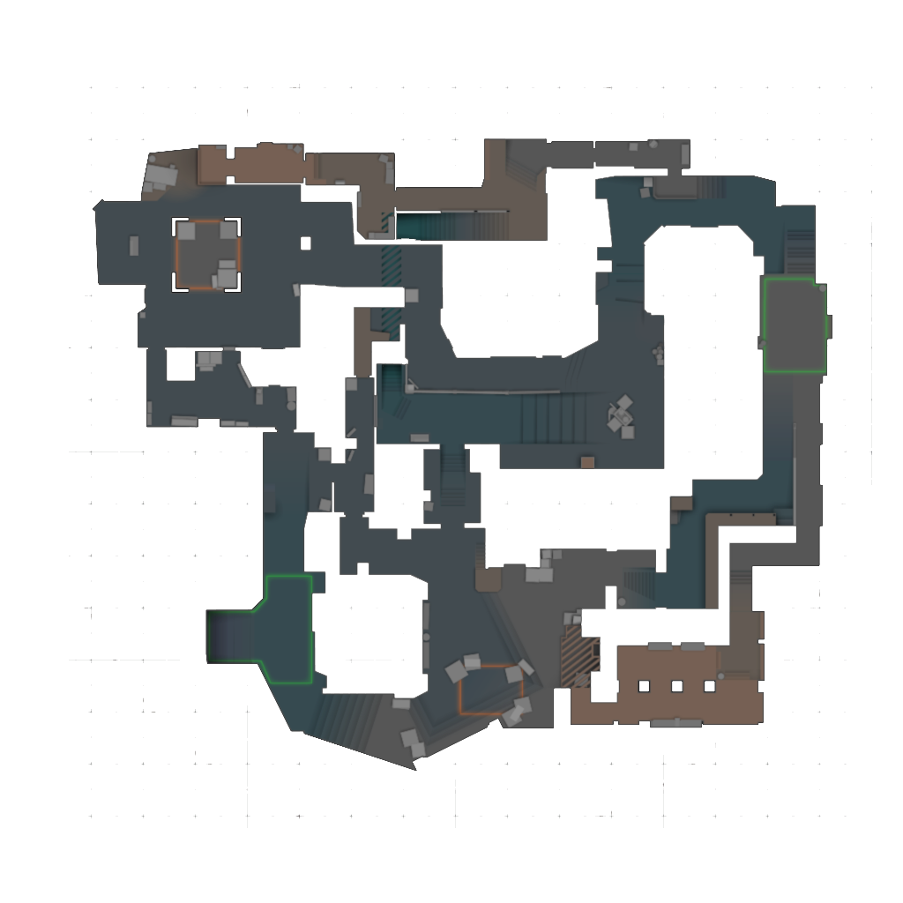 |  |
| 51 | de_overpass | 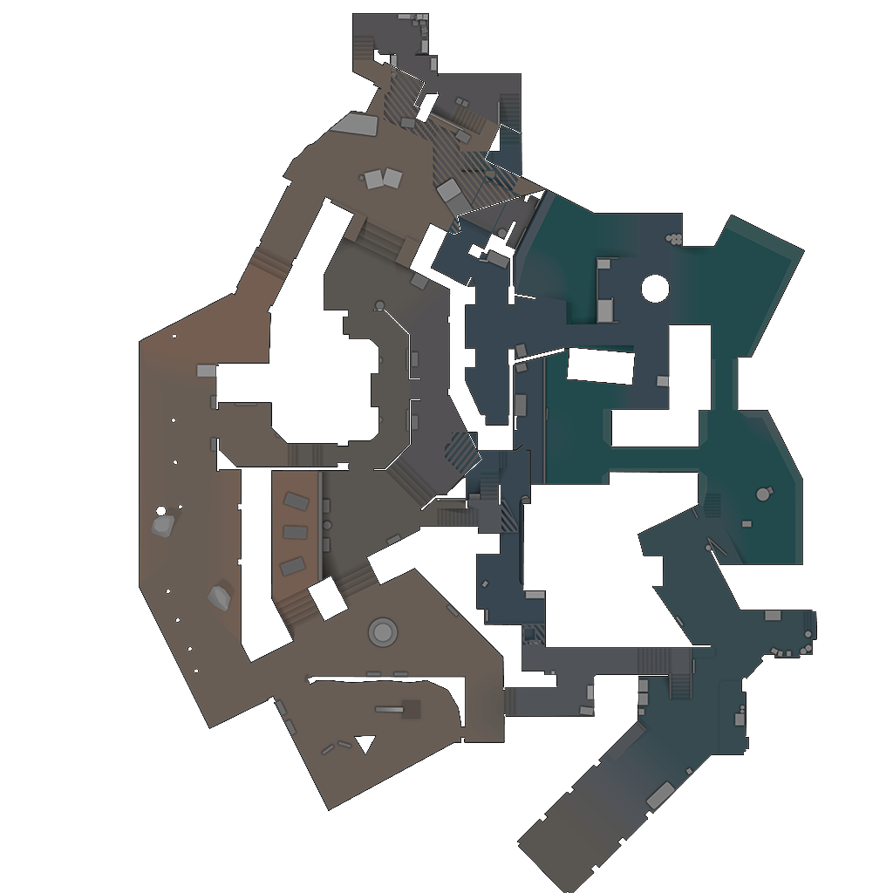 | 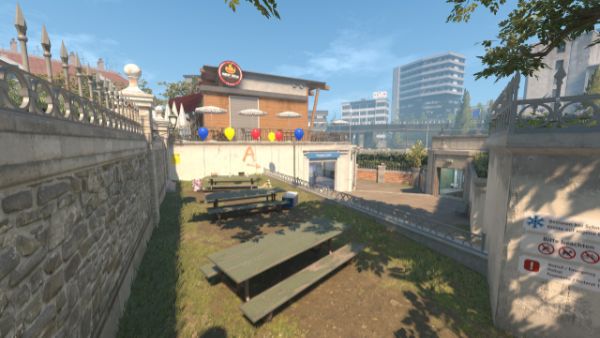 |
| 37 | de_anubis | 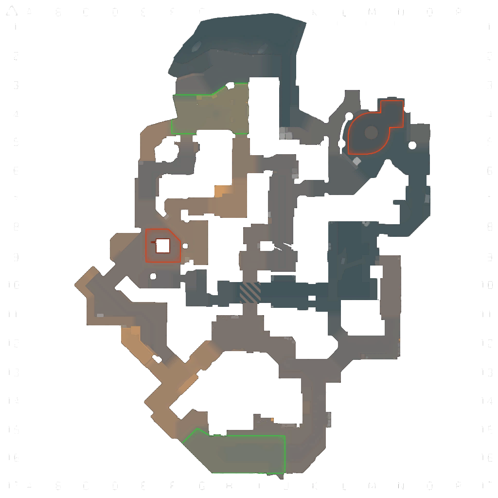 |  |
| 61 | de_inferno | 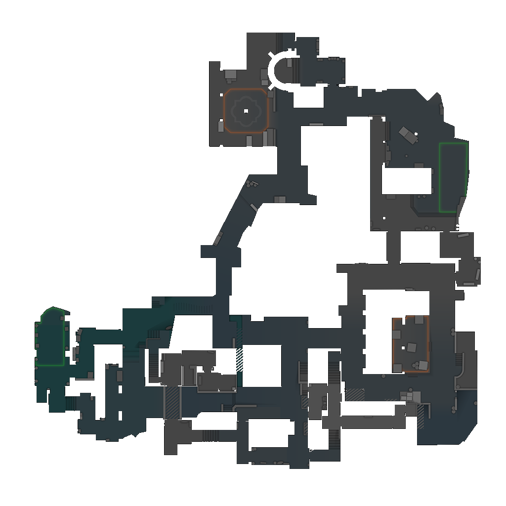 | 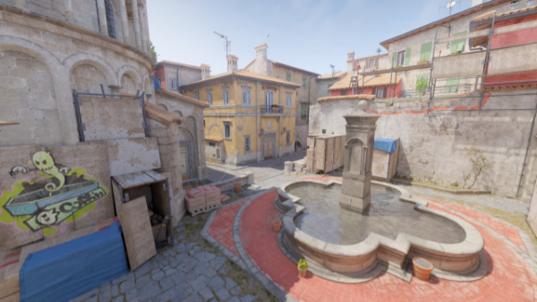 |
| 10 | de_train | 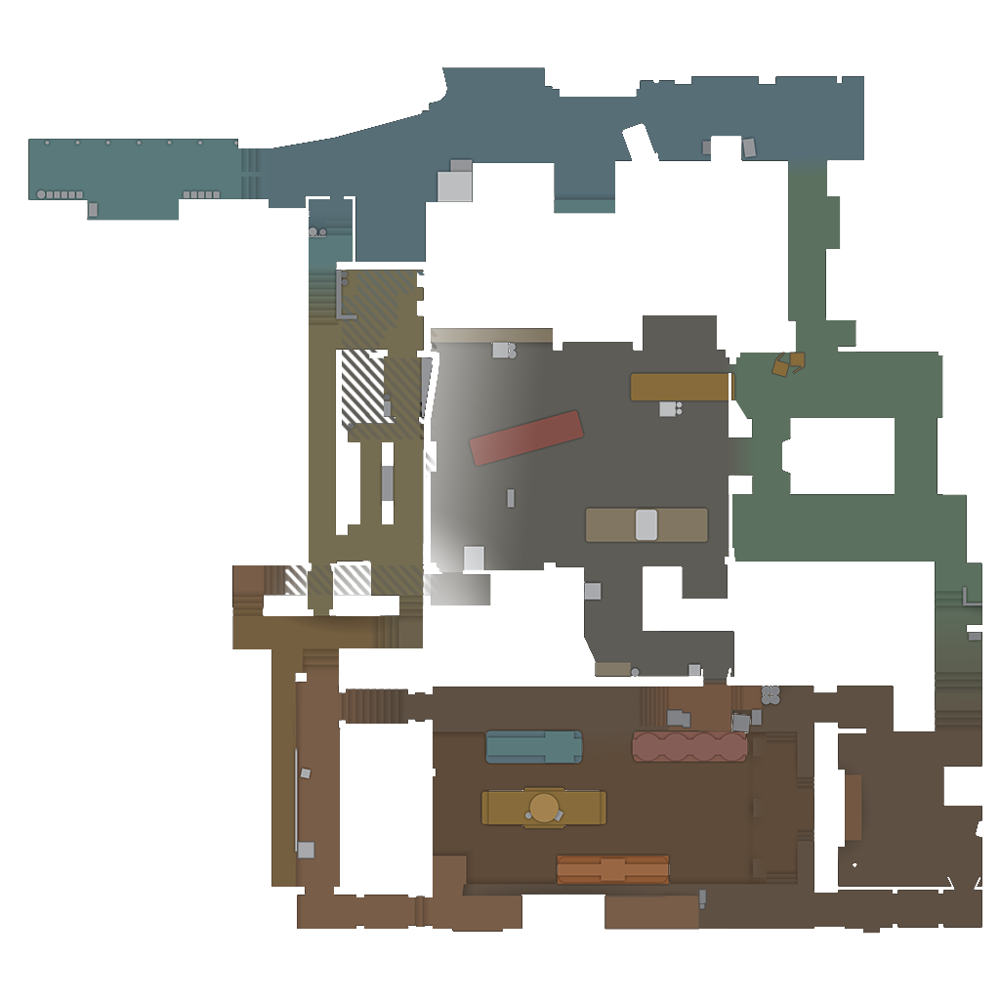 | 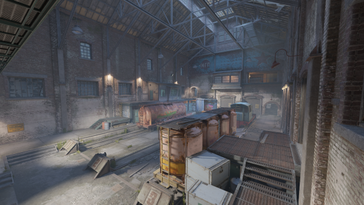 |
| 95 | de_ancient | 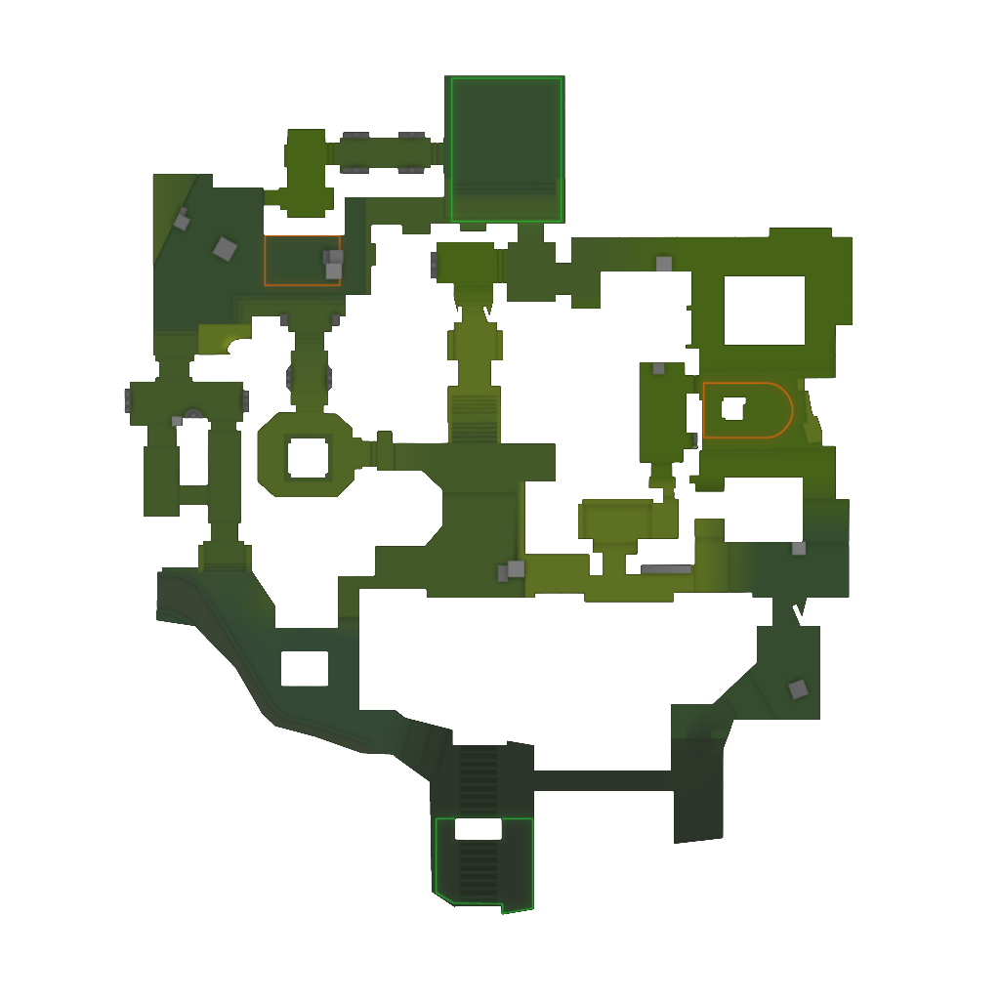 | 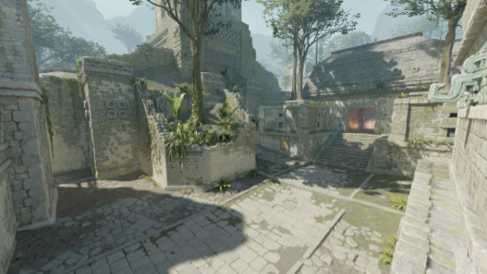 |
| 79 | de_nuke | 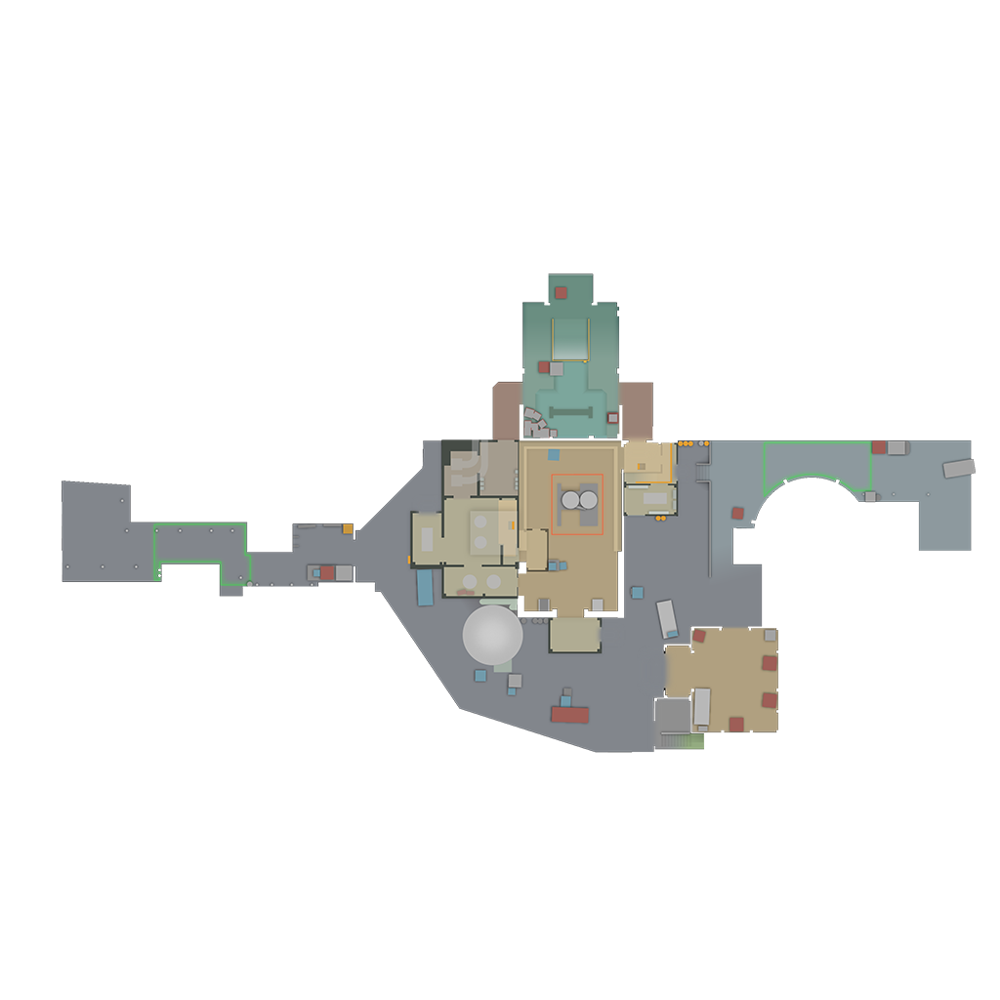 | 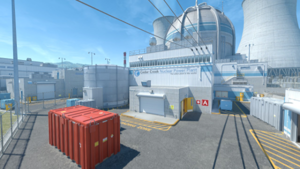 |
| 86 | de_dust2 | 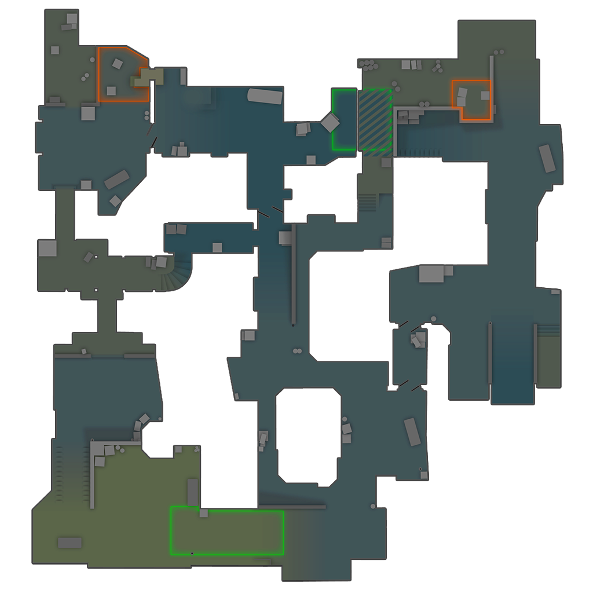 | 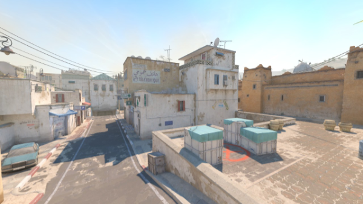 |
:::

<br>

> Nous conservons la possibilité d'enrichir continuellement cette base de données au cours du semestre en relançant notre pipeline, ou en croisant nos résultats avec une [API pour HLTV](https://hltv-api.vercel.app/) afin d'intégrer des statistiques avancées sur les performances des joueurs.

### Structure du Pipeline de Données

::: {style="text-align: justify;"}
Le traitement de nos données suit un flux automatisé divisé en trois étapes clés :

1.  **Collecte :** Récupération des archives `.rar` contenant les fichiers sources (*demos*) depuis les serveurs de [**HLTV**](https://www.hltv.org/). *Chaque archive correspond à un match enregistrer par HLTV.*

2.  **Extraction :** Décompression des archives pour isoler les fichiers **.dem**, formats bruts des données de match.

3.  **Analyse et Stockage :** Utilisation de l'outil [**CSDM (CS Demo Manager)**](https://cs-demo-manager.com/) pour parser (analyser) les fichiers. Ce logiciel extrait les événements de jeu (kills, positions, économie) afin de les structurer et de les injecter directement dans notre base de données **PostgreSQL**.

4.  **Déploiement et Accessibilité :** Mise à disposition des données via un conteneur **PostgreSQL** couplé à l'interface d'administration **CloudBeaver**. [**Accéder à l'interface**](http://if36.collineos.ovh/)

<br>

> **À propos de CSDM :** C'est une solution open-source de référence permettant de traduire le binaire complexe des fichiers démo en données lisibles et exploitables pour l'analyse statistique ou le replay.

> **Note technique :** Afin d'assurer la compatibilité avec l'environnement serveur (Linux/CLI), il a été nécessaire d'extraire l'exécutable binaire de **CSDM** de sa version graphique initiale pour permettre son exécution en ligne de commande sur notre distribution.
:::

<br>

## Schema de la base de données {#schema-de-la-base-de-données}

> Pour voir l'ensemble des liens entre les tables : [schema-bdd](schema-bdd.png)

::::::::::::::::::::::::::::::::::: {style="display:flex; justify-content : center; align-content:center; flex-direction:column"}
### Données générales sur les parties

::: {style="margin:20px"}
**demos** Colonne \| Type \| Commentaire \| \|---------\|------\|-------------\| \| **checksum** \| `varchar` \| Identifiant unique de la partie, souvent un hash ou une somme de contrôle pour vérifier l'intégrité du fichier. \| \| **name** \| `varchar` \| Nom du fichier demo : *Contient généralement les noms des équipes ou un identifiant personnalisé pour la partie.* \| \| **game** \| `varchar` \| Nom du jeu associé au fichier demo : *Toujours "CS2" (Counter-Strike 2).* \| \| **source** \| `varchar` \| Source du fichier demo : *Toujours "valve", indiquant que le fichier provient des serveurs officiels Valve.* \| \| **type** \| `varchar` \| Type de démonstration : *Toujours "GOTV" (Game Observer Television), utilisé pour les replays.* \| \| **date** \| `timestamptz` \| Date et heure de création ou d'enregistrement du fichier demo. \| \| **map_name** \| `varchar` \| Nom de la carte sur laquelle la partie a été jouée (ex: "de_dust2", "de_mirage"). \| \| **tick_count** \| `int4` \| Nombre total de ticks enregistrés dans le fichier demo : *Un tick est une unité de temps dans le moteur du jeu.* \| \| **tickrate** \| `float8` \| Fréquence des ticks par seconde : *Détermine la précision des événements enregistrés (ex: 64 ou 128 ticks/seconde).* \| \| **framerate** \| `float8` \| Nombre d'images par seconde (FPS) du replay. \| \| **duration** \| `float8` \| Durée totale de la partie en secondes. \| \| **server_name** \| `varchar` \| *Inutile* : Nom du serveur où la partie a été jouée. \| \| **client_name** \| `varchar` \| *Inutile* : Nom du client ou du joueur ayant enregistré le demo. \| \| **network_protocol** \| `int4` \| *Inutile* : Version du protocole réseau utilisé pendant la partie. \| \| **build_number** \| `int4` \| *Inutile* : Numéro de build du jeu au moment de l'enregistrement. \| \| **share_code** \| `varchar` \| *Inutile* : Code de partage pour accéder au replay via des plateformes tierces (ex: Faceit, ESEA). \|
:::

::: {style="margin:20px"}
**maps** Colonne \| Type \| Commentaire \| \|---------\|------\|-------------\| \| **id** \| `bigserial` \| Identifiant unique de la carte dans la base de données. \| \| **name** \| `varchar` \| Nom de la carte (ex: "de_dust2", "de_inferno", "de_mirage"). \| \| **game** \| `varchar` \| Version du jeu associée à la carte : *Peut être "CSGO" ou "CS2".* \| \| **position_x** \| `int4` \| Coordonnée X pour le positionnement de la minicarte : *Utilisé pour l'affichage visuel.* \| \| **position_y** \| `int4` \| Coordonnée Y pour le positionnement de la minicarte : *Utilisé pour l'affichage visuel.* \| \| **scale** \| `float4` \| Échelle de la minicarte : *Détermine la taille et le zoom pour l'affichage.* \| \| **threshold_z** \| `int4` \| Seuil Z pour le mapping : *Utilisé pour distinguer les niveaux de hauteur sur la minicarte (ex: étages, sous-sols).* \|
:::

::: {style="margin:20px"}
**matches** Colonne \| Type \| Commentaire \| \|---------\|------\|-------------\| \| **checksum** \| `varchar` \| Identifiant unique de la partie, équivalent à un ID. \| \| **demo_path** \| `varchar` \| Chemin d'accès ou URL vers le fichier demo de la partie. \| \| **game_type** \| `int4` \| Type de partie : *Toujours égal à 0 (uniquement des parties compétitives dans ce contexte).* \| \| **game_mode** \| `int4` \| Mode de jeu : *Toujours égal à 0 (uniquement des parties avec pose de bombe, ex: "Defuse").* \| \| **game_mode_str** \| `varchar` \| Mode de jeu sous forme de chaîne : *Toujours égal à "casual" (dépend d'informations externes au fichier demo).* \| \| **is_ranked** \| `bool` \| Indique si la partie est classée : *Toujours égal à false (dépend d'informations externes au fichier demo).* \| \| **kill_count** \| `int4` \| Nombre total de kills dans la partie. \| \| **death_count** \| `int4` \| Nombre total de morts dans la partie. \| \| **assist_count** \| `int4` \| Nombre total d'assistances dans la partie. \| \| **shot_count** \| `int4` \| Nombre total de tirs effectués pendant la partie. \| \| **analyze_date** \| `timestamptz` \| Date et heure à laquelle la partie a été analysée. \| \| **winner_name** \| `varchar` \| Nom de l'équipe ou du joueur gagnant. \| \| **winner_side** \| `int2` \| Côté du gagnant : *Égal à 3 (Terroristes) ou 2 (Contre-Terroristes).* \| \| **overtime_count** \| `int4` \| Nombre de prolongations jouées pendant la partie. \| \| **max_rounds** \| `int4` \| Nombre maximum de rounds prévus : *Toujours égal à 24 (standard pour les parties compétitives).* \| \| **has_vac_live_ban** \| `bool` \| *Inutile* : Indique si un joueur a été banni par VAC Live pendant la partie. \|
:::

::: {style="margin:20px"}
**rounds** Colonne \| Type \| Commentaire \| \|---------\|------\|-------------\| \| **id** \| `bigserial` \| Identifiant unique du round dans la base de données. \| \| **match_checksum** \| `varchar` \| Identifiant unique de la partie (checksum) à laquelle ce round appartient. \| \| **number** \| `int4` \| Numéro du round dans la partie. \| \| **start_tick** \| `int4` \| Tick de début du round. \| \| **start_frame** \| `int4` \| Frame de début du round. \| \| **freeze_time_end_tick** \| `int4` \| Tick de fin du temps de gel (freeze time). \| \| **freeze_time_end_frame** \| `int4` \| Frame de fin du temps de gel (freeze time). \| \| **end_tick** \| `int4` \| Tick de fin du round. \| \| **end_frame** \| `int4` \| Frame de fin du round. \| \| **end_officially_tick** \| `int4` \| Tick de fin officielle du round (peut inclure des délais supplémentaires). \| \| **end_officially_frame** \| `int4` \| Frame de fin officielle du round (peut inclure des délais supplémentaires). \| \| **team_a_name** \| `varchar` \| Nom de l'équipe A. \| \| **team_b_name** \| `varchar` \| Nom de l'équipe B. \| \| **team_a_score** \| `int4` \| Score de l'équipe A à la fin du round. \| \| **team_b_score** \| `int4` \| Score de l'équipe B à la fin du round. \| \| **team_a_side** \| `int2` \| Côté de l'équipe A : *2 pour Contre-Terroristes, 3 pour Terroristes.* \| \| **team_b_side** \| `int2` \| Côté de l'équipe B : *2 pour Contre-Terroristes, 3 pour Terroristes.* \| \| **team_a_start_money** \| `int4` \| Argent disponible pour l'équipe A au début du round. \| \| **team_b_start_money** \| `int4` \| Argent disponible pour l'équipe B au début du round. \| \| **team_a_equipment_value** \| `int4` \| Valeur totale de l'équipement acheté par l'équipe A pendant le round. \| \| **team_b_equipment_value** \| `int4` \| Valeur totale de l'équipement acheté par l'équipe B pendant le round. \| \| **team_a_money_spent** \| `int4` \| Argent dépensé par l'équipe A pendant le round. \| \| **team_b_money_spent** \| `int4` \| Argent dépensé par l'équipe B pendant le round. \| \| **team_a_economy_type** \| `varchar` \| Type d'économie de l'équipe A (ex: "full buy", "eco", "force buy"). \| \| **team_b_economy_type** \| `varchar` \| Type d'économie de l'équipe B (ex: "full buy", "eco", "force buy"). \| \| **duration** \| `int4` \| Durée totale du round en secondes. \| \| **end_reason** \| `int2` \| Raison de la fin du round (ex: 1 pour victoire des Terroristes, 2 pour victoire des Contre-Terroristes, etc.). \| \| **winner_name** \| `varchar` \| Nom de l'équipe gagnante du round. \| \| **winner_side** \| `int2` \| Côté de l'équipe gagnante : *2 pour Contre-Terroristes, 3 pour Terroristes.* \| \| **overtime_number** \| `int4` \| Numéro de la prolongation si le round fait partie d'une overtime. \|
:::

::: {style="margin:20px"}
**teams** Colonne \| Type \| Commentaire \| \|---------\|------\|-------------\| \| **id** \| `bigserial` \| Identifiant unique de l'équipe dans la base de données. \| \| **match_checksum** \| `varchar` \| Identifiant unique (checksum) de la partie à laquelle cette équipe participe. \| \| **name** \| `varchar` \| Nom de l'équipe. \| \| **current_side** \| `int2` \| Côté actuel de l'équipe : *2 pour Contre-Terroristes, 3 pour Terroristes.* \| \| **score** \| `int4` \| Score total de l'équipe à la fin de la partie. \| \| **score_first_half** \| `int4` \| Score de l'équipe à la fin de la première mi-temps. \| \| **score_second_half** \| `int4` \| Score de l'équipe à la fin de la deuxième mi-temps. \| \| **letter** \| `varchar` \| Lettre attribuée à l'équipe (ex: "A" ou "B") pour la différencier dans la partie. \|
:::

::: {style="margin:20px"}
**kills** Colonne \| Type \| Commentaire \| \|---------\|------\|-------------\| \| **id** \| `bigserial` \| Identifiant unique du kill dans la base de données. \| \| **match_checksum** \| `varchar` \| Identifiant unique (checksum) de la partie où le kill a eu lieu. \| \| **round_number** \| `int4` \| Numéro du round pendant lequel le kill a été enregistré. \| \| **tick** \| `int4` \| Tick précis auquel le kill a eu lieu. \| \| **frame** \| `int4` \| Frame précise à laquelle le kill a eu lieu. \| \| **killer_steam_id** \| `varchar` \| Identifiant Steam du joueur ayant effectué le kill. \| \| **killer_name** \| `varchar` \| Nom du joueur ayant effectué le kill. \| \| **killer_team_name** \| `varchar` \| Nom de l'équipe du tueur. \| \| **killer_side** \| `int2` \| Côté du tueur : *2 pour Contre-Terroristes, 3 pour Terroristes.* \| \| **victim_steam_id** \| `varchar` \| Identifiant Steam du joueur victime. \| \| **victim_name** \| `varchar` \| Nom du joueur victime. \| \| **victim_team_name** \| `varchar` \| Nom de l'équipe de la victime. \| \| **victim_side** \| `int2` \| Côté de la victime : *2 pour Contre-Terroristes, 3 pour Terroristes.* \| \| **assister_steam_id** \| `varchar` \| Identifiant Steam du joueur ayant assisté au kill (si applicable). \| \| **assister_name** \| `varchar` \| Nom du joueur ayant assisté au kill (si applicable). \| \| **assister_team_name** \| `varchar` \| Nom de l'équipe de l'assistant (si applicable). \| \| **assister_side** \| `int2` \| Côté de l'assistant : *2 pour Contre-Terroristes, 3 pour Terroristes (si applicable).* \| \| **is_headshot** \| `bool` \| Indique si le kill est un headshot. \| \| **is_assisted_flash** \| `bool` \| Indique si le kill a été assisté par un flashbang. \| \| **penetrated_objects** \| `int4` \| Nombre d'objets traversés par le tir (ex: murs, caisses). \| \| **killer_x** \| `float8` \| Coordonnée X du tueur au moment du kill. \| \| **killer_y** \| `float8` \| Coordonnée Y du tueur au moment du kill. \| \| **killer_z** \| `float8` \| Coordonnée Z du tueur au moment du kill. \| \| **is_killer_airbone** \| `bool` \| Indique si le tueur était en l'air (sautant) au moment du kill. \| \| **is_killer_blinded** \| `bool` \| Indique si le tueur était aveuglé (par un flashbang) au moment du kill. \| \| **victim_x** \| `float8` \| Coordonnée X de la victime au moment du kill. \| \| **victim_y** \| `float8` \| Coordonnée Y de la victime au moment du kill. \| \| **victim_z** \| `float8` \| Coordonnée Z de la victime au moment du kill. \| \| **is_victim_airbone** \| `bool` \| Indique si la victime était en l'air (sautant) au moment du kill. \| \| **is_victim_blinded** \| `bool` \| Indique si la victime était aveuglée (par un flashbang) au moment du kill. \| \| **is_victim_inspecting_weapon** \| `bool` \| Indique si la victime était en train d'inspecter son arme au moment du kill. \| \| **assister_x** \| `float8` \| Coordonnée X de l'assistant au moment du kill (si applicable). \| \| **assister_y** \| `float8` \| Coordonnée Y de l'assistant au moment du kill (si applicable). \| \| **assister_z** \| `float8` \| Coordonnée Z de l'assistant au moment du kill (si applicable). \| \| **weapon_name** \| `varchar` \| Nom de l'arme utilisée pour le kill. \| \| **weapon_type** \| `varchar` \| Type de l'arme utilisée (ex: "Rifle", "Pistol", "Knife"). \| \| **is_killer_controlling_bot** \| `bool` \| Indique si le tueur contrôlait un bot au moment du kill. \| \| **is_victim_controlling_bot** \| `bool` \| Indique si la victime était un bot contrôlé au moment du kill. \| \| **is_assister_controlling_bot** \| `bool` \| Indique si l'assistant contrôlait un bot au moment du kill (si applicable). \| \| **is_trade_kill** \| `bool` \| Indique si ce kill fait partie d'un échange de kills (trade kill). \| \| **is_trade_death** \| `bool` \| Indique si ce kill est une mort échangée (trade death). \| \| **is_trough_smoke** \| `bool` \| Indique si le tir a traversé de la fumée. \| \| **is_no_scope** \| `bool` \| Indique si le kill a été effectué sans viseur (no scope). \| \| **distance** \| `float8` \| Distance entre le tueur et la victime au moment du kill. \|
:::

::: {style="margin:20px"}
**shots** Colonne \| Type \| Commentaire \| \|---------\|------\|-------------\| \| **id** \| `bigserial` \| Identifiant unique du tir dans la base de données. \| \| **match_checksum** \| `varchar` \| Identifiant unique (checksum) de la partie où le tir a été effectué. \| \| **round_number** \| `int4` \| Numéro du round pendant lequel le tir a été effectué. \| \| **tick** \| `int4` \| Tick précis auquel le tir a été effectué. \| \| **frame** \| `int4` \| Frame précise à laquelle le tir a été effectué. \| \| **weapon_name** \| `varchar` \| Nom de l'arme utilisée pour le tir. \| \| **weapon_id** \| `varchar` \| Identifiant unique de l'arme dans le jeu. \| \| **projectile_id** \| `varchar` \| Identifiant unique du projectile tiré (si applicable). \| \| **player_steam_id** \| `varchar` \| Identifiant Steam du joueur ayant tiré. \| \| **player_side** \| `int2` \| Côté du joueur : *2 pour Contre-Terroristes, 3 pour Terroristes.* \| \| **player_name** \| `varchar` \| Nom du joueur ayant tiré. \| \| **player_team_name** \| `varchar` \| Nom de l'équipe du joueur. \| \| **is_player_controlling_bot** \| `bool` \| Indique si le joueur contrôlait un bot au moment du tir. \| \| **x** \| `float8` \| Coordonnée X du joueur au moment du tir. \| \| **y** \| `float8` \| Coordonnée Y du joueur au moment du tir. \| \| **z** \| `float8` \| Coordonnée Z du joueur au moment du tir. \| \| **player_velocity_x** \| `float8` \| Vitesse du joueur sur l'axe X au moment du tir. \| \| **player_velocity_y** \| `float8` \| Vitesse du joueur sur l'axe Y au moment du tir. \| \| **player_velocity_z** \| `float8` \| Vitesse du joueur sur l'axe Z au moment du tir. \| \| **player_yaw** \| `float8` \| Angle de rotation horizontale (yaw) du joueur au moment du tir. \| \| **player_pitch** \| `float8` \| Angle de rotation verticale (pitch) du joueur au moment du tir. \| \| **recoil_index** \| `float8` \| Index de recul de l'arme au moment du tir (influe sur la précision). \| \| **aim_punch_angle_x** \| `float8` \| Angle de perturbation de la visée (aim punch) sur l'axe X, dû au recul ou à des dégâts subis. \| \| **aim_punch_angle_y** \| `float8` \| Angle de perturbation de la visée (aim punch) sur l'axe Y, dû au recul ou à des dégâts subis. \| \| **view_punch_angle_x** \| `float8` \| Angle de perturbation de la vue (view punch) sur l'axe X, souvent causé par des explosions ou des impacts. \| \| **view_punch_angle_y** \| `float8` \| Angle de perturbation de la vue (view punch) sur l'axe Y, souvent causé par des explosions ou des impacts. \|
:::

::: {style="margin:20px"}
**damages** Colonne \| Type \| Commentaire \| \|---------\|------\|-------------\| \| **id** \| `bigserial` \| Identifiant unique du dégât infligé dans la base de données. \| \| **match_checksum** \| `varchar` \| Identifiant unique (checksum) de la partie où le dégât a été infligé. \| \| **round_number** \| `int4` \| Numéro du round pendant lequel le dégât a été infligé. \| \| **tick** \| `int4` \| Tick précis auquel le dégât a été infligé. \| \| **frame** \| `int4` \| Frame précise à laquelle le dégât a été infligé. \| \| **health_damage** \| `int4` \| Quantité de dégâts infligés à la santé de la victime. \| \| **armor_damage** \| `int4` \| Quantité de dégâts infligés à l'armure de la victime. \| \| **victim_new_health** \| `int4` \| Santé restante de la victime après avoir subi le dégât. \| \| **victim_armor** \| `int4` \| Quantité d'armure de la victime avant le dégât. \| \| **victim_new_armor** \| `int4` \| Quantité d'armure restante de la victime après le dégât. \| \| **is_victim_controlling_bot** \| `bool` \| Indique si la victime contrôlait un bot au moment du dégât. \| \| **hitgroup** \| `int2` \| Groupe de touchés (hitgroup) : *1 pour tête, 2 pour torse, 3 pour estomac, 4 pour bras, 5 pour jambes.* \| \| **weapon_name** \| `varchar` \| Nom de l'arme utilisée pour infliger le dégât. \| \| **weapon_type** \| `varchar` \| Type de l'arme utilisée (ex: "Rifle", "Pistol", "Knife", "Grenade"). \| \| **attacker_steam_id** \| `varchar` \| Identifiant Steam du joueur ayant infligé le dégât. \| \| **attacker_side** \| `int2` \| Côté de l'attaquant : *2 pour Contre-Terroristes, 3 pour Terroristes.* \| \| **attacker_team_name** \| `varchar` \| Nom de l'équipe de l'attaquant. \| \| **is_attacker_controlling_bot** \| `bool` \| Indique si l'attaquant contrôlait un bot au moment du dégât. \| \| **victim_steam_id** \| `varchar` \| Identifiant Steam de la victime. \| \| **victim_side** \| `int2` \| Côté de la victime : *2 pour Contre-Terroristes, 3 pour Terroristes.* \| \| **victim_team_name** \| `varchar` \| Nom de l'équipe de la victime. \| \| **weapon_unique_id** \| `varchar` \| Identifiant unique de l'arme dans le jeu ayant infligé le dégât. \|
:::

::: {style="margin:20px"}
**chat_messages** Colonne \| Type \| Commentaire \| \|---------\|------\|-------------\| \| **id** \| `bigserial` \| Identifiant unique du message dans la base de données. \| \| **match_checksum** \| `varchar` \| Identifiant unique (checksum) de la partie où le message a été envoyé. \| \| **round_number** \| `int4` \| Numéro du round pendant lequel le message a été envoyé. \| \| **tick** \| `int4` \| Tick précis auquel le message a été envoyé. \| \| **frame** \| `int4` \| Frame précise à laquelle le message a été envoyé. \| \| **message** \| `varchar` \| Contenu textuel du message envoyé dans le chat. \| \| **sender_steam_id** \| `varchar` \| Identifiant Steam de l'expéditeur du message. \| \| **sender_name** \| `varchar` \| Nom de l'expéditeur du message. \| \| **sender_is_alive** \| `bool` \| Indique si l'expéditeur était en vie au moment de l'envoi du message. \| \| **sender_side** \| `int2` \| Côté de l'expéditeur : *2 pour Contre-Terroristes, 3 pour Terroristes.* \|
:::

::: {style="margin:20px"}
**clutches** Colonne \| Type \| Commentaire \| \|---------\|------\|-------------\| \| **id** \| `bigserial` \| Identifiant unique du clutch dans la base de données. \| \| **match_checksum** \| `varchar` \| Identifiant unique (checksum) de la partie où le clutch a eu lieu. \| \| **round_number** \| `int4` \| Numéro du round pendant lequel le clutch s'est produit. \| \| **tick** \| `int4` \| Tick précis auquel le clutch a commencé. \| \| **frame** \| `int4` \| Frame précise à laquelle le clutch a commencé. \| \| **clutcher_name** \| `varchar` \| Nom du joueur réalisant le clutch. \| \| **clutcher_steam_id** \| `varchar` \| Identifiant Steam du joueur réalisant le clutch. \| \| **won** \| `bool` \| Indique si le clutch a été remporté par le joueur. \| \| **side** \| `int2` \| Côté du joueur en clutch : *2 pour Contre-Terroristes, 3 pour Terroristes.* \| \| **opponent_count** \| `int4` \| Nombre d'adversaires restants au début du clutch. \| \| **has_clutcher_survived** \| `bool` \| Indique si le joueur a survécu à la fin du clutch. \| \| **clutcher_kill_count** \| `int4` \| Nombre de kills réalisés par le joueur pendant le clutch. \|
:::

### Données sur les joueurs

::: {style="margin:20px"}
**players** Colonne \| Type \| Commentaire \| \|---------\|------\|-------------\| \| **id** \| `bigserial` \| Identifiant unique du joueur dans la base de données pour cette partie. \| \| **match_checksum** \| `varchar` \| Identifiant unique (checksum) de la partie. \| \| **steam_id** \| `varchar` \| Identifiant Steam du joueur. \| \| **index** \| `int2` \| Index du joueur dans la partie (position dans la liste des joueurs). \| \| **team_name** \| `varchar` \| Nom de l'équipe du joueur. \| \| **name** \| `varchar` \| Nom du joueur. \| \| **kill_count** \| `int4` \| Nombre total de kills du joueur pendant la partie. \| \| **death_count** \| `int4` \| Nombre total de morts du joueur pendant la partie. \| \| **assist_count** \| `int4` \| Nombre total d'assistances du joueur pendant la partie. \| \| **kill_death_ratio** \| `float4` \| Ratio kills/morts du joueur. \| \| **headshot_count** \| `int4` \| Nombre total de headshots réalisés par le joueur. \| \| **headshot_percentage** \| `float4` \| Pourcentage de headshots parmi les kills du joueur. \| \| **damage_health** \| `int4` \| Total des dégâts infligés à la santé des adversaires. \| \| **damage_armor** \| `int4` \| Total des dégâts infligés à l'armure des adversaires. \| \| **first_kill_count** \| `int4` \| Nombre de fois où le joueur a réalisé le premier kill d'un round. \| \| **first_death_count** \| `int4` \| Nombre de fois où le joueur est mort en premier dans un round. \| \| **mvp_count** \| `int4` \| Nombre de fois où le joueur a été MVP (Most Valuable Player) d'un round. \| \| **average_damage_per_round** \| `float4` \| Moyenne des dégâts infligés par round. \| \| **average_kill_per_round** \| `float4` \| Moyenne de kills par round. \| \| **average_death_per_round** \| `float4` \| Moyenne de morts par round. \| \| **utility_damage_per_round** \| `float4` \| Moyenne des dégâts infligés par les utilitaires (grenades, etc.) par round. \| \| **rank_type** \| `int4` \| *Donnée non renseignée* : Type de rang du joueur (ex: compétitif, wingman). \| \| **rank** \| `int4` \| *Donnée non renseignée* : Rang actuel du joueur. \| \| **old_rank** \| `int4` \| *Donnée non renseignée* : Ancien rang du joueur avant la partie. \| \| **wins_count** \| `int4` \| Nombre total de victoires du joueur. \| \| **bomb_planted_count** \| `int4` \| Nombre de bombes posées par le joueur. \| \| **bomb_defused_count** \| `int4` \| Nombre de bombes désamorçées par le joueur. \| \| **hostage_rescued_count** \| `int4` \| *Inutile* : Nombre d'otages sauvés (mode non pertinent pour CS2 compétitif). \| \| **score** \| `int4` \| Score total du joueur à la fin de la partie. \| \| **kast** \| `float4` \| Pourcentage de rounds où le joueur a tué, assisté, survécu ou échangé un kill. \| \| **hltv_rating** \| `float4` \| *Donnée liée au site HLTV* : Note calculée par HLTV reflétant la performance globale. \| \| **hltv_rating_2** \| `float4` \| *Donnée liée au site HLTV* : Variante ou mise à jour du HLTV rating. \| \| **utility_damage** \| `int4` \| Total des dégâts infligés par les utilitaires (grenades, etc.). \| \| **trade_kill_count** \| `int4` \| Nombre de kills échangés (trade kills) par le joueur. \| \| **trade_death_count** \| `int4` \| Nombre de morts échangées (trade deaths) du joueur. \| \| **first_trade_kill_count** \| `int4` \| Nombre de fois où le joueur a réalisé le premier kill d'un échange. \| \| **first_trade_death_count** \| `int4` \| Nombre de fois où le joueur est mort en premier lors d'un échange. \| \| **one_kill_count** \| `int4` \| Nombre de rounds avec exactement un kill. \| \| **two_kill_count** \| `int4` \| Nombre de rounds avec exactement deux kills. \| \| **three_kill_count** \| `int4` \| Nombre de rounds avec exactement trois kills. \| \| **four_kill_count** \| `int4` \| Nombre de rounds avec exactement quatre kills. \| \| **five_kill_count** \| `int4` \| Nombre de rounds avec exactement cinq kills (ace). \| \| **inspect_weapon_count** \| `int4` \| Nombre de fois où le joueur a inspecté son arme. \| \| **color** \| `int4` \| Couleur associée au joueur (pour l'affichage ou l'interface). \| \| **crosshair_share_code** \| `varchar` \| Code de partage du crosshair du joueur. \|
:::

::: {style="margin:20px"}
**player_buys** Colonne \| Type \| Commentaire \| \|---------\|------\|-------------\| \| **id** \| `bigserial` \| Identifiant unique de l'achat dans la base de données. \| \| **match_checksum** \| `varchar` \| Identifiant unique (checksum) de la partie où l'achat a été effectué. \| \| **round_number** \| `int4` \| Numéro du round pendant lequel l'achat a été effectué. \| \| **tick** \| `int4` \| Tick précis auquel l'achat a été effectué. \| \| **frame** \| `int4` \| Frame précise à laquelle l'achat a été effectué. \| \| **player_steam_id** \| `varchar` \| Identifiant Steam du joueur ayant effectué l'achat. \| \| **player_name** \| `varchar` \| Nom du joueur ayant effectué l'achat. \| \| **weapon_name** \| `varchar` \| Nom de l'arme ou de l'équipement acheté. \| \| **weapon_type** \| `varchar` \| Type de l'arme ou de l'équipement acheté (ex: "Rifle", "Pistol", "Grenade", "Equipment"). \| \| **weapon_unique_id** \| `varchar` \| Identifiant unique de l'arme ou de l'équipement dans le jeu. \| \| **has_refunded** \| `bool` \| Indique si l'achat a été remboursé (annulé) par le joueur. \|
:::

::: {style="margin:20px"}
**player_economies** Colonne \| Type \| Commentaire \| \|---------\|------\|-------------\| \| **id** \| `bigserial` \| Identifiant unique de l'économie du joueur pour ce round dans la base de données. \| \| **match_checksum** \| `varchar` \| Identifiant unique (checksum) de la partie. \| \| **round_number** \| `int4` \| Numéro du round concerné. \| \| **player_steam_id** \| `varchar` \| Identifiant Steam du joueur. \| \| **player_name** \| `varchar` \| Nom du joueur. \| \| **player_side** \| `int2` \| Côté du joueur : *2 pour Contre-Terroristes, 3 pour Terroristes.* \| \| **start_money** \| `int4` \| Argent disponible pour le joueur au début du round. \| \| **money_spent** \| `int4` \| Argent dépensé par le joueur pendant le round. \| \| **equipement_value** \| `int4` \| Valeur totale de l'équipement acheté par le joueur pendant le round. \| \| **type** \| `varchar` \| Type d'économie du joueur pour ce round (ex: "full buy", "eco", "force buy", "semi-eco"). \|
:::

::: {style="margin:20px"}
**player_blinds** Colonne \| Type \| Commentaire \| \|---------\|------\|-------------\| \| **id** \| `bigserial` \| Identifiant unique de l'éblouissement dans la base de données. \| \| **match_checksum** \| `varchar` \| Identifiant unique (checksum) de la partie où l'éblouissement a eu lieu. \| \| **round_number** \| `int4` \| Numéro du round pendant lequel l'éblouissement a eu lieu. \| \| **tick** \| `int4` \| Tick précis auquel l'éblouissement a commencé. \| \| **frame** \| `int4` \| Frame précise à laquelle l'éblouissement a commencé. \| \| **duration** \| `float8` \| Durée totale de l'éblouissement en secondes. \| \| **flasher_steam_id** \| `varchar` \| Identifiant Steam du joueur ayant lancé le flashbang. \| \| **flasher_name** \| `varchar` \| Nom du joueur ayant lancé le flashbang. \| \| **flasher_side** \| `int2` \| Côté du joueur ayant lancé le flashbang : *2 pour Contre-Terroristes, 3 pour Terroristes.* \| \| **is_flasher_controlling_bot** \| `int2` \| Indique si le joueur ayant lancé le flashbang contrôlait un bot. \| \| **flashed_steam_id** \| `varchar` \| Identifiant Steam du joueur ébloui. \| \| **flashed_name** \| `varchar` \| Nom du joueur ébloui. \| \| **flashed_side** \| `int2` \| Côté du joueur ébloui : *2 pour Contre-Terroristes, 3 pour Terroristes.* \| \| **is_flashed_controlling_bot** \| `bool` \| Indique si le joueur ébloui contrôlait un bot. \|
:::

::: {style="margin:20px"}
**player_positions** Colonne \| Type \| Commentaire \| \|---------\|------\|-------------\| \| **id** \| `bigserial` \| Identifiant unique de la position du joueur dans la base de données. \| \| **match_checksum** \| `varchar` \| Identifiant unique (checksum) de la partie. \| \| **round_number** \| `int4` \| Numéro du round concerné. \| \| **tick** \| `int4` \| Tick précis auquel la position a été enregistrée. \| \| **frame** \| `int4` \| Frame précise à laquelle la position a été enregistrée. \| \| **steam_id** \| `varchar` \| Identifiant Steam du joueur. \| \| **name** \| `varchar` \| Nom du joueur. \| \| **team_name** \| `varchar` \| Nom de l'équipe du joueur. \| \| **side** \| `int2` \| Côté du joueur : *2 pour Contre-Terroristes, 3 pour Terroristes.* \| \| **x** \| `float8` \| Coordonnée X de la position du joueur. \| \| **y** \| `float8` \| Coordonnée Y de la position du joueur. \| \| **z** \| `float8` \| Coordonnée Z de la position du joueur. \| \| **yaw** \| `float4` \| Angle de rotation horizontale (yaw) du joueur. \| \| **is_alive** \| `bool` \| Indique si le joueur est en vie. \| \| **is_blinded** \| `bool` \| Indique si le joueur est ébloui (par un flashbang). \| \| **is_airborne** \| `bool` \| Indique si le joueur est dans les airs (saut, chute). \| \| **is_ducking** \| `bool` \| Indique si le joueur est accroupi. \| \| **is_walking** \| `bool` \| Indique si le joueur est en train de marcher (et non de courir). \| \| **is_scoped** \| `bool` \| Indique si le joueur utilise le viseur de son arme. \| \| **active_weapon_name** \| `varchar` \| Nom de l'arme active du joueur. \| \| **health** \| `int4` \| Points de vie actuels du joueur. \| \| **armor** \| `int4` \| Points d'armure actuels du joueur. \| \| **has_helmet** \| `bool` \| Indique si le joueur porte un casque. \| \| **has_defuse_kit** \| `bool` \| Indique si le joueur possède un kit de désamorçage (side CT uniquement). \| \| **equipment_value** \| `int4` \| Valeur totale de l'équipement actuel du joueur. \| \| **money** \| `int4` \| Argent actuel du joueur. \|
:::

::: {style="margin:20px"}
**steam_accounts** Colonne \| Type \| Commentaire \| \|---------\|------\|-------------\| \| **steam_id** \| `varchar` \| Identifiant Steam unique du compte. \| \| **name** \| `varchar` \| Nom d'utilisateur ou pseudonyme du compte Steam. \| \| **avatar** \| `varchar` \| URL ou chemin vers l'avatar du compte. \| \| **last_ban_date** \| `timestamptz` \| Date et heure du dernier bannissement (VAC, jeu, communauté). \| \| **is_community_banned** \| `bool` \| Indique si le compte est banni de la communauté Steam. \| \| **has_private_profile** \| `bool` \| Indique si le profil Steam est privé. \| \| **vac_ban_count** \| `int4` \| Nombre total de bannissements VAC (Valves Anti-Cheat) sur le compte. \| \| **game_ban_count** \| `int4` \| Nombre total de bannissements de jeu (hors VAC). \| \| **economy_ban** \| `varchar` \| Statut du bannissement économique (ex: "none", "probation", "banned"). \| \| **creation_date** \| `timestamptz` \| Date et heure de création du compte Steam. \| \| **created_at** \| `timestamp` \| Date et heure de création de l'entrée dans la base de données. \| \| **updated_at** \| `timestamp` \| Date et heure de la dernière mise à jour de l'entrée dans la base de données. \|
:::

### Données sur les bombes

::: {style="margin:20px"}
**bombs_defused** Colonne \| Type \| Commentaire \| \|---------\|------\|-------------\| \| **id** \| `bigserial` \| Identifiant unique du désamorçage dans la base de données. \| \| **match_checksum** \| `varchar` \| Identifiant unique (checksum) de la partie où la bombe a été désamorcée. \| \| **round_number** \| `int4` \| Numéro du round pendant lequel la bombe a été désamorcée. \| \| **tick** \| `int4` \| Tick précis auquel la bombe a été désamorcée. \| \| **frame** \| `int4` \| Frame précise à laquelle la bombe a été désamorcée. \| \| **site** \| `varchar` \| Site de désamorçage (ex: "A", "B"). \| \| **defuser_steam_id** \| `varchar` \| Identifiant Steam du joueur ayant désamorcé la bombe. \| \| **defuser_name** \| `varchar` \| Nom du joueur ayant désamorcé la bombe. \| \| **is_defuser_controlling_bot** \| `bool` \| Indique si le joueur contrôlait un bot au moment du désamorçage. \| \| **x** \| `float8` \| Coordonnée X de la position du désamorçage. \| \| **y** \| `float8` \| Coordonnée Y de la position du désamorçage. \| \| **z** \| `float8` \| Coordonnée Z de la position du désamorçage. \| \| **ct_alive_count** \| `int4` \| Nombre de Contre-Terroristes en vie au moment du désamorçage. \| \| **t_alive_count** \| `int4` \| Nombre de Terroristes en vie au moment du désamorçage. \|
:::

::: {style="margin:20px"}
**bombs_defuse_start** Colonne \| Type \| Commentaire \| \|---------\|------\|-------------\| \| **id** \| `bigserial` \| Identifiant unique du début de désamorçage dans la base de données. \| \| **match_checksum** \| `varchar` \| Identifiant unique (checksum) de la partie où le désamorçage a commencé. \| \| **round_number** \| `int4` \| Numéro du round pendant lequel le désamorçage a commencé. \| \| **tick** \| `int4` \| Tick précis auquel le désamorçage a commencé. \| \| **frame** \| `int4` \| Frame précise à laquelle le désamorçage a commencé. \| \| **defuser_steam_id** \| `varchar` \| Identifiant Steam du joueur ayant commencé à désamorcer la bombe. \| \| **defuser_name** \| `varchar` \| Nom du joueur ayant commencé à désamorcer la bombe. \| \| **is_defuser_controlling_bot** \| `bool` \| Indique si le joueur contrôlait un bot au moment du début du désamorçage. \| \| **x** \| `float8` \| Coordonnée X de la position du début de désamorçage. \| \| **y** \| `float8` \| Coordonnée Y de la position du début de désamorçage. \| \| **z** \| `float8` \| Coordonnée Z de la position du début de désamorçage. \|
:::

::: {style="margin:20px"}
**bombs_exploded** Colonne \| Type \| Commentaire \| \|---------\|------\|-------------\| \| **id** \| `bigserial` \| Identifiant unique de l'explosion de bombe dans la base de données. \| \| **match_checksum** \| `varchar` \| Identifiant unique (checksum) de la partie où la bombe a explosé. \| \| **round_number** \| `int4` \| Numéro du round pendant lequel la bombe a explosé. \| \| **tick** \| `int4` \| Tick précis auquel la bombe a explosé. \| \| **frame** \| `int4` \| Frame précise à laquelle la bombe a explosé. \| \| **site** \| `varchar` \| Site où la bombe a explosé (ex: "A", "B"). \| \| **planter_steam_id** \| `varchar` \| Identifiant Steam du joueur ayant posé la bombe. \| \| **planter_name** \| `varchar` \| Nom du joueur ayant posé la bombe. \| \| **is_planter_controlling_bot** \| `bool` \| Indique si le joueur contrôlait un bot au moment de la pose de la bombe. \| \| **x** \| `float8` \| Coordonnée X de la position de l'explosion. \| \| **y** \| `float8` \| Coordonnée Y de la position de l'explosion. \| \| **z** \| `float8` \| Coordonnée Z de la position de l'explosion. \|
:::

::: {style="margin:20px"}
**bombs_plant_start** Colonne \| Type \| Commentaire \| \|---------\|------\|-------------\| \| **id** \| `bigserial` \| Identifiant unique du début de pose de bombe dans la base de données. \| \| **match_checksum** \| `varchar` \| Identifiant unique (checksum) de la partie où la pose de bombe a commencé. \| \| **round_number** \| `int4` \| Numéro du round pendant lequel la pose de bombe a commencé. \| \| **tick** \| `int4` \| Tick précis auquel la pose de bombe a commencé. \| \| **frame** \| `int4` \| Frame précise à laquelle la pose de bombe a commencé. \| \| **site** \| `varchar` \| Site où la bombe est en train d'être posée (ex: "A", "B"). \| \| **planter_steam_id** \| `varchar` \| Identifiant Steam du joueur posant la bombe. \| \| **planter_name** \| `varchar` \| Nom du joueur posant la bombe. \| \| **is_planter_controlling_bot** \| `bool` \| Indique si le joueur contrôlait un bot au moment du début de la pose. \| \| **x** \| `float8` \| Coordonnée X de la position du début de pose. \| \| **y** \| `float8` \| Coordonnée Y de la position du début de pose. \| \| **z** \| `float8` \| Coordonnée Z de la position du début de pose. \|
:::

::: {style="margin:20px"}
**bombs_planted** Colonne \| Type \| Commentaire \| \|---------\|------\|-------------\| \| **id** \| `bigserial` \| Identifiant unique de la pose de bombe dans la base de données. \| \| **match_checksum** \| `varchar` \| Identifiant unique (checksum) de la partie où la bombe a été posée. \| \| **round_number** \| `int4` \| Numéro du round pendant lequel la bombe a été posée. \| \| **tick** \| `int4` \| Tick précis auquel la bombe a été posée. \| \| **frame** \| `int4` \| Frame précise à laquelle la bombe a été posée. \| \| **site** \| `varchar` \| Site où la bombe a été posée (ex: "A", "B"). \| \| **planter_steam_id** \| `varchar` \| Identifiant Steam du joueur ayant posé la bombe. \| \| **planter_name** \| `varchar` \| Nom du joueur ayant posé la bombe. \| \| **is_planter_controlling_bot** \| `bool` \| Indique si le joueur contrôlait un bot au moment de la pose. \| \| **x** \| `float8` \| Coordonnée X de la position de la bombe posée. \| \| **y** \| `float8` \| Coordonnée Y de la position de la bombe posée. \| \| **z** \| `float8` \| Coordonnée Z de la position de la bombe posée. \|
:::

### Données sur les équipements ( Grenades, Smoke, Inferno )

::: {style="margin:20px"}
**smokes_start** Colonne \| Type \| Commentaire \| \|---------\|------\|-------------\| \| **id** \| `bigserial` \| Identifiant unique du début de fumée dans la base de données. \| \| **match_checksum** \| `varchar` \| Identifiant unique (checksum) de la partie où la fumée a été lancée. \| \| **round_number** \| `int4` \| Numéro du round pendant lequel la fumée a été lancée. \| \| **tick** \| `int4` \| Tick précis auquel la fumée a été lancée. \| \| **frame** \| `int4` \| Frame précise à laquelle la fumée a été lancée. \| \| **thrower_steam_id** \| `varchar` \| Identifiant Steam du joueur ayant lancé la fumée. \| \| **thrower_name** \| `varchar` \| Nom du joueur ayant lancé la fumée. \| \| **thrower_team_name** \| `varchar` \| Nom de l'équipe du joueur ayant lancé la fumée. \| \| **thrower_side** \| `int2` \| Côté du joueur : *2 pour Contre-Terroristes, 3 pour Terroristes.* \| \| **thrower_velocity_x** \| `float8` \| Vitesse du lanceur sur l'axe X au moment du lancer. \| \| **thrower_velocity_y** \| `float8` \| Vitesse du lanceur sur l'axe Y au moment du lancer. \| \| **thrower_velocity_z** \| `float8` \| Vitesse du lanceur sur l'axe Z au moment du lancer. \| \| **thrower_yaw** \| `float8` \| Angle de rotation horizontale (yaw) du lanceur au moment du lancer. \| \| **thrower_pitch** \| `float8` \| Angle de rotation verticale (pitch) du lanceur au moment du lancer. \| \| **grenade_id** \| `varchar` \| Identifiant unique de la grenade fumée dans le jeu. \| \| **projectile_id** \| `varchar` \| Identifiant unique du projectile (fumée) dans le jeu. \| \| **x** \| `float8` \| Coordonnée X de la position de départ de la fumée. \| \| **y** \| `float8` \| Coordonnée Y de la position de départ de la fumée. \| \| **z** \| `float8` \| Coordonnée Z de la position de départ de la fumée. \|
:::

::: {style="margin:20px"}
**decoys_start** Col leur \| Type \| Commentaire \| \|----------\|------\|-------------\| \| **id** \| `bigserial` \| Identifiant unique du début de leurre dans la base de données. \| \| **match_checksum** \| `varchar` \| Identifiant unique (checksum) de la partie où le leurre a été lancé. \| \| **round_number** \| `int4` \| Numéro du round pendant lequel le leurre a été lancé. \| \| **tick** \| `int4` \| Tick précis auquel le leurre a été lancé. \| \| **frame** \| `int4` \| Frame précise à laquelle le leurre a été lancé. \| \| **thrower_steam_id** \| `varchar` \| Identifiant Steam du joueur ayant lancé le leurre. \| \| **thrower_name** \| `varchar` \| Nom du joueur ayant lancé le leurre. \| \| **thrower_team_name** \| `varchar` \| Nom de l'équipe du joueur ayant lancé le leurre. \| \| **thrower_side** \| `int2` \| Côté du joueur : *2 pour Contre-Terroristes, 3 pour Terroristes.* \| \| **thrower_velocity_x** \| `float8` \| Vitesse du lanceur sur l'axe X au moment du lancer. \| \| **thrower_velocity_y** \| `float8` \| Vitesse du lanceur sur l'axe Y au moment du lancer. \| \| **thrower_velocity_z** \| `float8` \| Vitesse du lanceur sur l'axe Z au moment du lancer. \| \| **thrower_yaw** \| `float8` \| Angle de rotation horizontale (yaw) du lanceur au moment du lancer. \| \| **thrower_pitch** \| `float8` \| Angle de rotation verticale (pitch) du lanceur au moment du lancer. \| \| **grenade_id** \| `varchar` \| Identifiant unique de la grenade leurre dans le jeu. \| \| **projectile_id** \| `varchar` \| Identifiant unique du projectile (leurre) dans le jeu. \| \| **x** \| `float8` \| Coordonnée X de la position de départ du leurre. \| \| **y** \| `float8` \| Coordonnée Y de la position de départ du leurre. \| \| **z** \| `float8` \| Coordonnée Z de la position de départ du leurre. \|
:::

::: {style="margin:20px"}
**flashbangs_explode** Colonne \| Type \| Commentaire \| \|---------\|------\|-------------\| \| **id** \| `bigserial` \| Identifiant unique de l'explosion du flashbang dans la base de données. \| \| **match_checksum** \| `varchar` \| Identifiant unique (checksum) de la partie où le flashbang a explosé. \| \| **round_number** \| `int4` \| Numéro du round pendant lequel le flashbang a explosé. \| \| **tick** \| `int4` \| Tick précis auquel le flashbang a explosé. \| \| **frame** \| `int4` \| Frame précise à laquelle le flashbang a explosé. \| \| **thrower_steam_id** \| `varchar` \| Identifiant Steam du joueur ayant lancé le flashbang. \| \| **thrower_name** \| `varchar` \| Nom du joueur ayant lancé le flashbang. \| \| **thrower_team_name** \| `varchar` \| Nom de l'équipe du joueur ayant lancé le flashbang. \| \| **thrower_side** \| `int2` \| Côté du joueur : *2 pour Contre-Terroristes, 3 pour Terroristes.* \| \| **thrower_velocity_x** \| `float8` \| Vitesse du lanceur sur l'axe X au moment du lancer. \| \| **thrower_velocity_y** \| `float8` \| Vitesse du lanceur sur l'axe Y au moment du lancer. \| \| **thrower_velocity_z** \| `float8` \| Vitesse du lanceur sur l'axe Z au moment du lancer. \| \| **thrower_yaw** \| `float8` \| Angle de rotation horizontale (yaw) du lanceur au moment du lancer. \| \| **thrower_pitch** \| `float8` \| Angle de rotation verticale (pitch) du lanceur au moment du lancer. \| \| **grenade_id** \| `varchar` \| Identifiant unique de la grenade flashbang dans le jeu. \| \| **projectile_id** \| `varchar` \| Identifiant unique du projectile (flashbang) dans le jeu. \| \| **x** \| `float8` \| Coordonnée X de la position de l'explosion du flashbang. \| \| **y** \| `float8` \| Coordonnée Y de la position de l'explosion du flashbang. \| \| **z** \| `float8` \| Coordonnée Z de la position de l'explosion du flashbang. \|
:::

::: {style="margin:20px"}
**grenade_bounces** Colonne \| Type \| Commentaire \| \|---------\|------\|-------------\| \| **id** \| `bigserial` \| Identifiant unique du rebond de grenade dans la base de données. \| \| **match_checksum** \| `varchar` \| Identifiant unique (checksum) de la partie où la grenade a rebondi. \| \| **round_number** \| `int4` \| Numéro du round pendant lequel la grenade a rebondi. \| \| **tick** \| `int4` \| Tick précis auquel la grenade a rebondi. \| \| **frame** \| `int4` \| Frame précise à laquelle la grenade a rebondi. \| \| **grenade_name** \| `varchar` \| Nom de la grenade (ex: "flashbang", "smoke", "hegrenade", "decoy"). \| \| **thrower_steam_id** \| `varchar` \| Identifiant Steam du joueur ayant lancé la grenade. \| \| **thrower_name** \| `varchar` \| Nom du joueur ayant lancé la grenade. \| \| **thrower_team_name** \| `varchar` \| Nom de l'équipe du joueur ayant lancé la grenade. \| \| **thrower_side** \| `int2` \| Côté du joueur : *2 pour Contre-Terroristes, 3 pour Terroristes.* \| \| **thrower_velocity_x** \| `float8` \| Vitesse du lanceur sur l'axe X au moment du lancer. \| \| **thrower_velocity_y** \| `float8` \| Vitesse du lanceur sur l'axe Y au moment du lancer. \| \| **thrower_velocity_z** \| `float8` \| Vitesse du lanceur sur l'axe Z au moment du lancer. \| \| **thrower_yaw** \| `float8` \| Angle de rotation horizontale (yaw) du lanceur au moment du lancer. \| \| **thrower_pitch** \| `float8` \| Angle de rotation verticale (pitch) du lanceur au moment du lancer. \| \| **grenade_id** \| `varchar` \| Identifiant unique de la grenade dans le jeu. \| \| **projectile_id** \| `varchar` \| Identifiant unique du projectile (grenade) dans le jeu. \| \| **x** \| `float8` \| Coordonnée X de la position du rebond. \| \| **y** \| `float8` \| Coordonnée Y de la position du rebond. \| \| **z** \| `float8` \| Coordonnée Z de la position du rebond. \|
:::

::: {style="margin:20px"}
**grenade_positions** Colonne \| Type \| Commentaire \| \|---------\|------\|-------------\| \| **id** \| `bigserial` \| Identifiant unique de la position de la grenade dans la base de données. \| \| **match_checksum** \| `varchar` \| Identifiant unique (checksum) de la partie où la position de la grenade a été enregistrée. \| \| **round_number** \| `int4` \| Numéro du round pendant lequel la position a été enregistrée. \| \| **tick** \| `int4` \| Tick précis auquel la position a été enregistrée. \| \| **frame** \| `int4` \| Frame précise à laquelle la position a été enregistrée. \| \| **grenade_name** \| `varchar` \| Nom de la grenade (ex: "flashbang", "smoke", "hegrenade", "decoy"). \| \| **thrower_steam_id** \| `varchar` \| Identifiant Steam du joueur ayant lancé la grenade. \| \| **thrower_name** \| `varchar` \| Nom du joueur ayant lancé la grenade. \| \| **thrower_team_name** \| `varchar` \| Nom de l'équipe du joueur ayant lancé la grenade. \| \| **thrower_side** \| `int2` \| Côté du joueur : *2 pour Contre-Terroristes, 3 pour Terroristes.* \| \| **thrower_velocity_x** \| `float8` \| Vitesse du lanceur sur l'axe X au moment du lancer. \| \| **thrower_velocity_y** \| `float8` \| Vitesse du lanceur sur l'axe Y au moment du lancer. \| \| **thrower_velocity_z** \| `float8` \| Vitesse du lanceur sur l'axe Z au moment du lancer. \| \| **thrower_yaw** \| `float8` \| Angle de rotation horizontale (yaw) du lanceur au moment du lancer. \| \| **thrower_pitch** \| `float8` \| Angle de rotation verticale (pitch) du lanceur au moment du lancer. \| \| **grenade_id** \| `varchar` \| Identifiant unique de la grenade dans le jeu. \| \| **projectile_id** \| `varchar` \| Identifiant unique du projectile (grenade) dans le jeu. \| \| **x** \| `float8` \| Coordonnée X de la position de la grenade. \| \| **y** \| `float8` \| Coordonnée Y de la position de la grenade. \| \| **z** \| `float8` \| Coordonnée Z de la position de la grenade. \|
:::

::: {style="margin:20px"}
**grenade_projectiles_destroy** Colonne \| Type \| Commentaire \| \|---------\|------\|-------------\| \| **id** \| `bigserial` \| Identifiant unique de la destruction du projectile de grenade dans la base de données. \| \| **match_checksum** \| `varchar` \| Identifiant unique (checksum) de la partie où le projectile a été détruit. \| \| **round_number** \| `int4` \| Numéro du round pendant lequel le projectile a été détruit. \| \| **tick** \| `int4` \| Tick précis auquel le projectile a été détruit. \| \| **frame** \| `int4` \| Frame précise à laquelle le projectile a été détruit. \| \| **grenade_name** \| `varchar` \| Nom de la grenade (ex: "flashbang", "smoke", "hegrenade", "decoy"). \| \| **thrower_steam_id** \| `varchar` \| Identifiant Steam du joueur ayant lancé la grenade. \| \| **thrower_name** \| `varchar` \| Nom du joueur ayant lancé la grenade. \| \| **thrower_team_name** \| `varchar` \| Nom de l'équipe du joueur ayant lancé la grenade. \| \| **thrower_side** \| `int2` \| Côté du joueur : *2 pour Contre-Terroristes, 3 pour Terroristes.* \| \| **thrower_velocity_x** \| `float8` \| Vitesse du lanceur sur l'axe X au moment du lancer. \| \| **thrower_velocity_y** \| `float8` \| Vitesse du lanceur sur l'axe Y au moment du lancer. \| \| **thrower_velocity_z** \| `float8` \| Vitesse du lanceur sur l'axe Z au moment du lancer. \| \| **thrower_yaw** \| `float8` \| Angle de rotation horizontale (yaw) du lanceur au moment du lancer. \| \| **thrower_pitch** \| `float8` \| Angle de rotation verticale (pitch) du lanceur au moment du lancer. \| \| **grenade_id** \| `varchar` \| Identifiant unique de la grenade dans le jeu. \| \| **projectile_id** \| `varchar` \| Identifiant unique du projectile (grenade) dans le jeu. \| \| **x** \| `float8` \| Coordonnée X de la position de destruction du projectile. \| \| **y** \| `float8` \| Coordonnée Y de la position de destruction du projectile. \| \| **z** \| `float8` \| Coordonnée Z de la position de destruction du projectile. \|
:::

::: {style="margin:20px"}
**he_grenades_explode** Colonne \| Type \| Commentaire \| \|---------\|------\|-------------\| \| **id** \| `bigserial` \| Identifiant unique de l'explosion de la grenade HE dans la base de données. \| \| **match_checksum** \| `varchar` \| Identifiant unique (checksum) de la partie où la grenade HE a explosé. \| \| **round_number** \| `int4` \| Numéro du round pendant lequel la grenade HE a explosé. \| \| **tick** \| `int4` \| Tick précis auquel la grenade HE a explosé. \| \| **frame** \| `int4` \| Frame précise à laquelle la grenade HE a explosé. \| \| **thrower_steam_id** \| `varchar` \| Identifiant Steam du joueur ayant lancé la grenade HE. \| \| **thrower_name** \| `varchar` \| Nom du joueur ayant lancé la grenade HE. \| \| **thrower_team_name** \| `varchar` \| Nom de l'équipe du joueur ayant lancé la grenade HE. \| \| **thrower_side** \| `int2` \| Côté du joueur : *2 pour Contre-Terroristes, 3 pour Terroristes.* \| \| **thrower_velocity_x** \| `float8` \| Vitesse du lanceur sur l'axe X au moment du lancer. \| \| **thrower_velocity_y** \| `float8` \| Vitesse du lanceur sur l'axe Y au moment du lancer. \| \| **thrower_velocity_z** \| `float8` \| Vitesse du lanceur sur l'axe Z au moment du lancer. \| \| **thrower_yaw** \| `float8` \| Angle de rotation horizontale (yaw) du lanceur au moment du lancer. \| \| **thrower_pitch** \| `float8` \| Angle de rotation verticale (pitch) du lanceur au moment du lancer. \| \| **grenade_id** \| `varchar` \| Identifiant unique de la grenade HE dans le jeu. \| \| **projectile_id** \| `varchar` \| Identifiant unique du projectile (grenade HE) dans le jeu. \| \| **x** \| `float8` \| Coordonnée X de la position de l'explosion. \| \| **y** \| `float8` \| Coordonnée Y de la position de l'explosion. \| \| **z** \| `float8` \| Coordonnée Z de la position de l'explosion. \|
:::

::: {style="margin:20px"}
**inferno_positions** Colonne \| Type \| Commentaire \| \|---------\|------\|-------------\| \| **id** \| `bigserial` \| Identifiant unique de la position de l'incendie (inferno) dans la base de données. \| \| **match_checksum** \| `varchar` \| Identifiant unique (checksum) de la partie où l'incendie a été enregistré. \| \| **round_number** \| `int4` \| Numéro du round pendant lequel l'incendie a été enregistré. \| \| **tick** \| `int4` \| Tick précis auquel la position de l'incendie a été enregistrée. \| \| **frame** \| `int4` \| Frame précise à laquelle la position de l'incendie a été enregistrée. \| \| **thrower_steam_id** \| `varchar` \| Identifiant Steam du joueur ayant lancé la grenade incendiaire (molotov/incendiary). \| \| **thrower_name** \| `varchar` \| Nom du joueur ayant lancé la grenade incendiaire. \| \| **unique_id** \| `varchar` \| Identifiant unique de l'incendie dans le jeu. \| \| **convex_hull_2d** \| `varchar` \| Représentation 2D de la zone couverte par l'incendie (souvent sous forme de polygone ou de liste de points). \| \| **x** \| `float8` \| Coordonnée X de la position centrale ou de référence de l'incendie. \| \| **y** \| `float8` \| Coordonnée Y de la position centrale ou de référence de l'incendie. \| \| **z** \| `float8` \| Coordonnée Z de la position centrale ou de référence de l'incendie. \|
:::

::: {style="margin:20px"}
**smokes_start** Colonne \| Type \| Commentaire \| \|---------\|------\|-------------\| \| **id** \| `bigserial` \| Identifiant unique du début de la fumée dans la base de données. \| \| **match_checksum** \| `varchar` \| Identifiant unique (checksum) de la partie où la fumée a commencé. \| \| **round_number** \| `int4` \| Numéro du round pendant lequel la fumée a commencé. \| \| **tick** \| `int4` \| Tick précis auquel la fumée a commencé. \| \| **frame** \| `int4` \| Frame précise à laquelle la fumée a commencé. \| \| **thrower_steam_id** \| `varchar` \| Identifiant Steam du joueur ayant lancé la fumée. \| \| **grenade_id** \| `varchar` \| Identifiant unique de la grenade fumée dans le jeu. \| \| **projectile_id** \| `varchar` \| Identifiant unique du projectile (fumée) dans le jeu. \| \| **x** \| `float8` \| Coordonnée X de la position de départ de la fumée. \| \| **y** \| `float8` \| Coordonnée Y de la position de départ de la fumée. \| \| **z** \| `float8` \| Coordonnée Z de la position de départ de la fumée. \|
:::

### Données sur les poulets

::: {style="margin:20px"}
**chicken_deaths** Colonne \| Type \| Commentaire \| \|---------\|------\|-------------\| \| **id** \| `bigserial` \| Identifiant unique de la mort d'un poulet dans la base de données. \| \| **match_checksum** \| `varchar` \| Identifiant unique (checksum) de la partie où le poulet est mort. \| \| **round_number** \| `int4` \| Numéro du round pendant lequel le poulet est mort. \| \| **tick** \| `int4` \| Tick précis auquel le poulet est mort. \| \| **frame** \| `int4` \| Frame précise à laquelle le poulet est mort. \| \| **killer_steam_id** \| `varchar` \| Identifiant Steam du joueur ayant tué le poulet. \| \| **weapon_name** \| `varchar` \| Nom de l'arme utilisée pour tuer le poulet. \|
:::

::: {style="margin:20px"}
**chicken_positions** Colonne \| Type \| Commentaire \| \|---------\|------\|-------------\| \| **id** \| `bigserial` \| Identifiant unique de la position du poulet dans la base de données. \| \| **match_checksum** \| `varchar` \| Identifiant unique (checksum) de la partie où la position du poulet a été enregistrée. \| \| **round_number** \| `int4` \| Numéro du round pendant lequel la position a été enregistrée. \| \| **tick** \| `int4` \| Tick précis auquel la position a été enregistrée. \| \| **frame** \| `int4` \| Frame précise à laquelle la position a été enregistrée. \| \| **x** \| `float8` \| Coordonnée X de la position du poulet. \| \| **y** \| `float8` \| Coordonnée Y de la position du poulet. \| \| **z** \| `float8` \| Coordonnée Z de la position du poulet. \|
:::
:::::::::::::::::::::::::::::::::::

### Prise de position concernant la base de données

Nous avons retiré des tables vides générées par CSDM :

-   steam_account_overrides
-   steam_account_tags
-   hostage_rescued
-   faceit_accounts
-   faceit_match_players
-   faceit_match_teams
-   hostage_pick_up_start
-   hostage_picked_up
-   hostage_positions
-   round_tags
-   round_comments
-   renown_accounts
-   player_comments
-   ignored_steam_accounts
-   faceit_matches
-   comments
-   checksum_tags
-   5eplay_accounts
-   demo_paths
-   download_history

*Certaines de ces tables vides étaient à prévoir car nos demo files ne contiennent que des parties compétitives avec bombe, donc sans otages.*

De plus certaines tables ne sont pas utiles elle servent simplement au fonctionnement de l'application : - tags - timestamps - migrations - cameras

<br>

> On peut identifier des sous-groupes qui correspondent aux rounds joués dans une certaine map.

<br>

## Plan d'analyse {#plan-danalyse}

*Notre plan d’analyse est découpé en plusieurs parties, chacune ayant leur propre but et domaines d’analyse.*

On retrouve:

**Les stratégies** **Les relations** **Les analyses sur le temps** **Les probabilités** **Les questions liés aux équipes**

### Les stratégies

*Ici, les stratégies liés à l'équipement, ou encore à des pratiques individuelles sont étudiés pour savoir lesquelles font gagner le plus souvent*

Les données comparées pourraient inclure : la position moyenne des joueurs, les armes achetées, la position de la pose de la bombe, la position des kills, la gestion des rounds eco, sur quel site on désamorce le plus la bombe, une équipe utilise-t-elle plus de bombes smoke ou explosive… …donc toute donnée pouvant refléter une quelconque stratégie. Cela pourra ensuite être comparé au taux de victoire de chaque stratégie.

-   L'économie détermine-t-elle vraiment l'issue d'un round ? -\> Hypothèse : un "full buy" bat presque toujours un "eco". On croisera team_a_economy_type / team_b_economy_type avec winner_side dans la table rounds. Relation

-   Est ce qu'on a le même pourcentage de win lors d'un round eco lorsqu'on est en défense et en attaque ? -\> comparaison

-   Les équipes qui "tradent" mieux (is_trade_kill) gagnent-elles plus de rounds ? -\> relation

-   Sur chaque map, quel site mène le plus souvent à la victoire des T ? -\> comparaison

-   Les smokes posées près des sites de bombe augmentent-elles le taux de victoire des T ? -\> comparaison

### Les relations

*Le but de ce type d’analyse est de discerner des relations entre les variables, permettant ainsi de prédire l’une en fonction de l’autre.*

-   La grenade est-elle plus utilisée par les terro ou les CT ? -\> comparaison

-   Les 20% avec le moins de kills vs avec le plus de kills, qui tue le plus de poulet ? -\> comparaison

-   Sur quels endroits de la map il y a le plus de kills ? -\> distribution

-   Quel côté (T ou CT) a un avantage structurel selon les maps ? -\> On s'attend à trouver des asymétries selon les cartes (ex : Inferno traditionnellement favorable aux T). On comparera winner_side par map_name. comparaison

-   Envoyer "Have Fun" / "GG" / "EZ" en début de partie influence-t-il le résultat ? -\> On filtrera chat_messages sur des mots-clés, puis on croisera avec winner_name dans matches. relation

-   Tuer un poulet sur Inferno est-il corrélé à la victoire du round ? -\> On filtrera chicken_deaths sur de_inferno, on associera les rounds correspondants via match_checksum + round_number, puis on regardera winner_side. relation

-   Le premier kill d'un round est-il décisif ? -\> On déterminera le premier kill de chaque round via kill_time_in_round dans la table kills, puis on comparera avec winner_side dans rounds. relation

-   Est-ce que les joueurs toxiques (ceux qui insultent dans le chat) ont de meilleures ou de moins bonnes performances? -\> On filtrera chat_messages sur des mots-clés, puis on croisera avec winner_name dans matches. comparaison

-   Une équipe qui domine la première mi-temps maintient-elle son avantage après le changement de camp ? -\> On calculera les scores au 15 tours via round_number et winner_side, puis on comparera avec le résultat final du match dans matches. relation

-   Plus un joueur fait de dégâts par round, plus son K/D est élevé ? -\> relation

### Les analyses sur le temps

*Ces analyses permettent une compréhension sur le temps de l’évolution des tendances (certaines de ces questions risquent de ne pas avoir de réponse possible au vu la forme des données, ie limité dans le temps).*

-   Les techniques de jeu ont-elles évolué au cours du temps ? -\> évolution des métas

-   Quelles armes sont les plus utilisées ? -\> comparaison

-   Quels ont été les maps les plus populaires ? Pourquoi ? -\> nombre d’action spectaculaire, richesse des stratégies. distribution; evolution

-   Quelles ont été les équipes gagnant le plus de matchs ? Pourquoi ? -\> changement des joueurs, changement des stratégies, changement du coach. evolution

### Les probabilités

*Chaque variable étudiée ici permet d’observer sa distribution ou sa probabilité pour proposer une prédiction de la valeur suite de cette même variable, ou d’une autre, correlée.*

-   Quelle est la probabilité de gagner un clutch (pourcentage pour chaque nombre de joueur: 1v5, 1v4, etc) ? -\> probabilité

-   Où meurt-on le plus sur chaque map ? -\> On utilisera les coordonnées victim_x, victim_y de la table kills. probabilité

### Les questions liés aux équipes

Cette sesction est particulière, car après réflection, nous avons considéré que la réalisation de visualisation sur les questions relevants des équipes, et notamment leurs stratégies, serait trop compliqués à mettre en place. En effet, la majorité des parties lancés sont anonymes, donc non-traçable dans l'idée de faire un suivi de ces dernières; de plus cela nécessiterait (dans le cas des stratégies) de pouvoir reconstituer les parties via leurs données de jeu, afin de manuellement déterminer la/les stratégie.s utilisée.s, puis faire une études de ces nouvelles données.

Ainsi vous trouverez en dessous un echantillon de questions auquels nous n'apporterons pas de réponses:

-   Un joueur gagne-t-il plus dans une équipe qu’une autre ? Si oui, quels sont les facteurs qui influencent le potentiel d’un joueur à bien jouer ou non?

-   Y a t-il des maps qui favorisent certaines équipes ?

-   Les équipes ont-elles des stratégies différentes ?

-   Quelles sont les meilleures stratégies ?

### Problèmes possibles ?

Notre banque de données est plutôt longue, ce qui est un avantage, mais requiert donc une organisation méticuleuse pour bien être exploitée. Notre base de données possède beaucoup d'entrées, mais sur une temporalité limitée; si l'on souhaite faire des études sur la durée, cela peut amener des complications liés à la récupération de données, quoi que faisable.

Aussi, les termes techniques du jeu pourraient mettre des barrières à ceux n’étant pas familier avec le jeu ou ne le connaissant que peu, ainsi nous avons pris la liberté de réaliser un glossaire des termes les moins explicites.

Les données ne concernant que le pro play, aucun résultat n'est généralisable à l'utilisation dite classique du jeu.

<br>

------------------------------------------------------------------------

## Annexes

### Glossaire {#glossaire}

-   **Traded** : Un joueur est considéré comme "tradé" lorsqu'il meurt, mais qu'un coéquipier élimine immédiatement son tueur.

-   **Tick** : L'unité de mesure de la fréquence de rafraîchissement du serveur. Le serveur met à jour l'état du jeu (position des joueurs, tirs, etc.) à un intervalle régulier.

-   **Frame** : Une image unique affichée par l'écran.

-   **Decoy** : Une grenade leurre.

-   **Clutch** : Une situation de jeu où un joueur se retrouve seul face à plusieurs adversaires. Réussir le "clutch" signifie remporter la manche malgré l'infériorité numérique.

-   **Pistol Round** : Le tout premier round de chaque mi-temps (round 1 et round 13). Tout le monde commence avec 800\$ et uniquement des pistolets. La victoire ici est cruciale car elle donne un avantage financier immédiat pour les rounds suivants.

-   **Eco (Economy Round)** : Un round où l'équipe dépense le moins d'argent possible (souvent 0\$) afin d'économiser pour le round suivant. Le but est de pouvoir acheter un équipement complet (fusils, grenades, kevlar) plus tard.

-   **Full Eco** : Identique à l'Eco, mais plus strict. Les joueurs n'achètent absolument rien, pas même un pistolet, afin de garantir une accumulation maximale de fonds pour le round d'après.

-   **Full Buy** : L'opposé de l'Eco. L'équipe dépense une grande partie de son argent pour s'équiper au mieux : fusil d'assaut principal (AK-47 ou M4), kevlar + casque, et une série complète de grenades.

-   **Force-buy** : Une situation où l'équipe décide d'acheter tout ce qu'elle peut, même si le budget est incomplet, pour tenter de gagner un round important alors que les finances sont fragiles. C'est un pari risqué pour tenter de briser l'économie adverse.

<br>

> Nous nous gardons le droit d'enrichir ce glossaire au fur et à mesure de nos analyses

<br>

::: {align="center"}
[Retour en haut](#projet-if36--counter-strike-2)
:::

```{r, include=FALSE}
knitr::opts_chunk$set(echo = FALSE)
library(ggplot2)
library(dplyr)
library(ggimage)
library(patchwork)
library(dbscan)
library(tidyr)
set.seed(42)
```

# Analyse exploratoire : Est-ce qu'une carte favorise un camp par rapport à l'autre ?

Nous allons explorer une question fréquemment débattue au sein de la communauté de *Counter-Strike* : certaines cartes favorisent-elles un camp par rapport à l’autre ?

Afin de simplifier la lecture et l’interprétation des analyses, nous adopterons les conventions suivantes :

-   Les Terroristes seront représentés par la couleur **orange**

-   Les Anti-Terroristes seront représentés par la couleur **bleue**

*En cas d’hésitation, mieux vaut laisser tomber le graphique.*

Une croyance répandue parmi les joueurs est que certaines cartes confèrent un avantage à l’un des deux camps, en raison de leur design, de la géométrie des sites ou des stratégies possibles. L’objectif est de confronter cette intuition à des données issues de parties réelles, afin d’évaluer si un déséquilibre existe.

Dans un premier temps, nous nous concentrerons sur la carte ***Mirage***, souvent perçue par les joueurs comme **favorable aux Anti-Terroristes**.

::: {style="display: flex; justify-content: center; gap: 20px; align-items: center;"}
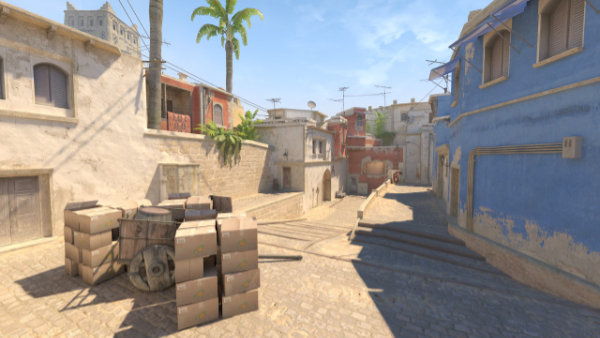 
:::

*Par la suite, nous pourrons envisager de reproduire la même analyse sur les autres cartes. Il suffira alors de modifier les fichiers CSV utilisés.*

Notre processus d’analyse repose sur l’extraction de fichiers `.csv` depuis notre base de données à l’aide de requêtes SQL. Celles-ci sont présentées à chaque fois qu’un nouveau fichier est introduit. Nous vous invitons à vous référer aux tables présentes dans le sommaire si certaines extractions ne sont pas claires.

## Analyse principale : La carte Mirage favorise-t-elle un camp ?

### Est-ce qu’un camp gagne plus de rounds que l’autre ?

Dans un premier temps, nous allons récupérer l’ensemble des rounds joués sur *Mirage* afin d’observer la proportion de rounds remportés par chaque camp.

**rounds_de_mirage.csv**

``` sql
CREATE TABLE csdm.public.round_de_mirage 
AS SELECT *
FROM rounds WHERE match_checksum 
IN ( SELECT checksum FROM demos WHERE map_name = 'de_mirage' )
```

```{r}
rounds = read.csv("./data/rounds_de_mirage.csv") 

rounds_mapped = mutate(rounds, winner_side = case_when(
    winner_side == 2 ~ "Terroriste",  
    winner_side == 3 ~ "Anti-Terroriste"
  ))

rounds_count = count(rounds_mapped, winner_side)

ggplot(rounds_count, aes(x = winner_side, y = n, fill = winner_side)) +
  geom_bar(stat = "identity", show.legend = FALSE) +
  labs(
    title = "Nombre de manche gagnée par camp",
    x = "Camp",
    y = "Nombre de Rounds"
  ) +
  geom_text(aes(label = n), vjust = 0) +
  scale_fill_manual(values = c(
    "Anti-Terroriste" = "#00428C",
    "Terroriste" = "#F99E1C"
  ))
```

Sur le papier, et compte tenu du nombre limité de matchs disponibles (103 matchs), la différence observée reste relativement faible. On peut alors se demander si cette tendance devient plus significative lorsque l’on considère le nombre de rounds gagnés par match, plutôt que le total brut.

```{r}
#tally permet de compter le nombre de lignes dans chaque groupe
#On est proche d'une logique de SQL avec un group by et un count
#On rajoute ungroup pour récuperer un ensemble non groupé

rounds_per_match <- ungroup(tally(group_by(rounds_mapped, match_checksum, winner_side)))

ggplot(rounds_per_match, aes(x = winner_side, y = n, fill = winner_side)) +
  geom_violin(trim = FALSE, alpha = 0.6) +
  geom_boxplot(width = 0.15, outlier.shape = NA, alpha = 0.8) +
  labs(
    title = "Distribution du Nombre de Rounds Gagnés par Côté par match",
    x = "Côté Gagnant",
    y = "Nombre de Rounds"
  ) +
  scale_fill_manual(values = c("Anti-Terroriste" = "#00428C","Terroriste" = "#F99E1C")) +
  theme_minimal()
```

D’un point de vue statistique, il est difficile de conclure à une différence significative entre les deux camps. La dispersion des valeurs est importante, comme le montre l’étendue des distributions, ce qui limite la capacité à identifier un avantage clair.

Il est donc nécessaire d’aller plus loin dans l’analyse afin de déterminer si un éventuel avantage en faveur des Anti-Terroristes peut être mis en évidence de manière plus robuste.

------------------------------------------------------------------------

### Est-ce que les kills expliquent cet avantage ?

Nous allons maintenant chercher à déterminer si les kills peuvent expliquer un éventuel avantage observé entre les deux camps.

Dans un premier temps, nous commençons par récupérer les informations relatives aux kills.

**kills_de_mirage.csv**

``` sql
CREATE TABLE csdm.public.kill_de_mirage 
AS SELECT killer_x, killer_y, killer_z, victim_x, victim_y, victim_z, 
killer_side, victim_side, match_checksum
FROM kills WHERE match_checksum 
IN ( SELECT checksum FROM demos WHERE map_name = 'de_mirage' )
```

```{r}
kills = read.csv("./data/kills_de_mirage.csv")
```

#### Un camp fait-il plus de kills que l’autre ?

```{r}
kill_categories <- mutate(kills, kill_type = case_when(
    killer_side == victim_side ~ "Team Kill",
    killer_side == 2 & victim_side == 3 ~ "Terroriste", 
    killer_side == 3 & victim_side == 2 ~ "Anti-Terroriste", 
    TRUE ~ "Déconnexion / Suicide / Explosion" #Cas par défaut pour traiter
  ))
kill_categories <- count(kill_categories, kill_type)
kill_categories <- mutate(kill_categories, kill_type = factor(kill_type, levels = c(
    "Anti-Terroriste",
    "Terroriste",
    "Team Kill",
    "Déconnexion / Suicide / Explosion"
  )))

ggplot(kill_categories, aes(x = kill_type, y = n, fill = kill_type)) +
  geom_bar(stat = "identity", show.legend = FALSE) +
  labs(title = "Nombre de Kills par Catégorie",
       x = "Type de Kill",
       y = "Nombre de Kills") +
  theme_minimal()+
  geom_text(aes(label=n), vjust=0)+
  scale_fill_manual(values = c(
    "Anti-Terroriste" = "#00428C",
    "Terroriste" = "#F99E1C"
  ))
```

On observe une différence d’environ 1 000 kills, ce qui peut être significatif dans l’économie d’une partie. Toutefois, afin de s’assurer de la pertinence de cette observation, nous allons rapporter le nombre de kills au nombre de kills par camp et par match.

#### Y a-t-il une différence de kills par match ?

```{r}
#Ici les logs m'indiquent de mettre .groups = 'drop' au lieu de ungroup
kills_per_match <- summarise(
    group_by(kills, match_checksum, killer_side), 
    n_kills = n(), .groups='drop'
  )

ggplot(kills_per_match, aes(
  x = factor(killer_side, levels = c(2, 3), labels = c("Terroriste", "Anti-Terroriste")), #On fait le mapping entre le chiffre et le camp en texte
  y = n_kills,
  fill = factor(killer_side, levels = c(2, 3), labels = c("Terroriste", "Anti-Terroriste"))
)) +
  geom_boxplot() +
  geom_jitter(width = 0.1, alpha = 0.3, size = 1) + #Permet de rajouter les points
  labs(
    title = "Distribution du Nombre de Kills par Match et par Côté",
    x = "Côté", y = "Nombre de Kills par Match"
  ) +
  scale_fill_manual(
    name="Côté du Tueur",
    values = c("Terroriste" = "#F99E1C","Anti-Terroriste" = "#00428C")
  ) + theme_minimal()
```

*Les valeurs NA correspondent aux autres types de kills ne résultant pas d’un affrontement direct entre les deux équipes.*

De même que pour le nombre moyen de manches gagnées par match, la variabilité des données ne permet pas de conclure clairement à un avantage d’un camp sur l’autre. On peut éventuellement conjecturer un léger avantage en faveur des Anti-Terroristes, mais les résultats ne sont pas suffisamment robustes pour en tirer une conclusion définitive.

------------------------------------------------------------------------

## Analyse spatiale : La carte influence-t-elle les combats ?

À partir de ce point, nous allons utiliser une terminologie associée aux différentes zones de la carte. Une carte annotée est fournie afin de faciliter la compréhension des analyses qui suivent.

::: {style="display: flex; justify-content: center; gap: 20px; align-items: center;"}
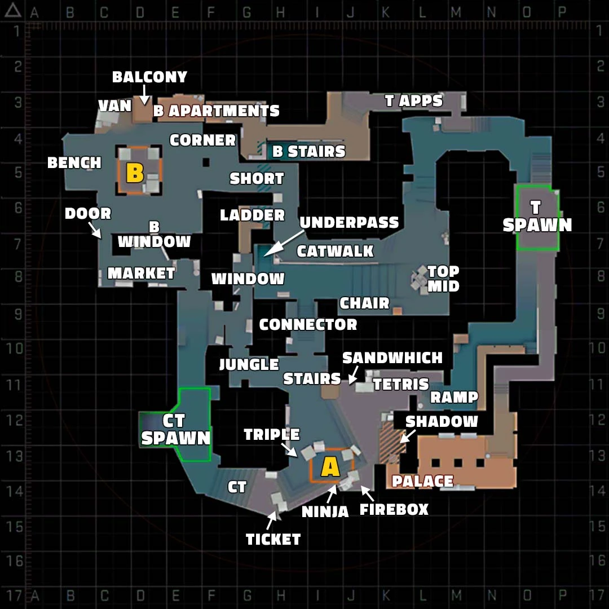
:::

Par ailleurs, nous avons mis en place un masque pour simplifier l’affichage des graphiques. Nous avons utilisé la carte ***Mirage*** disponible dans notre jeu de données, en conservant les zones utiles *(blanches)* et en rendant le fond *(zone jouables)* transparent. Ce masque est ensuite appliqué sur les graphiques afin de ne conserver que les zones pertinentes pour l’analyse.

**Algorithme python pour la génération du masque**

``` python
def process_image_for_white_and_transparent(input_path, output_path, white_threshold=240):

    img = cv2.imread(input_path, cv2.IMREAD_UNCHANGED)

    if img is None:
        raise FileNotFoundError(f"Impossible de lire l'image : {input_path}")

    if img.shape[2] == 3:
        img = cv2.cvtColor(img, cv2.COLOR_BGR2BGRA)

    bgr = img[:, :, 0:3]
    alpha_orig = img[:, :, 3]

    hsv = cv2.cvtColor(bgr, cv2.COLOR_BGR2HSV)
    lower_white = np.array([0, 0, white_threshold])
    upper_white = np.array([180, 255, 255])
    mask_white = cv2.inRange(hsv, lower_white, upper_white)

    mask_transparent = (alpha_orig == 0).astype(np.uint8) * 255

    pixels_to_become_white = cv2.bitwise_or(mask_white, mask_transparent)

    output_bgr = np.zeros_like(bgr, dtype=np.uint8)
    output_alpha = np.zeros_like(alpha_orig, dtype=np.uint8)

    output_bgr[pixels_to_become_white == 255] = [255, 255, 255] 
    output_alpha[pixels_to_become_white == 255] = 255

    result_rgba = cv2.merge([output_bgr[:, :, 0], output_bgr[:, :, 1], output_bgr[:, :, 2], output_alpha])

    cv2.imwrite(output_path, result_rgba)

input_image_original = "de_mirage.png"
output_image_processed = "de_mirage_processed.png"
process_image_for_white_and_transparent(input_image_original, output_image_processed)
```

*Nous avons ensuite retravaillé ces images afin de les rendre plus propres, notamment en supprimant certains pixels noirs résiduels présents dans les zones blanches de la carte.*

### Où sont posées les bombes ?

Nous commençons par récupérer les informations relatives aux bombes plantées, afin d'identifier les zones de plant privilégiées par les Terroristes.

**bomb_de_mirage.csv**

``` sql
DROP TABLE IF EXISTS csdm.public.bomb_de_mirage;

CREATE TABLE csdm.public.bomb_de_mirage AS
WITH mirage_matches AS (
    SELECT checksum
    FROM demos
    WHERE map_name = 'de_mirage'
),

planted AS ( /*Permet de crée des 'tables' temporaires dans la requête*/
    SELECT 
        bp.match_checksum,
        bp.round_number,
        bp.x,
        bp.y
    FROM bombs_planted bp
    WHERE bp.match_checksum IN (SELECT checksum FROM mirage_matches)
),

exploded AS (
    SELECT 
        match_checksum,
        round_number
    FROM bombs_exploded
    WHERE match_checksum IN (SELECT checksum FROM mirage_matches)
),

defused AS (
    SELECT 
        match_checksum,
        round_number
    FROM bombs_defused
    WHERE match_checksum IN (SELECT checksum FROM mirage_matches)
)

SELECT 
    p.match_checksum,
    p.round_number,
    p.x,
    p.y,

    CASE 
        WHEN e.match_checksum IS NOT NULL THEN 'exploded'
        WHEN d.match_checksum IS NOT NULL THEN 'defused'
        ELSE 'planted_only'
    END AS bomb_status

FROM planted p /*On peut donc les réutiliser ici*/
LEFT JOIN exploded e
    ON p.match_checksum = e.match_checksum
    AND p.round_number = e.round_number
LEFT JOIN defused d
    ON p.match_checksum = d.match_checksum
    AND p.round_number = d.round_number;
```

```{r}
bombs = read.csv("./data/bombs_de_mirage.csv")
```

#### Tout d'abord est ce que les Terroristes jouent souvent la bombe sur mirage ?

```{r}
bomb_rounds <- select(bombs, match_checksum, round_number)


#On join les deux bases de données pour vérifier la présence ou non d'information
#De la pose d'une bombe lors du round
rounds_bomb_status <- left_join(
  rounds,
  mutate(bomb_rounds, has_bomb = TRUE),
  by = c("match_checksum", "number" = "round_number")
)

rounds_bomb_status <- mutate(
  rounds_bomb_status,
  has_bomb = ifelse(is.na(has_bomb), "Sans bombe", "Avec bombe")
)

#On compte les occurences avant pour pouvoir utiliser geom_col
df_bomb_rounds <- count(rounds_bomb_status, has_bomb)

ggplot(df_bomb_rounds, aes(x = has_bomb, y = n, fill = has_bomb)) +
  geom_col() + #Plus simple a gérer que geom_bar
  geom_text(aes(label = n), vjust = -0.3) +
  scale_fill_manual(values = c(
    "Avec bombe" = "#F99E1C",
    "Sans bombe" = "#00428C"
  )) +
  labs(
    title = "Rounds avec vs sans bombe plantée (Mirage)",
    x = "Type de round",
    y = "Nombre de rounds",
    fill="Status"
  ) +
  theme_minimal()
```

```{r}
df_match_prop <- group_by(rounds_bomb_status, match_checksum, has_bomb)
df_match_prop <- summarise(df_match_prop, n = n(), .groups = "drop")
df_match_prop <- group_by(df_match_prop, match_checksum)
df_match_prop <- mutate(df_match_prop, prop = n / sum(n))
df_match_prop <- ungroup(df_match_prop)

ggplot(df_match_prop, aes(x = has_bomb, y = prop, fill = has_bomb)) +
  geom_violin(trim = FALSE, alpha = 0.6) +
  geom_boxplot(width = 0.15, outlier.shape = NA, alpha = 0.8) +
  scale_fill_manual(values = c(
    "Avec bombe" = "#F99E1C",
    "Sans bombe" = "#00428C"
  )) +
  labs(
    title = "Proportion de rounds avec/sans bombe par match (Mirage)",
    x = "Type de round",
    y = "Proportion dans le match",
    fill="Status"
  ) +
  theme_minimal()
```

La distribution des proportions de rounds avec et sans bombe par match reste relativement stable, indiquant que la structure des matchs est globalement homogène sur cet aspect. On observe néanmoins une certaine variabilité, suggérant des styles de jeu légèrement différents selon les rencontres.

Nous allons toutefois analyser l’issue des rounds en fonction de la pose ou non de la bombe.

```{r}
rounds_no_bomb <- anti_join(
    rounds,
    bomb_rounds,
    by = c("match_checksum" = "match_checksum",
           "number" = "round_number")
  )

rounds_no_bomb <- mutate(rounds_no_bomb,
    winner_side = case_when(
      winner_side == 2 ~ "Terroriste",
      winner_side == 3 ~ "Anti-Terroriste"
    )
  )

df_no_bomb <- count(rounds_no_bomb, winner_side)

ggplot(df_no_bomb, aes(x = winner_side, y = n, fill = winner_side)) +
  geom_col() +
  geom_text(aes(label = n), vjust = -0.3) +
  scale_fill_manual(values = c(
    "Anti-Terroriste" = "#00428C",
    "Terroriste" = "#F99E1C"
  )) +
  labs(
    title = "Issue des round sans bombe plantée (Mirage)",
    x = "Camp gagnant",
    y = "Nombre de rounds",
    fill="Camp"
  ) +
  theme_minimal()
```

Lorsque la bombe n’est pas plantée, l’avantage semble revenir aux Anti-Terroristes. Leur position de défense et leur capacité de temporisation peuvent expliquer ce résultat.

*Pour confirmer cette observation, il serait pertinent d’analyser plus en détail les durées des rounds, les conditions de victoire, ainsi que la proportion de rounds se terminant par l’élimination complète de l’équipe adverse.*

#### Emplacement de prédilections pour les bombes ?

```{r}
killer_xy = select(kills, c(killer_x ,killer_y))
ggplot(bombs, aes(x = x, y = y)) +
  geom_image(
    data = tibble(x = -680, y = -850),
    aes(image = "./images/de_mirage.png"),
    size = 1.32
  )+
  geom_bin2d(bins = 50) +
  scale_fill_continuous(type = "viridis")+
  coord_equal(ratio=1, xlim=c(max(select(killer_xy, killer_x)), min(select(killer_xy, killer_x))), ylim=c(max(select(killer_xy, killer_y)), min(select(killer_xy, killer_y))))+geom_image(
      data = tibble(x = -680, y = -850),
      aes(image = "./images/de_mirage_mask.png"),
      size = 1.32
    )
```

Les règles du jeu imposent le placement de la bombe dans des zones dédiées, appelées sites A et B. Cependant, on observe que le site B présente une zone particulièrement utilisée pour le plant.

Mais cette tendance correspond-elle à une stratégie réellement gagnante ?

#### Est-ce que les bombes servent réellement ?

```{r}
ggplot(count(bombs, bomb_status), aes(x = bomb_status, y = n, fill=bomb_status)) +
geom_bar(stat = "identity") +
theme_minimal() +
  scale_x_discrete(labels = c(
    "defused" = "Désamorcée",
    "exploded" = "Explosée",
    "planted_only" = "Plantée uniquement"
  ))+
   scale_fill_manual(values = c(
    "defused" = "#00ba38",
    "exploded" = "#f8766d",
    "planted_only" = "#619cff"
  ),labels = c(
      "defused" = "Désamorcée",
      "exploded" = "Explosée",
      "planted only" = "Plantée uniquement"
    )) +
labs(
  title = "Etat final de la bombe sur Mirage",
  x = "Etat de la bombe",
  y = "Occurence",
  fill="Etat de la bombe"
  )
```

On remarque que les bombes sont moins souvent désamorcées que dans les autres cas (explosions ou absence de désamorçage après avoir été plantées). Cette tendance est-elle similaire pour chaque site ?

#### Quelle issu pour les bombes sur chaque site ?

Nous allons utiliser un algorithme de *k-means* afin d’identifier les clusters et d’estimer la proportion de chaque type d’issue en fonction du site sur lequel on se trouve.

```{r}
km <- kmeans(bombs[, c("x", "y")], centers = 2)

bombs$cluster <- as.factor(km$cluster)

centers <- summarise(
    group_by(bombs, cluster),
    mean_x = mean(x),
    mean_y = mean(y),
    .groups = "drop"
  )

print(centers)
```

Par analyse visuelle de la carte, il est possible d’associer le cluster 1 au site A et le cluster 2 au site B.

```{r}
cluster_labels <- mutate(centers,
  site = ifelse(mean_x > median(mean_x), "A site", "B site"))

bombs <- left_join(
  bombs,
  select(cluster_labels, cluster, site),
  by = "cluster"
)

df_prop <- group_by(bombs, site, bomb_status)
df_prop <- summarise(df_prop, n = n(), .groups = "drop")
df_prop <- group_by(df_prop, site)
df_prop <- mutate(df_prop, prop = n / sum(n))

ggplot(df_prop, aes(x = bomb_status, y = prop, fill = bomb_status)) +
  geom_bar(stat = "identity") +
  facet_wrap(~ site) +
  theme_minimal() +
  scale_x_discrete(labels = c(
    "defused" = "Désamorcée",
    "exploded" = "Explosée",
    "planted_only" = "Plantée U"
  ))+
   scale_fill_manual(values = c(
    "defused" = "#00ba38",
    "exploded" = "#f8766d",
    "planted_only" = "#619cff"
  ),
  labels = c(
      "defused" = "Désamorcée",
      "exploded" = "Explosée",
      "planted_only" = "Plantée U"
    )) +
  labs(
    title = "Bomb outcomes by Mirage site",
    x = "Bomb status",
    y = "Proportion",
    fill="Etat de la bombe"
  )
```

L’analyse des issues de bombe montre une différence de comportement entre les deux sites.

Sur le site A, les rounds se terminent plus fréquemment par des bombes plantées sans désamorçage, suivies des explosions. Cela suggère une meilleure réussite des Terroristes une fois la bombe installée sur ce site.

Sur le site B, les explosions sont plus fréquentes que les simples situations de bombe plantée, ce qui indique des situations où la défense intervient moins efficacement avant l’issue du round.

Dans les deux cas, les désamorçages représentent systématiquement l’issue la moins fréquente, ce qui confirme que la pose de bombe tend globalement à favoriser les Terroristes, indépendamment du site.

#### **Quel est le taux de victoires pour chaque sites avec pose de bombes ?**

En considérant que les Terroristes remportent le round lorsque la bombe explose ou reste simplement plantée, et que les Anti-Terroristes gagnent en cas de désamorçage, nous pouvons comparer les taux de victoire selon les sites.

```{r}
df_win <- filter(bombs, bomb_status %in% c("exploded", "defused", "planted_only"))
df_win <- mutate(df_win,
    winner = case_when(
      bomb_status %in% c("exploded", "planted_only") ~ "Terroriste",
      bomb_status == "defused" ~ "Anti-Terroriste"
    )
  )
df_win <- group_by(df_win, site, winner)
df_win <- summarise(df_win, n = n(), .groups = "drop")
df_win <- tidyr::complete(df_win, site, winner = c("Terroriste", "Anti-Terroriste"), fill = list(n = 0))
df_win <- group_by(df_win, site)
df_win <- mutate(df_win, prop = n / sum(n))
df_win <- ungroup(df_win)

ggplot(df_win, aes(x = winner, y = prop, fill = winner)) +
  geom_col() +
  facet_wrap(~ site) +
  scale_fill_manual(values = c("Terroriste" = "#F99E1C", "Anti-Terroriste" = "#00428C")) +
  labs(
    title = "Proportion de victoires par site (avec pose de bombe)",
    x = "Côté gagnant",
    y = "Proportion",
    fill="Gagnant"
  ) +
  theme_minimal()
```

Dès qu’une bombe est plantée, l’avantage bascule en faveur des Terroristes, que ce soit sur le site A ou sur le site B. À l’inverse, en l’absence de bombe, l’avantage revient aux Anti-Terroristes.

On peut donc conclure que la présence de la bombe constitue un facteur déterminant dans l’issue d’un round, indépendamment de son emplacement. La défense et la temporisation apparaissent comme les stratégies les plus efficaces pour les Anti-Terroristes, tandis que les Terroristes prennent l’avantage une fois la bombe amorcée.

------------------------------------------------------------------------

```{r}
#Je prépare les données pour pouvoir exploiter les cotes plus simplement

killer_xy = select(kills, x = killer_x, y = killer_y, side = killer_side)
killer_xy = mutate(killer_xy, side = case_when(
    side == 2 ~ "terro",
    side == 3 ~ "anti"
  ))

victim_xy = select(kills, x = victim_x, y = victim_y, side = victim_side)
victim_xy = mutate(victim_xy, side = case_when(
    side == 2 ~ "terro",
    side == 3 ~ "anti"
  ))
```

**Fonction pour l'affichage des cartes de densités**

```{r}
#J'ai trouvé comment faire des fonctions pour pouvoir simplifier l'affichage des
#cartes avec le mask et la fonction de densité
plot_heatmap <- function(data, title = "") {
  ggplot(data, aes(x = x, y = y)) +
    geom_image(
      data = tibble(x = -680, y = -850),
      aes(image = "./images/de_mirage.png"),
      size = 1.32
    ) +
    stat_density_2d(
      aes(fill = after_stat(ndensity)),
      geom = "raster",
      contour = FALSE,
      alpha = 0.5,
      bins = 100
    ) +
    scale_fill_gradientn(colors = c("blue", "green", "yellow", "red")) +
    geom_image(
      data = tibble(x = -680, y = -850),
      aes(image = "./images/de_mirage_mask.png"),
      size = 1.32
    ) +
    coord_equal() +
    ggtitle(title)
}
```

------------------------------------------------------------------------

### Où meurent les joueurs ?

```{r}
plot_heatmap(victim_xy, "Mort - Général")
```

### Où sont les tueurs ?

```{r}
plot_heatmap(killer_xy, "Killer - Général")
```

Ici, on n’observe pas de différence marquée entre les zones où se trouvent les tueurs et celles où se trouvent les victimes. Les densités restent globalement similaires sur l’ensemble de la carte.

On observe des zones clés *( de forte concentration )* telles que Connector, Stairs, Shadow, Palace, Tetris, Short ou encore Balcony, des espaces connus des joueurs comme étant des points de confrontation fréquents.

Un différence notable est la hausse de la densité sur la cartes des morts au niveau de Top Mid. Un endroit réputé pour être une ligne favorable au affrontement au centre de la carte entre les Anti-Terroriste et les Terrosites. Mais est-ce une ligne utilisé ?

### Distance moyenne de kill ?

```{r}

kills = mutate(kills, distance = sqrt((killer_x - victim_x)^2 + (killer_y - victim_y)^2))

mean_distance = mean(kills$distance, na.rm = TRUE)

mean_distance
```

Cette distance relativement courte peut expliquer la similarité observée entre les cartes de densité. En effet, les engagements ont tendance à se produire à moyenne portée, ce qui limite les différences spatiales marquées entre les zones de kills et de morts.

Elle n'écarte pas notre hypothèse sur la ligne de duel au centre de la carte qui couvre catwalk, window et Top Mid.

Nous allons maintenant analyser ces mêmes cartes en distinguant les camps afin d’affiner l’interprétation.

### Y a-t-il une différence selon le camp ?

```{r}
p1 <- plot_heatmap(filter(killer_xy, side == "terro"), "Killer - Terrorists")
p2 <- plot_heatmap(filter(killer_xy, side == "anti"), "Killer - Anti-Terrorists")
p3 <- plot_heatmap(filter(victim_xy, side == "terro"), "Mort - Terrorists")
p4 <- plot_heatmap(filter(victim_xy, side == "anti"), "Mort - Anti-Terrorists")

(p1 + p2 ) / (p3 + p4)
```

On observe des cartes de chaleur similaires dans leur structure globale. Cependant, les zones les plus marquées ne sont pas identiques selon les camps. Chez les Terroristes, on observe une forte concentration de morts au niveau de Top Mid, Palace et Tetris, tandis que chez les Anti-terroristes, celles-ci se situent davantage au niveau de Window, Stairs et Ticket.

On remarque que les deux équipes partagent une zone centrale commune, ainsi que quelques zones plus spécifiques situées de part et d’autre de la carte selon le camp. On peut alors se demander s’il est pertinent de diviser la carte en deux zones distinctes afin de mieux caractériser ces différences de contrôle et d’engagement.

------------------------------------------------------------------------

**Mise en perspective**

*Le site HLTV propose aussi des visuels avec heatmaps pour Mirage. Ils possèdent un plus grand nombre d'observations, cependant on converge vers une solution qui ressemble à la leur même avec moins d'observation. Voici le lien pour aller consulter leur proposition de heatmaps :* [Counter-Strike Statistics database \| HLTV.org](https://www.hltv.org/stats/maps/map/32/Mirage?showKills=true&showDeaths=false&firstKillsOnly=false&allowEmpty=false&showKillDataset=true&showDeathDataset=false). Nous pouvons allors décemment nous permettre de faire des généralités concernant ces cartes de chaleurs.

------------------------------------------------------------------------

*Avant d’envisager une segmentation de la carte, nous allons dans un premier temps analyser les lignes de tir, afin de déterminer si certaines orientations ou trajectoires sont plus favorables à un camp en particulier.*

## Analyse avec algorithmes de Data Analyse

### Quelles sont les directions des kills ?

Nous allons dans un premier temps reconstruire les vecteurs associés aux éliminations, afin d’analyser les directions des tirs mortels.

```{r}
vectors <- mutate(kills,
    dx = victim_x - killer_x,
    dy = victim_y - killer_y,
    start_x = killer_x,
    start_y = killer_y
  )
```

### Existe-t-il des lignes de tirs récurrentes ?

Nous utilisons ensuite l’algorithme de clustering DBSCAN afin d’identifier d’éventuelles trajectoires de tirs récurrentes. L’objectif est de mettre en évidence les vecteurs les plus fréquemment observés.

Les hyperparamètres ont été choisis de manière empirique.

```{r}
#Normalisation de la données
vectors_norm <- scale(select(vectors, killer_x, killer_y, dx, dy))

#DBSCAN
cl <- dbscan::dbscan(vectors_norm, eps = 0.3, minPts = 50)

cl

vectors$cluster <- cl$cluster
```

*Ce clustering peut être débattu, dans la mesure où une grande partie des points n’est pas regroupée et est considérée comme du bruit. Cependant, étant donné la nature du rendu (un document PDF), l’augmentation du nombre de clusters nuirait à la lisibilité des graphiques ( qui sont déjà assez compliqué à lire ). Nous avons donc retenu ce partitionnement comme compromis entre interprétabilité et richesse de l’information.*

*Il est laissé à la discrétion du lecteur d’expérimenter d’autres paramètres afin de tirer ses propres conclusions. Une analyse plus poussée et un travail d’optimisation des hyperparamètres seraient nécessaires pour exploiter pleinement cette approche.*

On observe en effet qu’un nombre important d’observations est classé comme bruit. Il serait possible d’ajuster les paramètres afin de rendre le clustering plus inclusif, mais cela risquerait de dégrader la pertinence des groupes identifiés en introduisant une trop forte variabilité au sein des clusters.

```{r}
killer_xy = select(kills, c(killer_x, killer_y))
victim_xy = select(kills, c(victim_x, victim_y))


#On reconstitue les cluster avec les éléments nécessaire
#ON UTILISE LA MEDIANE POUR AVOIR DES TRAJECTOIRES REELLES ET QUI
#NE TRAVERSE PAS LE MUR
cluster_representatives <- filter(vectors, cluster != 0)
cluster_representatives <- group_by(cluster_representatives, cluster)
cluster_representatives <- summarise(cluster_representatives,
    killer_x = median(killer_x),
    killer_y = median(killer_y),
    victim_x = median(victim_x),
    victim_y = median(victim_y),
    n = n()
  )
cluster_representatives <- ungroup(cluster_representatives)

ggplot(killer_xy, aes(x = killer_x, y = killer_y)) +
  geom_image(
    data = tibble(killer_x = -680, killer_y = -830),
    aes(image = "./images/de_mirage.png"),
    size = 1.32
  ) +
  geom_segment(
    data = cluster_representatives,
    aes(
      x = killer_x, 
      y = killer_y, 
      xend = victim_x, 
      yend = victim_y,
      color = as.factor(cluster)
    ),
    arrow = arrow(length = unit(0.2, "cm"), type = "closed"),
    alpha = 0.9,
    linewidth = 1.2
  ) +
  geom_image(
    data = tibble(killer_x = -680, killer_y = -830),
    aes(image = "./images/de_mirage_mask.png"),
    size = 1.32
  ) +
  labs(
    title="Lignes de tir récurrentes",
    x ="x",
    y ="y"
  )+
  scale_color_discrete(name = "Cluster")+
  geom_point(size = 0.1, alpha = 0.01) +
  coord_equal()
```

On retrouve plusieurs lignes connues des joueurs, notamment la ligne de Window vers Top Mid, ainsi que des échanges à double sens entre Tetris et Ticket, ou encore entre Palace et Tetris.

*Dans cette analyse, l’axe Z n’est pas pris en compte. Ce choix est motivé par le fait que cette dimension est difficile à représenter de manière lisible et qu’elle n’apporte qu’une information limitée à quelques situations spécifiques, notamment sur des positions comme Van vers Balcony ou encore la distinction entre Shadow et Palace.*

Reste alors à déterminer à quel camp bénéficie chaque trajectoire de tir.

### Quel camp domine chaque cluster ?

```{r}
killer_counts <- filter(vectors, cluster != 0)
killer_counts <- count(killer_counts, cluster, killer_side, name = "n")

killer_counts <- rename(killer_counts, side = killer_side)

ggplot(killer_counts, aes(x = factor(cluster), y = n, fill = factor(side))) +
  geom_bar(stat = "identity", position = "stack") +
  labs(
    title = "Nombre de tirs par cluster et côté",
    x = "Cluster",
    y = "Nombre de tirs",
    fill = "Camp"
  ) +
  scale_fill_manual(
    values = c("2" = "#F99E1C", "3" = "#00428C"),
    labels = c("2" = "Terroriste", "3" = "Anti-Terroriste")
  ) +
  theme_minimal()
```

On observe que certaines lignes sont davantage utilisées par les Anti-terroristes ou par les Terroristes. Cela peut s’expliquer par leur orientation, souvent dirigée vers des positions contrôlées par le camp adverse.

Certaines trajectoires sont ainsi majoritairement exploitées par les Anti-terroristes, ce qui pourrait contribuer à expliquer leur léger avantage mis en évidence dans les analyses précédentes.

On remarque notamment que la ligne 6 (Window vers Top Mid) semble conférer un avantage aux Anti-terroristes. Cette observation vient confirmer l’hypothèse formulée à partir des heatmaps.

Cependant, cela soulève une question plus générale : existe-t-il réellement des zones de jeu distinctes entre les deux camps ?

```{r}

tmp1 <- filter(vectors, cluster != 0)

tmp2 <- count(tmp1, cluster, killer_side)

tmp3 <- group_by(tmp2, cluster)

tmp4 <- mutate(tmp3,
               total = sum(n),
               prop = n / total)

cluster_side <- ungroup(tmp4)

tmp5 <- group_by(cluster_side, cluster)

tmp6 <- slice_max(tmp5, n, n = 1, with_ties = FALSE)

dominant_cluster <- ungroup(tmp6)

sel <- select(dominant_cluster, cluster, killer_side, total)

cluster_representatives2 <- left_join(
  cluster_representatives,
  sel,
  by = "cluster"
)

#On convertit les sides en textes
cluster_representatives2$killer_side <- factor(
  cluster_representatives2$killer_side,
  levels = c(2, 3),
  labels = c("Terroriste", "Anti-Terroriste")
)

ggplot(killer_xy, aes(x = killer_x, y = killer_y)) +
  geom_image(
    data = tibble(killer_x = -680, killer_y = -830),
    aes(image = "./images/de_mirage.png"),
    size = 1.32
  ) +
  geom_segment(
    data = cluster_representatives2,
    aes(
      x = killer_x,
      y = killer_y,
      xend = victim_x,
      yend = victim_y,
      color = killer_side
    ),
    arrow = arrow(length = unit(0.2, "cm"), type = "closed"),
    linewidth = 1,
    alpha = 0.9
  ) +
  geom_image(
    data = tibble(killer_x = -680, killer_y = -830),
    aes(image = "./images/de_mirage_mask.png"),
    size = 1.32
  ) +
  scale_color_manual(values = c(
    "Terroriste" = "#F99E1C",
    "Anti-Terroriste" = "#4DA3FF"
  )) +
  labs(
    title = "Lignes de tir par camp",
    x = "x",
    y = "y",
    color = "Camp dominant"
  ) +
  coord_equal(ratio=1, xlim=c(max(select(killer_xy, killer_x)), min(select(killer_xy, killer_x))), ylim=c(max(select(killer_xy, killer_y)), min(select(killer_xy, killer_y))))+
  theme_minimal()
```

*Ce résultat est a prendre avec précaution, ici la coloration ce base sur le camp dominant, mais ne tient pas en compte de la répartition exact, il suffit d'un tir de différence pour que la couleur change.*

### Peut-on séparer la map en deux zones distinctes en fonction des deux camps par rapport à leur mort / kills ?

#### **Killer**

Ici nous avons pris la décision de faire un SVM linéaire, on pourrait étailler avec un non linéaire, mais pour notre étude cela suffira.

```{r}
killer_xy_side = select(kills, killer_x, killer_y, killer_side)
killer_xy_side = mutate(killer_xy_side,
    killer_side = case_when(
      killer_side == 2 ~ "Terroriste",
      killer_side == 3 ~ "Anti-Terroriste"
    ),
    side_num = ifelse(killer_side == "Terroriste", 1, 0)
  )
killer_xy_side = filter(killer_xy_side, !is.na(killer_side))

model <- glm(side_num ~ killer_x + killer_y,
             data = killer_xy_side,
             family = "binomial")

coef_k <- coefficients(model)

ggplot(killer_xy_side, aes(x = killer_x, y = killer_y)) +
  geom_image(
    data = tibble(killer_x = -680, killer_y = -830, killer_side = 1),
    aes(image = "./images/de_mirage.png"),
    size = 1.32
  ) +
  geom_point(aes(color = killer_side), size = 0.5) +
  geom_image(
    data = tibble(killer_x = -680, killer_y = -850, killer_side = 1),
    aes(image = "./images/de_mirage_mask.png"),
    size = 1.32
  ) +
  geom_abline(
    slope = -coef_k[2] / coef_k[3],
    intercept = -coef_k[1] / coef_k[3],
    color = "red",
    linewidth = 1
  ) +
  scale_color_manual(values = c(
    "Terroriste" = "#F99E1C",
    "Anti-Terroriste" = "#4DA3FF"
  ))+
  labs(title="Séparation de la carte en fonction du camp du tueur", color="Camp du tueur")+
  coord_equal()
```

#### Victim

```{r}
victim_xy_side = select(kills, victim_x, victim_y, victim_side)
victim_xy_side = mutate(victim_xy_side,
    victim_side = case_when(
      victim_side == 2 ~ "Terroriste",
      victim_side == 3 ~ "Anti-Terroriste"
    ),
    side_num = ifelse(victim_side == "Terroriste", 1, 0)
  )

model <- glm(side_num ~ victim_x + victim_y,
             data = victim_xy_side,
             family = "binomial")

coef_v <- coefficients(model)

ggplot(victim_xy_side, aes(x = victim_x, y = victim_y)) +
  geom_image(
    data = tibble(victim_x = -680, victim_y = -830, victim_side = 1),
    aes(image = "./images/de_mirage.png"),
    size = 1.32
  ) +
  geom_point(aes(color = victim_side), size = 0.5) +
  geom_image(
    data = tibble(victim_x = -680, victim_y = -850, victim_side = 1),
    aes(image = "./images/de_mirage_mask.png"),
    size = 1.32
  ) +
  geom_abline(
    slope = -coef_v[2] / coef_v[3],
    intercept = -coef_v[1] / coef_v[3],
    color = "blue",
    size = 1
  )+
  scale_color_manual(values = c(
    "Terroriste" = "#F99E1C",
    "Anti-Terroriste" = "#4DA3FF"
  ))+
  labs(title="Séparation de la carte en fonction du camp de la victime", color="Camp de la victime")+
  coord_equal()
```

Si on supperpose ces deux droites on obtient le graphique suivant :

#### Superposition

```{r}
ggplot(victim_xy_side, aes(x = victim_x, y = victim_y)) +
  geom_image(
    data = tibble(x = -680, y = -830),
    aes(x = x, y = y, image = "./images/de_mirage.png"),
    size = 1.32
  ) +
  geom_point(data = victim_xy_side, aes(x = victim_x, y = victim_y), alpha = 0.01, size = 0.1) +
  geom_image(
    data = tibble(x = -680, y = -850),
    aes(x = x, y = y, image = "./images/de_mirage_mask.png"),
    size = 1.32
  ) +
  geom_abline(
    slope = -coef_k[2] / coef_k[3],
    intercept = -coef_k[1] / coef_k[3],
    color = "red",
    size = 1
  ) +
  geom_abline(
    slope = -coef_v[2] / coef_v[3],
    intercept = -coef_v[1] / coef_v[3],
    color = "blue",
    size = 1
  ) +
  labs(title = "Segmentation par Kill et par Victim")+
  coord_equal()
```

On observe l’apparition d’un *no man’s land* au centre de la carte. La superposition avec les autres visualisations permet de mettre en évidence des éléments particulièrement intéressants concernant la répartition des engagements entre les deux camps.

------------------------------------------------------------------------

## **On s'amuse ?**

```{r}

slope_k <- -coef_k[2] / coef_k[3]
intercept_k <- -coef_k[1] / coef_k[3]
slope_v <- -coef_v[2] / coef_v[3]
intercept_v <- -coef_v[1] / coef_v[3]


hatch_x <- seq(-2500, 2000, by = 50) 
hatch_data <- data.frame(
  x = hatch_x,
  y_start = slope_k * hatch_x + intercept_k,
  y_end = slope_v * hatch_x + intercept_v
)


ggplot(killer_xy, aes(x = killer_x, y = killer_y)) +
  geom_image(
    data = tibble(killer_x = -680, killer_y = -830),
    aes(image = "./images/de_mirage.png"),
    size = 1.32
  ) +
  
  geom_segment(
    data = hatch_data,
    aes(x = x, xend = x, y = y_start, yend = y_end),
    color = "black",
    alpha = 0.4,   
    linewidth = 1
  ) +
  
  geom_segment(
    data = cluster_representatives2,
    aes(
      x = killer_x,
      y = killer_y,
      xend = victim_x,
      yend = victim_y,
      color = killer_side
    ),
    arrow = arrow(length = unit(0.2, "cm"), type = "closed"),
    linewidth = 1,
    alpha = 0.9
  ) +
  geom_image(
    data = tibble(killer_x = -680, killer_y = -830),
    aes(image = "./images/de_mirage_mask.png"),
    size = 1.32
  ) +
  scale_color_manual(values = c(
    "Terroriste" = "#F99E1C",
    "Anti-Terroriste" = "#4DA3FF"
  )) +

  geom_abline(slope = slope_k, intercept = intercept_k, color = "black", linewidth = 1) +
  geom_abline(slope = slope_v, intercept = intercept_v, color = "black", linewidth = 1) +
  labs(
    title = "Lignes de tir et Zone 'No Man's Land'",
    subtitle = "La zone hachurée représente l'espace entre le front des tueurs et celui des victimes",
    x = "X", y = "Y"
  ) +
  theme_minimal() +
  coord_equal(ratio=1, xlim=c(max(select(killer_xy, killer_x)), min(select(killer_xy, killer_x))), ylim=c(max(select(killer_xy, killer_y)), min(select(killer_xy, killer_y))))+
  theme(legend.position = "none")
```

On observe que les lignes naissent dans l’un ou l’autre camp et qu’à une exception près, leur camp d’origine détermine celui qui les utilise le plus.

```{r}

df_victimes_plot <-
  filter(select( victim_xy , x = victim_x, y = victim_y), !is.na(x) & !is.na(y))

ggplot(df_victimes_plot, aes(x = x, y = y)) +
  geom_image(data = tibble(x = -680, y = -850), aes(image = "./images/de_mirage.png"), size = 1.32) +
  
  stat_density_2d(
      aes(fill = after_stat(ndensity)),
      geom = "raster",
      contour = FALSE,
      alpha = 0.5,
      bins = 100
    ) +
    scale_fill_gradientn(colors = c("blue", "green", "yellow", "red")) +
  
  geom_segment(data = hatch_data, aes(x = x, xend = x, y = y_start, yend = y_end),
               color = "black", alpha = 0.4, linewidth = 1, inherit.aes = FALSE) +
  
  geom_image(data = tibble(x = -680, y = -850), aes(image = "./images/de_mirage_mask.png"), size = 1.32) +
  
  geom_abline(slope = slope_k, intercept = intercept_k, color = "black", linewidth = 1) +
  geom_abline(slope = slope_v, intercept = intercept_v, color = "black", linewidth = 1) +
  
  coord_equal(ratio=1, xlim=c(max(select(killer_xy, killer_x)), min(select(killer_xy, killer_x))), ylim=c(max(select(killer_xy, killer_y)), min(select(killer_xy, killer_y))))+
  theme(legend.position = "none")+
  ggtitle("Heatmap des morts")
```

```{r}
# On prépare les données tueurs
df_tueurs_plot <-  
  filter(select(killer_xy, x = killer_x, y = killer_y),!is.na(x) & !is.na(y))

ggplot(df_tueurs_plot, aes(x = x, y = y)) +
  geom_image(data = tibble(x = -680, y = -850), aes(image = "./images/de_mirage.png"), size = 1.32) +
  
  stat_density_2d(
      aes(fill = after_stat(ndensity)),
      geom = "raster",
      contour = FALSE,
      alpha = 0.5,
      bins = 100
    ) +
    scale_fill_gradientn(colors = c("blue", "green", "yellow", "red")) +
  
  geom_segment(data = hatch_data, aes(x = x, xend = x, y = y_start, yend = y_end),
               color = "black", alpha = 0.4, linewidth = 1, inherit.aes = FALSE) +
  
  geom_image(data = tibble(x = -680, y = -850), aes(image = "./images/de_mirage_mask.png"), size = 1.32) +
  
  geom_abline(slope = slope_k, intercept = intercept_k, color = "black", linewidth = 1) +
  geom_abline(slope = slope_v, intercept = intercept_v, color = "black", linewidth = 1) +
  
  coord_equal(ratio=1, xlim=c(max(select(killer_xy, killer_x)), min(select(killer_xy, killer_x))), ylim=c(max(select(killer_xy, killer_y)), min(select(killer_xy, killer_y))))+
  theme(legend.position = "none")+
  ggtitle("Heatmap des tueurs")
```

On observe que les zones de forte densité se concentrent majoritairement au sein du *no man’s land*. En croisant ces résultats avec les visualisations séparant les densités par camp, il apparaît que les principaux pics de densité propres à chaque équipe se situent de part et d’autre de cette zone centrale.

------------------------------------------------------------------------

## Conclusion

L’étude de *Mirage* permet de mettre en évidence une dynamique structurée entre Terroristes et Anti-Terroristes, mais aussi un déséquilibre dans la manière dont chaque camp contrôle la carte.

À première vue, les résultats globaux sur les rounds et les kills ne montrent pas de déséquilibre important. Cependant, dès que l’on entre dans une analyse spatiale et comportementale, une tendance apparaît : les Anti-Terroristes disposent d’un réseau de positions et de lignes de tir qui sont à leurs avantages. Cette organisation leur permet de mieux contrôler l’espace et de multiplier les points d’engagement défensifs.

À l’inverse, les Terroristes semblent moins présents en termes de diversité de lignes, mais leurs actions sont plus orientées vers un objectif précis : la prise de site et l’exploitation du post-plant. Cette différence de logique explique pourquoi les deux camps peuvent apparaître équilibrés au niveau global, malgré des avantages locaux différents.

Un point important ressort : dès que la bombe est posée, l’avantage bascule en faveur des Terroristes, ce qui confirme le poids central de cette mécanique dans l’issue des rounds. À l’opposé, lorsque la bombe n’est pas plantée, les Anti-Terroristes reprennent l’avantage grâce à leur capacité de contrôle et de temporisation.

Enfin, les analyses de clustering et de densité montrent que les engagements ne sont pas répartis aléatoirement, mais suivent des structures récurrentes et des zones de friction bien identifiées. Cela renforce l’idée que l’équilibre de mirage ne vient pas d’une symétrie parfaite, mais d’un compromis entre deux styles de jeu opposés.

------------------------------------------------------------------------

### En résumé

-   Les Anti-Terroristes dominent le contrôle spatial et les lignes de tir.

-   Les Terroristes dominent les situations de post-plant.

-   L’équilibre global de la carte résulte de cette opposition de styles plutôt que d’une égalité parfaite sur tous les aspects.

Ainsi, *Mirage* n’est pas une carte déséquilibrée, mais une carte où l’avantage dépend du contexte du round et de la capacité de chaque camp à imposer sa phase de jeu.

------------------------------------------------------------------------

### Ouverture

Cette analyse de *Mirage* met en évidence des dynamiques intéressantes entre contrôle spatial, prises de site et issue des rounds, mais elle reste centrée sur une seule carte. Une extension de ce travail consisterait à appliquer la même méthodologie à d’autres cartes du jeu.

Comparer plusieurs environnements permettrait notamment de répondre à plusieurs questions :

-   Certaines cartes accentuent-elles davantage l’avantage des Anti-Terroristes dans le contrôle de l’espace ?

-   Le post-plant permet-il un avantage systématique côté Terroriste, ou dépend-il fortement de la structure de la carte ?

Au-delà de la comparaison entre cartes, une autre piste d’amélioration serait d’affiner l’analyse temporelle des rounds *(timings des engagements, durée des contrôles de zone, séquences post-plant)*, afin de mieux comprendre comment l’avantage évolue au cours d’un round plutôt que seulement à son issue.

Enfin, l’intégration de modèles plus avancés *(clustering non linéaire, analyse de graphes des positions ou modèles prédictifs de victoire)* permettrait d’aller au-delà de la description pour tendre vers une véritable compréhension prédictive des dynamiques de jeu.

------------------------------------------------------------------------

# Est-ce que les messages dans le tchat on une influence sur la partie ?

Dans les jeux compétitifs comme *Counter-Strike*, la communication est souvent perçue comme un facteur clé de la victoire. Pourtant, d’un point de vue pragmatique, les messages textuels envoyés dans le chat (comme un simple *"ez"* ou *"gg"*) relèvent davantage de l’expression d’émotions ou de la mise en avant de l’ego d’un joueur que d’une stratégie impactant directement le déroulement de la partie.\
Notre hypothèse initiale est donc qu’il n’existe aucune corrélation entre l’envoi de messages et l’issue des matchs.

\
Pour vérifier cela, nous allons analyser les messages, leur fréquence, leur contenu et leur timing, en les croisant avec les résultats des parties. Notre analyse s’appuie sur les tables `demos`, `matches`, `messages` et `players`.

## **Les messages ont-ils un impact sur l’issue des matchs ?**

```{r setup, include=FALSE}
knitr::opts_chunk$set(echo = TRUE)
```

```{r, include=FALSE}
library(dplyr)
library(ggplot2)
library(tidyr)
```

```{r, include=FALSE}

#Chargement des données

#On aurait du utiliser le steamID mais on suppose que chaque 
#joueur ne change pas de nom ( on le sait )

demos = read.csv("./data/demos.csv")
matches = read.csv("./data/matches.csv")
messages = read.csv("./data/messages.csv")
players = read.csv("./data/players.csv")

n_player <- count(distinct(players, name)) #884 joueurs

player_n_partie <- arrange(count(players, name), desc(n))

msg_count <- count(messages, sender_name)
player_n_message <- merge(players, msg_count,
                          by.x = "name",
                          by.y = "sender_name",
                          all.x = TRUE)
player_n_message <- distinct(player_n_message, name, .keep_all = TRUE)
player_n_message$n[is.na(player_n_message$n)] <- 0
player_n_message <- player_n_message[order(-player_n_message$n), ]
player_n_message <- mutate(player_n_message, sender_name=name)

#Nombre de joueur qui ont joué un certain nombre de partie
nn_n_games <- count(rename(player_n_partie, "nombre_partie"=n), nombre_partie)

#On rajoute une colonne sender_winner qui est vrai ou fausse
#En fonction de l'issu du match pour l'expéditeur

message_is_winner <- mutate(left_join(left_join(messages, matches, by=c("match_checksum" = "checksum")), select(players, c("steam_id", "team_name", "match_checksum")), by=c("sender_steam_id"="steam_id", "match_checksum"= "match_checksum")), is_winner= team_name == winner_name)

#Ici on rajoute la durée en seconde à laquelle à était envoyer le message
#et on enrichit avec la durée totale du match
message_is_winner_when <- mutate(left_join(message_is_winner, select(demos, c("checksum", "tickrate", "duration")), by=c("match_checksum" = "checksum")), when=round(tick/tickrate))
```

### Analyse de la situation

Avant de commencer notre analyse, il est nécessaire de nettoyer les données pour éviter les biais. En examinant la table `matches`, nous avons identifié 7 matchs sans vainqueur déclaré. Ces cas, probablement dus à des matchs nuls, des bugs ou des annulations, pourraient fausser nos résultats.

```{r, include=TRUE}
filter(count(matches, winner_name), winner_name=="")
```

### **Les messages sont-ils liés au nombre de parties jouées ?**

```{r, echo=FALSE}
x_mean <- mean(player_n_partie$n, na.rm = TRUE)

ggplot(nn_n_games, aes(x = nombre_partie, y = n)) +
  geom_col() +
  geom_vline(
    xintercept = x_mean,
    linetype = "dashed",
    color = "red"
  ) +
  annotate(
    "text",
    x = x_mean,
    y = max(nn_n_games$n, na.rm = TRUE),
    label = round(x_mean, 2),
    color = "red",
    vjust = -0.5
  ) +
  geom_text(aes(label = n), hjust = 0.2, vjust = -0)+
  ggtitle("Nombre de parties jouée")+
  ylab("nb_joueurs")
```

```{r, echo=FALSE}
x_mean <- mean(player_n_message$n, na.rm = TRUE)

ggplot(count(rename(player_n_message, "nb_message"=n), nb_message), aes(x = nb_message, y = n)) +
  geom_col() +
  geom_vline(
    xintercept = x_mean,
    linetype = "dashed",
    color = "red"
  ) +
  annotate(
    "text",
    x = x_mean,
    y = max(nn_n_games$n, na.rm = TRUE),
    label = round(x_mean, 2),
    color = "red",
    vjust = -0.5
  ) +
  ggtitle("Nombre de message envoyée")+
  ylab("nb_joueurs")
```

```{r, echo=FALSE}
player_parties_messages <- left_join(
  rename(player_n_partie, "name" = "name", "nb_parties" = "n"),
  rename(player_n_message, "name" = "name", "nb_messages" = "n"),
  by = "name"
)

player_parties_messages$nb_messages[is.na(player_parties_messages$nb_messages)] <- 0

ggplot(player_parties_messages, aes(x = nb_parties, y = nb_messages)) +
  geom_point(alpha = 0.6) +
  geom_smooth(method = "loess", se = FALSE, color = "red", linetype = "dashed") +
  labs(
    title = "Relation entre le nombre de parties jouées et le nombre de messages envoyés",
    x = "Nombre de parties jouées",
    y = "Nombre de messages envoyés",
  ) 
```

Les données révèlent que la majorité des joueurs participent à un nombre limité de matchs, avec une moyenne de 6 parties par joueur (explicable par notre échantillonnage). De même, la distribution des messages montre que la plupart des joueurs en envoient peu ou pas du tout, avec une moyenne de 9 messages par joueur. Donc L’envoi de messages n’est pas une activité systématique, mais plutôt occasionnelle. Cependant comme on peut s'y attendre plus un joueur joue de partie, plus il est susceptible d'envoyer des messages, comme le suggére le dernier graphique.

### **L’envoi de messages influence-t-il l’issue des matchs ?**

On peut se demander si envoyer simplement des messages (peu importe le contenu) n’est pas un indicateur de l’issue d’un match. On pourrait s’attendre à ce que l’envoi d’un message perturbe la concentration d’un joueur et conduise, au fur et à mesure, à une perte d’efficacité, et donc à la perte du match. Pour vérifier cela, nous avons croisé les données de messages avec les résultats des parties.

```{r, echo=FALSE}
#Permet d'afficher le taux de victoire, et de défait en fonction des messages
#envoyées pendant le match

ggplot(drop_na(count(distinct(message_is_winner_when, match_checksum, sender_name, is_winner), is_winner)), aes(x=is_winner, y=n))+geom_col()+ggtitle("Issu du match pour les expéditeurs de messages")+ylab("nb_expéditeurs")
```

Ici, nous avons une répartition équilibrée entre les deux issues. Donc, les joueurs qui envoient des messages ne semblent ni plus ni moins susceptibles de gagner. Cette absence de déséquilibre suggère que le simple fait d’envoyer un message, quel qu’en soit le contenu, n’a pas d’influence sur le résultat final.

```{r, include=FALSE}
#Regardons le nombre de défaite/victoire d'un joueur

player_n_win <- summarise(group_by(mutate(right_join(players, matches, by=c("match_checksum"="checksum")), winner = team_name == winner_name), name), nb_victoires = sum(winner, na.rm=TRUE))

#Ici on calcul son ratio de victoire
player_ratio_win <- mutate(right_join(rename(player_n_partie, "nb_parties"=n), player_n_win, by=("name"="name")), ratio=nb_victoires/nb_parties)

#Calcul du winrate par nombre de message
win_rate_nb_message <- rename(
  summarise(
    group_by(
      mutate(
        right_join(
          player_n_message,
          player_ratio_win,
          by = c("sender_name" = "name")
        ),
        n = coalesce(n, 0)
      ),
      n
    ),
    ratio_moyen = mean(ratio, na.rm = TRUE)
  ),
  nb_msg = n
)
```

Pour affiner cette analyse, nous allons calculer le ratio de victoire moyen en fonction du nombre de messages envoyés par joueur. On s’attend à obtenir une moyenne similaire au taux de winrate global, donc environ 50 %.

```{r, echo=FALSE}
ratio_general <- mean(player_ratio_win$ratio, na.rm = TRUE)

ratio_msg <- mean(
  left_join(
    filter(player_n_message, n>0),
    player_ratio_win,
    by = c("sender_name" = "name")
  )$ratio,
  na.rm = TRUE
)

ggplot(win_rate_nb_message, aes(x = nb_msg, y = ratio_moyen)) +
  geom_col() +

  geom_hline(
    aes(
      yintercept = ratio_general,
      color = "Ratio général"
    ),
    linetype = "dashed",
    linewidth = 1
  ) +

  geom_hline(
    aes(
      yintercept = ratio_msg,
      color = "Ratio joueurs avec messages"
    ),
    linetype = "dashed",
    linewidth = 1
  ) +

  scale_color_manual(
    name = "Légendes",
    values = c(
      "Ratio général" = "red",
      "Ratio joueurs avec messages" = "blue"
    ),
    labels = c(
      paste0("Ratio général : ", round(ratio_general, 3)),
      paste0("Ratio joueurs avec messages : ", round(ratio_msg, 3))
    )
  ) +

  ggtitle("Ratio de victoire moyen en fonction du nombre de messages envoyés")
```

On observe que le ratio de victoire est stable, quel que soit le nombre de messages, et qu’il est identique au ratio de victoire de l’ensemble des joueurs (autour de 50 %). Cela confirme que la fréquence des messages n’a pas d’effet sur la probabilité de victoire. Ainsi, envoyer un message ne semble pas affecter les performances des joueurs (de manière positive comme négative).

### Quand est-ce que les joueurs envoient des messages ?

Avant toute chose, il est intéressant de connaître la durée moyenne d’un match, afin d’établir ensuite les différentes périodes d’une partie.

```{r, echo=FALSE}
ggplot(demos, aes(x = duration)) +
  geom_histogram(bins=50, color = "white") + ggtitle("Temps moyen d'une partie en seconde")
```

On observe qu’en moyenne une partie dure 40 min (2500/60). On propose alors une analyse de la période d’envoi des messages, dont les limites sont choisies arbitrairement. *Il est à la discrétion du lecteur de se tourner vers la Shiny app proposée afin de modifier dynamiquement ces limites et d’observer leur impact.* Ici, on choisit 10 min après le début et 10 min avant la fin. On s’attend à observer des messages au début et à la fin, mais peu pendant la partie.

```{r, echo=FALSE}
#Analyse de quand son envoyé les messages

down_limit <- 60*10
up_limit <- 60*10

message_is_winner_when_limits <- 
  mutate(message_is_winner_when,
    period = case_when(
      when <= down_limit ~ "Start",
      when >= duration - up_limit ~ "End",
      TRUE ~ "Sometime"
    )
  )
period_summarise <- summarise(group_by(message_is_winner_when_limits, period), n=n())
ggplot(period_summarise, aes(x=period, y=n))+geom_col()+ggtitle("Analyse de la période d'envoie d'un message")+ylab("nb_messages")
```

Contrairement à notre hypothèse initiale, les messages sont majoritairement envoyés entre le début et le milieu de partie, avec une dominance du milieu de match.

### Quels sont les messages les plus envoyés ?

```{r, echo=FALSE}
ggplot(
  head(
    count(messages, message, sort = TRUE),
    tail = 20
  ),
  aes(x = reorder(message, n), y = n)
) +
  geom_col() +
  geom_text(aes(label = n), hjust = -0.1) +
  coord_flip() +
  xlab(NULL)+
  ggtitle("Messages les plus envoyés")
```

On remarque que « gg » est le message le plus envoyé. À partir de ce constat, nous allons réaliser la même étude en nous concentrant uniquement sur ce type de message. On s’attend à ce que celui-ci soit un marqueur de la politesse et de la bienveillance des joueurs.

------------------------------------------------------------------------

## **Analyse par contenu des messages**

### Analyse des "gg"

Ici, nous proposons une analyse des messages contenant « gg ». *Il est à la discrétion du lecteur de se tourner vers la Shiny app proposée afin de modifier dynamiquement ces filtres et de tirer ses propres conclusions.*

```{r, echo=FALSE}

inclu = "gg"
exclu = "gging"

filtered_messages <- filter(messages, grepl(inclu, message, ignore.case = TRUE))
filtered_messages_out <- filter(filtered_messages, !grepl(exclu, message, ignore.case = TRUE))

player_n_message_filtered <- rename(
  arrange(
    count(filtered_messages, sender_name),
    desc(n)
  ),
  nb_messages = n
)

message_is_winner_filtered <- mutate(
  left_join(
    left_join(
      filtered_messages,
      matches,
      by = c("match_checksum" = "checksum")
    ),
    select(players, c("steam_id", "team_name", "match_checksum")),
    by = c("sender_steam_id" = "steam_id", "match_checksum" = "match_checksum")
  ),
  is_winner = ifelse(team_name == winner_name, TRUE, FALSE)
)

message_is_winner_when_filtered <- mutate(
  left_join(
    message_is_winner_filtered,
    select(demos, c("checksum", "tickrate", "duration")),
    by = c("match_checksum" = "checksum")
  ),
  when = round(tick / tickrate)
)

tmp_win_rate <- left_join(
  player_n_message_filtered,
  player_ratio_win,
  by = c("sender_name" = "name")
)

tmp_win_rate2 <- group_by(tmp_win_rate, nb_messages)

win_rate_nb_message_filtered <- rename(
  summarise(
    tmp_win_rate2,
    ratio_moyen = mean(ratio, na.rm = TRUE),
    .groups = "drop"
  ),
  nb_msg = nb_messages
)

message_counts_filtered <- drop_na(
  count(distinct(message_is_winner_when_filtered, match_checksum, sender_name, is_winner), is_winner)
)
```

```{r, echo=FALSE}
ggplot(
  head(
    count(filtered_messages, message, sort = TRUE),
    tail = 20
  ),
  aes(x = reorder(message, n), y = n)
) +
  geom_col() +
  geom_text(aes(label = n), hjust = -0.1) +
  coord_flip() +
  ggtitle("Messages les plus envoyés")+
  ylab(NULL)
```

On observe, avec le filtre, une dominance de « gg » et de quelques dérivés, qui ne seront pas significatifs dans notre analyse.

### L’issue du match conditionne-t-elle l’envoi du message ?

On s’attend à ce qu’en cas de défaite, les joueurs soient moins enclins à envoyer « gg ».

```{r, echo=FALSE}
ggplot(message_counts_filtered, aes(x = is_winner, y = n)) +
  geom_col() +
  geom_text(aes(label = n), hjust = -0., vjust=-0.5) +
  labs(
    title = "Nombre de message envoyé (par expéditeur distinct) en fonction de l'issu du match",
    x = "Victoire ?",
    y = "Nombre de messages"
  )
```

On remarque que l’issue du match ne conditionne pas l’envoi du mot « gg ». Nous allons tout de même vérifier les ratios moyens afin de nous en assurer.

```{r, echo=FALSE}
agg_tmp <- mutate(
  win_rate_nb_message_filtered,
  nb_msg = as.numeric(as.character(nb_msg))
)

agg_tmp2 <- group_by(agg_tmp, nb_msg)

agg_data <- arrange(
  summarise(
    agg_tmp2,
    mean_ratio = mean(ratio_moyen, na.rm = TRUE),
    .groups = "drop"
  ),
  nb_msg
)

mean_ratio_all <- mean(player_ratio_win$ratio, na.rm = TRUE)
mean_ratio_filtered <- mean(win_rate_nb_message_filtered$ratio_moyen, na.rm = TRUE)

sd_ratio_filtered <- sd(win_rate_nb_message_filtered$ratio_moyen, na.rm = TRUE)
lower_filtered <- mean_ratio_filtered - sd_ratio_filtered
upper_filtered <- mean_ratio_filtered + sd_ratio_filtered

ggplot(agg_data, aes(x = nb_msg, y = mean_ratio)) +
  geom_col(width = 0.8) +
  scale_x_continuous(breaks = agg_data$nb_msg) +

  geom_hline(
    aes(yintercept = mean_ratio_all, color = "global"),
    linetype = "dashed"
  ) +

  geom_hline(
    aes(yintercept = mean_ratio_filtered, color = "filtered"),
    linetype = "dashed"
  ) +

  geom_hline(
    aes(yintercept = lower_filtered, color = "lower"),
    linetype = "dotted"
  ) +

  geom_hline(
    aes(yintercept = upper_filtered, color = "upper"),
    linetype = "dotted"
  ) +

  scale_color_manual(
    name = "Lignes de référence",
    values = c(
      global = "red",
      filtered = "blue",
      lower = "blue",
      upper = "blue"
    ),
    labels = c(
      global = paste0("Moyenne globale : ", round(mean_ratio_all, 3)),
      filtered = paste0("Moyenne filtrée : ", round(mean_ratio_filtered, 3)),
      lower = paste0("± 1 SD (bas) : ", round(lower_filtered, 3)),
      upper = paste0("± 1 SD (haut) : ", round(upper_filtered, 3))
    )
  ) +

  labs(
    title = "Taux de victoire moyen par nombre de messages",
    x = "Nombre de messages",
    y = "Taux de victoire moyen"
  )
```

On s’attendait en effet à ce résultat. Malgré une moyenne supérieure, en raison de l’écart-type, il n’est pas possible de conclure à un effet positif de l’envoi d’un « gg ». D’autant plus que nous n’avons pas pris en compte le moment d’envoi de ce message. En effet, envoyé en fin de partie, il ne peut pas conférer d’avantage sur la partie en cours, mais éventuellement sur la suivante. Analysons donc le moment auquel le message est envoyé. ( On prend 5min avant la fin et 3min aprés le début )

```{r, echo=FALSE}

down_limit <- 60 * 5
up_limit <- 60 * 3

message_is_winner_when_filtered_limits <- mutate(
  message_is_winner_when_filtered,
  period = case_when(
    when <= down_limit ~ "Start",
    when >= duration - up_limit ~ "End",
    TRUE ~ "Sometime"
  )
)

period_summarise_filtered <- summarise(
  group_by(message_is_winner_when_filtered_limits, period),
  n = n()
)

ggplot(period_summarise_filtered, aes(x = period, y = n)) +
  geom_col() +
  geom_text(aes(label = n), hjust = -0., vjust=-0.5) +
  ggtitle("Période d'envoi des messages")+
  ylab("nb_messages")
```

On observe en effet que « gg » est principalement envoyé en fin de match. Il ne peut donc pas être un indicateur de réussite d’une partie en cours. Avec davantage de données, il serait possible d’approfondir cette analyse en étudiant, par exemple, l’évolution du winrate des joueurs avant et après l’envoi d’un message filtré.

Cependant, une telle analyse n’est pas réalisable dans l’état actuel du jeu de données. Nous disposons de 370 parties différentes concernant les « gg », pour un total de 522 parties distinctes. Il reste 185 parties exploitables, sachant que 366 joueurs différents ont envoyé « gg ».

Dans ces conditions, nous ne pouvons pas conclure de manière fiable, le manque de données limitant fortement la robustesse des résultats. Une augmentation du dataset serait nécessaire pour mener une analyse pertinente et statistiquement solide.

### Est-ce que les joueurs de CS sont polis ?

```{r, echo=FALSE}
#Dans combien de partie différente le message a était envoyer ? ( Tout message correspondant au filtre confondu )
nb_partie_différente <- count(distinct(message_is_winner_filtered, match_checksum))

#Combien de message correspondent au filtre ?
nb_message_filtered <- count(message_is_winner_filtered)

#Combien de personne différente envoie le message ?
nb_personne_différente <- count(distinct(message_is_winner_filtered, sender_name))

#Nombre de message filtré par partie ?
message_filtered_by_game <- count(message_is_winner_filtered, match_checksum)

##On ajoute a message_filtered_by_game toutes les parties de matches
message_filtered_by_game <- merge(
  data.frame(match_checksum = matches$checksum),
  message_filtered_by_game,
  by = "match_checksum",
  all.x = TRUE
)
##Ou le checksum n'appait pas dans message_filtered_by_game en on les mets a zero
##Cela nous permet d'avoir une moyenne correcte
message_filtered_by_game$n[is.na(message_filtered_by_game$n)] <- 0

mean_message_filtered_by_game <-  summarize(message_filtered_by_game, mean_messages = mean(n))

ggplot(message_filtered_by_game, aes(x=n)) + geom_bar()+
  geom_vline(
    xintercept = mean_message_filtered_by_game$mean_messages,
    linetype = "dashed",
    color = "red"
  )+
   annotate(
    "text",
    x = mean_message_filtered_by_game$mean_messages,
    y = Inf,
    label = round(mean_message_filtered_by_game$mean_messages, 2),
    vjust = 1.5,
    color = "red"
  )+
  geom_text(
    stat = "bin",
    binwidth = 1,
    aes(label = after_stat(count), y = after_stat(count)),
    vjust = -0.5
  ) +
  scale_x_continuous(breaks = seq(min(message_filtered_by_game$n), max(message_filtered_by_game$n), by = 1)) +
  ylab("nb_matchs")+
  ggtitle("Nombre d'occurence du nombre d'envoie de message par match")
```

On remarque qu’en moyenne, deux messages de type « gg » sont envoyés par match. Observons si ceux-ci sont suivis d’une réponse ou non.

```{r, echo=FALSE}
message_count <- count(message_is_winner_filtered, match_checksum)

communication_type <- summarise(
  group_by(message_is_winner_filtered, match_checksum),
  is_winner = n_distinct(is_winner, na.rm = TRUE)
)


communication_type <- merge(
  message_count,
  communication_type,
  by = "match_checksum",
  all.x = TRUE
)

communication_type$is_winner[is.na(communication_type$is_winner)] <- 0

communication_type$communication <- ifelse(
  communication_type$n == 1,
  "Appel déséspérer",
  ifelse(
    communication_type$is_winner == 1,
    "Communication interne",
    "Communication entre les deux camps"
  )
)

communication_summary <- count(communication_type, communication)

ggplot(communication_summary,
       aes(x = communication, y = n)) +
  geom_col() +
  geom_text(aes(label = n), vjust = -0.3) +
  ggtitle("Type de communication par match") +
  xlab("") +
  ylab("Nombre de matchs")
```

On remarque que la majorité des « gg » sont suivis d’une réponse du camp adverse. Peut-on en déduire que l’absence de réponse provient du fait que certains joueurs seraient de mauvais perdants ?

```{r, echo=FALSE}
message_is_winner_filtered$is_winner_cat <- ifelse(
  message_is_winner_filtered$is_winner == TRUE,
  "Winner",
  "Loser"
)

plot_data <- merge(
  message_is_winner_filtered,
  communication_type[, c("match_checksum", "communication")],
  by = "match_checksum"
)

plot_data <- filter(plot_data, communication != "Communication entre les deux camps", !is.na(is_winner_cat),!is.na(communication))

ggplot(plot_data,
       aes(x = communication, fill = is_winner_cat)) +
  geom_bar(position = "fill") +
  ggtitle("Proportion winner / loser dans les communications a sens unique") +
  xlab("") +
  ylab("Proportion") +
  scale_y_continuous(labels = scales::percent) +
  theme(legend.title = element_blank())
```

On observe un ratio d’environ 60/40 en faveur des gagnants, mais cela ne permet pas de conclure que les joueurs de CS sont de mauvais perdants. Au contraire, dans la majorité des cas, un « gg » envoyé par une équipe semble appeler un « gg » en retour de l’équipe adverse, ce qui peut être interprété comme un signe de fair-play.

Toutefois, il convient de nuancer fortement cette interprétation : le jeu de données n’est probablement pas suffisamment large ni représentatif pour capturer l’ensemble des comportements. Et, toute chose considérée, il ne couvre sans doute pas tout le champ lexical des insultes russes, qui pourraient "éventuellement" dominer les échanges dans d’autres conditions d’observation.

------------------------------------------------------------------------

## Conclusion

L’analyse des messages échangés dans le chat pendant les matchs de Counter-Strike nous a permis de répondre à une question centrale : les messages textuels ont-ils une influence sur l’issue des parties ? Les résultats obtenus montrent de manière claire et cohérente que l’envoi de messages, quels que soient leur fréquence, leur contenu ou leur timing, n’a aucun impact mesurable sur le résultat des matchs.

En effet, la répartition des victoires et des défaites parmi les joueurs qui envoient des messages est parfaitement équilibrée, et le ratio de victoire reste stable, quel que soit le nombre de messages envoyés. De plus, les messages les plus fréquents, comme "gg", sont majoritairement envoyés en fin de partie, ce qui en fait des réactions à l’issue du match plutôt que des facteurs influençant son déroulement.

Par ailleurs, l’étude du timing des messages révèle qu’ils sont principalement concentrés en début et en milieu de match, avec une dominance pour le milieu de partie, ce qui contredit l’hypothèse initiale selon laquelle les messages seraient surtout envoyés en fin de match. Enfin, l’analyse des communications avec les "gg", montre que, dans la majorité des cas, un "gg" envoyé par une équipe appelle un "gg" en retour de l’équipe adverse, ce qui suggère un comportement globalement fair-play parmi les joueurs.

------------------------------------------------------------------------

## Ouverture

Cette partie ouvre plusieurs pistes. Tout d’abord, il serait intéressant d’élargir le jeu de données pour inclure un plus grand nombre de matchs, afin de capturer une diversité plus large de comportements, notamment les échanges toxiques ou les insultes, qui pourraient avoir un impact sur la performance des joueurs. Une autre piste consisterait à analyser les communications vocales, qui jouent probablement un rôle plus central que le chat texte dans la coordination d’équipe et pourraient influencer davantage l’issue des matchs. Malheuresement celle-ci ne sont pas disponible dans les fichiers démos.

Par ailleurs, une analyse temporelle fine (par exemple, l’étude des messages envoyés pendant les rounds décisifs) pourrait révéler des dynamiques plus subtiles.
